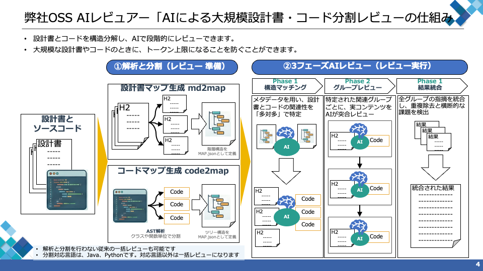

# 分割レビュー機能の詳細



## 全体像

この機能は大きく **2つのツール** と **3フェーズのAIレビュー** で構成されています。

---

## 1. md2map（設計書の分割）

**ディレクトリ**: [md2map/](../md2map/)

マークダウン変換済みの設計書を、3つの分割モードからユーザーが選択してセクション分割します。

### 1.1 分割モード

| モード | 説明 | LLM |
|---|---|---|
| 見出し（heading） | 見出し（H1〜H6）の階層構造に基づいて分割する。デフォルト | 不要 |
| NLP | 自然言語処理（形態素解析）を用いて意味的な区切りで分割する | 不要 |
| AI | LLM（大規模言語モデル）を用いて意味的な区切りで分割する | 必要 |

- **見出しモード**: 高速で安定。見出しが適切に構造化された文書に最適
- **NLPモード**: 見出しによる基本分割に加え、見出しのない長大なセクションもサブスプリット（subsplit）として細分化
- **AIモード**: NLPモードと同様にサブスプリットを生成するが、LLMを使用するため最も高精度。レビュー実行用のLLM設定を流用する

NLP/AIモードの1セクションあたりの最大サブスプリット数はフロントエンドの分割設定UIから指定可能（デフォルト: 5）。

### 1.3 サマリーモード

INDEX.md の各セクションのサマリー（要約）を生成するモードを選択できます。

| モード | 説明 | LLM |
|---|---|---|
| text（ルールベース） | セクション冒頭テキストを指定文字数で切り出す | 不要 |
| ai（推奨・デフォルト） | LLMを使用して高品質なサマリーを生成する | 必要 |

- `summaryMaxChars` でサマリー最大文字数を制御可能（デフォルト: 通常セクション100 / 事前重要指定セクション300）
- サマリーモードと最大文字数はフロントエンドの分割設定UIから、事前重要指定セクション・通常セクションそれぞれ独立して指定する
- 分割モード変更時にサマリーモードが自動連動する: AI → サマリーモード AI、見出し/NLP → サマリーモード ルールベース（ユーザーによる手動変更は可能）

### 1.2 コンポーネント

| コンポーネント | ファイル | 役割 |
|---|---|---|
| パーサー | [markdown_parser.py](../md2map/md2map/parsers/markdown_parser.py) | ATXスタイルの見出しを正規表現で解析。split_mode に応じて NLP/AI サブスプリットを実行 |
| Parts生成 | [parts_generator.py](../md2map/md2map/generators/parts_generator.py) | 各セクションを個別ファイルに出力（`<H1>_<H2>_<H3>.md`形式） |
| Index生成 | [index_generator.py](../md2map/md2map/generators/index_generator.py) | 階層ツリー構造の `INDEX.md` を作成 |
| Map生成 | [map_generator.py](../md2map/md2map/generators/map_generator.py) | `MAP.json` を生成（id, section, level, path, 行範囲, word count, SHA-256チェックサム） |

各セクションには `MD1`, `MD2`, ... のIDが付与され、デフォルトの分割深度は **H2** です。

---

## 2. code2map（ソースコードの分割）

**ディレクトリ**: [code2map/](../code2map/)

ソースコードをAST（抽象構文木）解析し、クラス・メソッド・関数単位で分割します。

| パーサー | ファイル | 方式 |
|---|---|---|
| Python | [python_parser.py](../code2map/parsers/python_parser.py) | Python標準の`ast`モジュールで解析。クラス、メソッド、トップレベル関数を抽出 |
| Java | [java_parser.py](../code2map/parsers/java_parser.py) | `javalang`ライブラリで解析。クラス、インターフェース、メソッド、コンストラクタを抽出 |

各シンボルには `CD1`, `CD2`, ... のIDが付与されます。ネストされた関数は親に含められます。

### 2.1 警告表示

パース時に構文エラーや不完全な解析が発生した場合、`warnings` フィールドにメッセージが格納されます。フロントエンドは分割プレビュー結果のプログラムパーツ一覧の下に警告パネルを表示します。

レビュー実行は可能ですが、正しく分割されていない可能性があります。

---

## 3. 分割前の設定

分割プレビュー実行前にユーザーが設定する項目です。

### 3.1 事前重要指定

分割前にセクション単位で「事前重要指定」を行い、事前重要指定セクションと通常セクションで異なる分割設定を適用できます。

- 「分割」モード選択時に `POST /api/split/headings` で H2 見出し一覧を取得・表示する
  - 取得結果はキャッシュし、一括↔分割の切り替えでは再取得しない
  - 設計書のマークダウンが変更された場合はキャッシュをリセットする
- 各見出しにチェックボックスを配置し、事前重要指定セクションを選択する
- 事前重要指定セクションと通常セクションでそれぞれ独立した分割設定（分割モード、見出しレベル、AI注意事項、最大分割数、サマリーモード、サマリー最大文字数）を指定可能
- 分割実行時にバックエンドが md2map の `section_overrides` に変換して処理する
- 事前重要指定セクションから生成された DocumentPart のうち、サブスプリットされていないパートは自動的に重要=ON が設定される（手動変更可）
- md2map 自体は「事前重要指定」の概念を持たず、バックエンドが変換・付与を担当する

### 3.2 事前除外指定

分割前にセクション単位で「事前除外指定」を行い、不要なセクションを分割・レビューの対象から完全に除外できます。

- 事前指定パネルで各見出しに「事前除外指定」チェックボックスが配置される
- 事前重要指定と事前除外指定は排他制御（同一セクションに両方を指定することはできない）
- 事前除外指定セクションはバックエンドで md2map の `section_overrides` に `skip: true` として変換される
- md2map の `skip` 機能により、事前除外セクションは `parse()` 結果に含まれず、分割プレビュー結果にも表示されない
- 事前除外により以下の効果が得られる:
  - 分割処理の対象から外すことで **処理時間を短縮**
  - AI/NLP サブスプリットの対象外になることで **LLM 問い合わせ回数を削減**
  - 不要コンテンツを処理しないことで **トークンを節約**

### 3.3 AIモード分割時の注意事項指定

AIモード選択時、分割オプションに「分割時の注意事項（任意）」テキストエリアが表示される。事前重要指定セクションと通常セクションでそれぞれ独立して指定可能。

- ユーザーが入力したテキストは md2map の AIサブスプリットプロンプト `# 注意事項` パートの末尾に追記される
- ドメイン固有の分割ルールを柔軟に指定できる
- 入力例: 「Mermaidブロックの途中では分割しない」「処理フロー単位で分割する」「項番単位で分割する」
- 空欄の場合は md2map のデフォルトプロンプトのみが使用される
- 見出し（heading）モード・NLPモードでは表示されない（AIサブスプリット専用）

---

## 4. 分割後の設定

分割プレビュー実行後、レビュー開始前にユーザーが設定できる項目です。

### 4.1 重要パートの選択

分割された設計書セクションおよびコードシンボルの一覧テーブルで、各パートに「重要」チェックボックスを設定できます。

- **重要パートに指定したセクション/シンボル**は、フェーズ2のグループレビュー時に**すべてのグループに共通で注入**される
- 仕様の前提条件や用語定義など、全体に関わるセクションを指定することで、グループ間でのレビュー品質のばらつきを抑制できる
- 既にグループに含まれるセクション/シンボルと重複する場合は自動的に除外される
- 事前重要指定セクションのうちサブスプリットされていないパートは、分割プレビュー時に自動的に重要=ON が設定される（手動変更可）

### 4.2 セクション除外

分割された設計書セクションおよびコードシンボルのうち、レビュー不要なパートを除外できます。

- 一覧テーブルで各パートの「内容を表示」で内容を確認し、「除外」チェックボックスをチェックすると、そのパートが構造マッチング・グループレビューの対象から外れる
- 除外チェックON時は「重要」「要約」のチェックが自動的に解除される
- 除外は MAP.json からの除去として実装されており、INDEX.md はオリジナルが維持される
- ダウンロード zip に含まれる INDEX.md / MAP.json はオリジナル（除外前）のものが使用される
- プレビューを再実行すると除外状態はリセットされる
- コードパートの場合、メソッドが個別シンボルとして存在するクラスシンボル（全体）を除外することで、トークン上限エラーを回避できる

### 4.3 事前要約

分割された設計書セクションおよびコードシンボルのうち、トークン数が大きいものを事前に要約してレビュー時のトークン消費を削減できます。

- 一覧テーブルで各パートの「要約」チェックボックスを選択し、「要約実行」ボタンで一括実行
- 設計書の要約は `POST /api/summarize`（`targetType: "design"`）、コードの要約は同エンドポイント（`targetType: "code"`）を使用
- 要約済みパートはレビュー時に原文の代わりに要約テキストが使用され、ヘッダに `[要約版]` と表示される
- 要約によって微妙なニュアンスや制約が失われる可能性があるため、品質検証が必要
- 設計書またはコードで「要約」選択かつ未実行のパートがある場合、レビュー実行ボタンは disabled となり、該当する警告メッセージが表示される

**設計書の要約時に保持される情報:**

- 具体的な仕様値（数値、文字数制限、範囲、閾値）
- 条件分岐と判断条件
- エラーケースと例外条件
- 制約・前提条件
- 入出力項目名と型
- 元の行番号参照（Lxx-Lyy）

**コードの要約時に保持される情報:**

- 関数シグネチャ
- バリデーション条件
- 分岐ロジック
- エラーハンドリング
- 重要なビジネスロジック
- 行番号コメント

---

## 5. 3フェーズAIレビュー

バックエンドのAPIは [latest/backend/app/routers/](../latest/backend/app/routers/) に実装されています。

### フェーズ1: 構造マッチング (`POST /api/review/structure-matching`)

**ファイル**: [review.py](../latest/backend/app/routers/review.py)

- **入力**: 設計書とコードそれぞれの `INDEX.md` + `MAP.json`
- **処理**: LLMが両方の構造を分析し、関連性の高いセクションとコードシンボルを **多対多** のグループにまとめる
- **出力**: `MatchedGroup[]` — 各グループにdocSectionsとcodeSymbolsが含まれる

```
例: group1「ユーザー管理」
  - 設計書: MD1(概要), MD3(ユーザー登録)
  - コード: CD1(UserService), CD4(UserRepository)
```

ポイントは **1:1マッピングではなく多対多** であること。1つの設計セクションが複数のコード部分に、またその逆も関連づけられます。

### フェーズ2: グループレビュー (`POST /api/review/group`)

- **入力**: グループに含まれる設計書の実コンテンツ（または要約テキスト） + コードの実コンテンツ
- **処理**: 各グループごとにLLMが設計書とコードの突合レビューを実施
- **出力**: Markdownフォーマットのレビューレポート
- フロントエンドが各グループを順次実行し、一時停止・再開も可能
- 重要パートに指定されたセクションは各グループに自動注入される

### フェーズ3: 結果統合 (`POST /api/review/integrate`)

- **入力**: フェーズ1の構造情報 + フェーズ2の全グループレビュー結果
- **処理**: LLMが全結果を統合し、重複を除去、グループ横断の問題を検出
- **出力**: 最終的な統一レビューレポート（Markdown）

### エラー時の要約・リトライ

フェーズ2（グループレビュー）およびフェーズ3（結果統合）でエラーが発生した場合、以下の対応が可能です。

#### グループレビューのエラー

トークン上限超過やAPI エラーでグループレビューが失敗した場合、レビューは一時停止し、ユーザーに以下の選択肢が提示されます。

1. **要約してリトライ**: 設計書・コードそれぞれについて「そのまま」または「要約」を選択できる。要約を選択した場合は `POST /api/summarize` で要約を実行してからリトライする
2. **スキップ**: 該当グループをスキップして次のグループに進む

要約実行後はトークン削減率（例: `~12,000 → ~5,200 tokens, -57%`）が表示され、効果を確認してからリトライできます。要約が未実行の場合はリトライボタンが無効化され、先に要約を実行するよう案内されます。

要約版でレビューを実施した場合、結果に「要約版の設計書でレビューを実施しました」等の注記が表示されます。

#### 結果統合のエラー

結果統合でエラーが発生した場合も同様に、各グループのレビュー結果を個別に「そのまま」または「要約」に切り替えてリトライできます。

---

## 6. フロントエンド実装

**ディレクトリ**: [latest/frontend/src/features/reviewer/](../latest/frontend/src/features/reviewer/)

| コンポーネント | ファイル | 役割 |
|---|---|---|
| 分割設定UI | [SplitSettingsSection.tsx](../latest/frontend/src/features/reviewer/components/SplitSettingsSection.tsx) | batch/splitモード選択、分割モード選択（見出し/NLP/AI）、分割深度設定、重要パート・要約設定、プレビュー |
| 実行画面 | [SplitExecutingScreen.tsx](../latest/frontend/src/features/reviewer/components/SplitExecutingScreen.tsx) | 3フェーズの進捗表示（✓/⏳/○）、一時停止・再開、エラー時のリトライ・スキップ |
| リトライ設定 | [RetrySettingsPanel.tsx](../latest/frontend/src/features/reviewer/components/RetrySettingsPanel.tsx) | グループレビューエラー時の要約・リトライ設定 |
| 統合リトライ設定 | [IntegrateRetrySettingsPanel.tsx](../latest/frontend/src/features/reviewer/components/IntegrateRetrySettingsPanel.tsx) | 結果統合エラー時の要約・リトライ設定 |
| 分割ロジック | [useSplitSettings.ts](../latest/frontend/src/features/reviewer/hooks/useSplitSettings.ts) | 状態管理、API呼び出し、分割モード管理、要約実行 |
| APIサービス | [api.ts](../latest/frontend/src/features/reviewer/services/api.ts) | 各エンドポイントへのリクエスト |

---

## 7. 設計上のポイント

- **ステートレスなバックエンド**: サーバー側にセッション状態を持たず、各APIコールが必要なデータを全て含む。失敗時のリトライが容易
- **トークン推定**: 日本語 ≈ 1.5トークン/文字、英語 ≈ 0.25トークン/文字 で概算し、分割の必要性判断に利用
- **フェーズ1の効率性**: 実コンテンツではなくINDEX.md + MAP.json（メタデータ）だけをLLMに渡すため、トークン消費を抑えて構造分析を実施
- **フェーズ2で初めて実コンテンツ**: グループ化された関連部分のみを渡すため、1回あたりのトークン量を抑制
- **設計書・コード両方分割が必須**: 片側だけの分割は構造マッチングの精度が低下するため、分割モード選択時は両方を分割する
- **分割モードの柔軟性**: 見出し/NLP/AIの3モードにより、文書の特性やLLM利用可否に応じた最適な分割が可能
- **重要パートの共有**: 全体に関わるセクションを全グループに注入することで、文脈の欠落によるレビュー精度の低下を防止
- **段階的なトークン削減**: 事前要約とエラー時要約の2段階で、トークン上限超過に柔軟に対応

---

## 8. 環境変数

バックエンドの `.env` ファイルで以下の環境変数を設定できます。`.env.example` をコピーして使用してください。

```bash
cp .env.example .env
```

| 環境変数名 | 説明 | デフォルト値 |
|---|---|---|
| AWS_ACCESS_KEY_ID | AWS認証情報（システムLLM用） | - |
| AWS_SECRET_ACCESS_KEY | AWS認証情報（システムLLM用） | - |
| AWS_REGION | AWSリージョン（システムLLM用） | ap-northeast-1 |
| BEDROCK_MODEL_ID | システムLLMのBedrockモデルID | global.anthropic.claude-haiku-4-5-20251001-v1:0 |
| BEDROCK_MAX_TOKENS | システムLLMの最大出力トークン数 | 16384 |
| EXCEL2MD_PATH | excel2mdツールのパス | 内蔵デフォルトパス |
| ORGANIZE_TIMEOUT_SECONDS | 構造マッチングのタイムアウト（秒） | 180 |
| ORGANIZE_MAX_RETRIES | 構造マッチングの最大リトライ回数 | 2 |

- AWS認証情報はシステムLLM（Bedrock）使用時のみ必要。Web画面からLLM設定をアップロードする場合は不要
- NLP/AIモードの最大サブスプリット数はフロントエンドの分割設定UIから指定可能（デフォルト: 5）。値を大きくするとより細かく分割されるが、AIモードではLLM呼び出しのトークン消費が増加する
- `BEDROCK_MODEL_ID` / `BEDROCK_MAX_TOKENS` はシステムLLMのモデルとトークン上限を制御する。デフォルトで動作するため、通常は変更不要
- `ORGANIZE_TIMEOUT_SECONDS` / `ORGANIZE_MAX_RETRIES` は構造マッチング（Phase 1）の実行制御パラメータ

---

## 9. エンドツーエンドの流れ

```
ユーザー: 大規模な設計書.xlsx + UserService.java をアップロード
    ↓
[Excel→Markdown変換、コードに行番号付与]（既存機能）
    ↓ ユーザーが「分割」モードを選択
    ↓ 見出し一覧を取得し、事前重要指定・事前除外指定セクションを選択
    ↓ 事前重要指定/通常セクションごとに分割モード（見出し/NLP/AI）を選択
    ↓
[md2map] 設計書 → セクション分割（事前除外セクションはスキップ） → INDEX.md + MAP.json
[code2map] コード → シンボル分割 → INDEX.md + MAP.json
    ↓
[分割設定] 重要パートの選択、セクション除外の設定、事前要約の実行（任意）
    ↓
[Phase 1] INDEX + MAP をLLMに送信 → グループ化結果
    ↓ 重要パートを各グループに注入
[Phase 2] 各グループの実コンテンツ（または要約）をLLMに送信 → 個別レビュー結果
    ↓ エラー時: 要約してリトライ or スキップ
[Phase 3] 全レビュー結果をLLMに送信 → 最終統合レポート
    ↓ エラー時: レビュー結果を要約してリトライ
ユーザーに表示（通常レビューと同じフォーマット）
```
