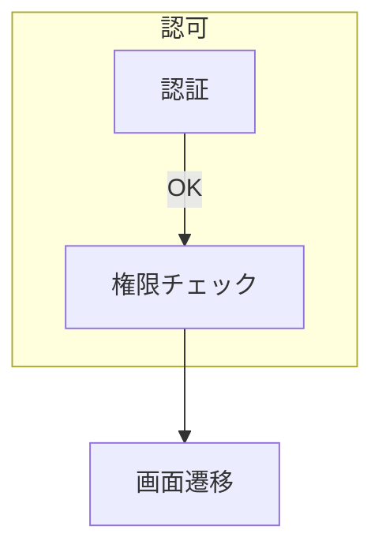

# エクセル→マークダウン変換 仕様書（spec.md / v1.8）

本書は、v1.7の仕様に**画像抽出機能**を追加した仕様です。

---

## 0. 目的
Excel ブック（.xlsx/.xlsm 等）を読み取り、各シートの**印刷領域**内で「空行・空列」境界により分割された矩形ブロックを**テーブル**とみなして Markdown へ変換する。
**印刷領域外のセルは処理対象外**であり、出力には含まれない。
また、デフォルトで各シートの印刷領域をCSV形式のコードブロックとして記載したマークダウンファイル（CSVマークダウン）も出力する。
さらに、Excelファイル内の画像を外部ファイルとして抽出し、Markdownリンク形式で出力する。

---

## 1. 対象・前提
- 対象拡張子：`.xlsx`（必須）/ `.xlsm`（数式は値表示、マクロは無視）
  ※ `.xls`/`.xlsb` は将来対応（前処理で `.xlsx` 化推奨）
- 対象：ワークシート（チャート/マクロ/ダイアログ/グラフシートは除外）
- **印刷領域外のセル**：処理対象外。印刷領域（Print_Area）で定義された範囲外のセルは、値の有無に関わらず出力に含まれない。
- 出力エンコーディング：UTF-8（NFC 正規化）
- シート順：Excel 上の並び順
- 印刷領域未設定時の扱いは §4.2 参照

---

## 2. 用語
- **印刷領域（Print_Area）**：Excel 定義の印刷範囲。離散複数範囲を取り得る。
- **空セル**：§6.1 の規則で「空」と判定されたセル。
- **空行/空列**：その行/列内の全セルが空セル。
- **テーブル領域**：空行・空列で区切られた**連続する矩形**セル範囲。

---

## 3. 入出力仕様
### 3.1 入力
- 必須引数：Excel ファイルパス
- 設定（CLI/YAML）
  - `no_print_area_mode`: `"used_range" | "entire_sheet_range" | "skip_sheet"`（既定: `"used_range"`）
  - `value_mode`: `"display" | "formula" | "both"`（既定: `"display"`）
  - `merge_policy`: `"expand" | "repeat" | "warn" | "top_left_only"`（既定: `"top_left_only"`）
  - `hyperlink_mode`: `"inline" | "inline_plain" | "footnote" | "both" | "text_only"`（既定: `"footnote"`）
    - `"inline"`: Markdown形式（`[表示](URL)`）
    - `"inline_plain"`: 平文形式（`表示 (URL)`）※v1.6で追加
    - `"footnote"`: 脚注形式（通常マークダウンのみ対応）
    - `"both"`: inline + footnote（通常マークダウンのみ対応）
    - `"text_only"`: 表示テキストのみ（リンク情報なし）※v1.6で追加
  - `header_detection`: `"none" | "first_row" | "heuristic"`（既定: `"first_row"`）
  - `hidden_policy`: `"ignore" | "include" | "exclude"`（既定: `"ignore"`）
  - `strip_whitespace`: `true|false`（既定: `true`）
  - `escape_pipes`: `true|false`（既定: `true`）
  - `date_format_override`: `null | "YYYY-MM-DD" など`（既定: `null`）
  - `numeric_thousand_sep`: `"keep" | "remove"`（既定: `"keep"`）
  - `percent_format`: `"keep" | "numeric"`（既定: `"keep"` *例: 12.3% は "12.3%" 出力*）
  - `currency_symbol`: `"keep" | "strip"`（既定: `"keep"`）
  - `detect_dates`: `true|false`（既定: `true`）
  - `date_default_format`: `"YYYY-MM-DD"`（override が `null` で Excel 表示値が得られない場合に使用）
  - `align_detection`: `"none" | "numbers_right"`（既定: `"numbers_right"`）
  - `numbers_right_threshold`: `0〜1`（既定: `0.8`）
  - `max_sheet_count`: 数値（既定: 無制限）
  - `max_cells_per_table`: 数値（既定: `200000`）
  - `sort_tables`: `"document_order"`（既定）
  - `footnote_scope`: `"book" | "sheet"`（既定: `"book"`）
  - `locale`: 例 `"ja-JP"`（既定: `"ja-JP"`）
  - `markdown_escape_level`: `"safe"`（既定）|`"minimal"`|`"aggressive"`

  #### Mermaid 変換関連（新規・補強）
  - （既出の各設定に加えて）
  - `mermaid_enabled`: `true|false`（既定: `false`）
  - `mermaid_diagram_type`: `"flowchart" | "sequence" | "state"`（既定: `"flowchart"`）
  - `mermaid_detect_mode`: `"none" | "column_headers" | "heuristic" | "shapes"`（既定: `"column_headers"`）
    - `"shapes"`: ExcelのDrawingML（シェイプ/図形）からフローチャートを検出（§⑦''参照）
  - `mermaid_columns`: オブジェクト（既定: `{"from":"From","to":"To","label":"Label","group":null,"note":null}`）
  - `mermaid_direction`: `"TD" | "LR" | "BT" | "RL"`（既定: `"TD"`）
  - `mermaid_keep_source_table`: `true|false`（既定: `true`）
  - `mermaid_dedupe_edges`: `true|false`（既定: `true`）
  - `mermaid_node_id_policy`: `"auto" | "shape_id" | "explicit"`（既定: `"auto"`）
    - `"auto"`: 表示名をサニタイズしてID化（テキストベース、可読性重視）
    - `"shape_id"`: Excel描画IDをそのまま使用（`s{id}`形式、トレーサビリティ重視、シェイプ検出時のみ有効）
    - `"explicit"`: テーブルにID列があれば使用（将来拡張）
  - `mermaid_group_column_behavior`: `"subgraph" | "ignore"`（既定: `"subgraph"`）
  - `mermaid_heuristic_min_rows`: 数値（既定: `3`）
  - `mermaid_heuristic_arrow_ratio`: 0〜1（既定: `0.3`）
  - `mermaid_heuristic_len_median_ratio_min`: 実数（既定: `0.4`）
  - `mermaid_heuristic_len_median_ratio_max`: 実数（既定: `2.5`）
    - ※ `heuristic` モードのしきい値デフォルト。設定で上書き可。
  - `dispatch_skip_code_and_mermaid_on_fallback`: `true|false`（既定: `true`）
    - フォールバック再評価時に**コード/Mermaid判定をスキップ**する実装向けフラグ（付録A.x参照）。

  #### CSVマークダウン出力関連
  - `csv_markdown_enabled`: `true|false`（既定: `true`）
    - `true` の場合、CSVマークダウンファイル**のみ**を出力する（通常Markdown出力は行わない）
    - `false` の場合、通常Markdownファイル**のみ**を出力する（CSVマークダウン出力は行わない）
    - CSVマークダウンは、各シートの印刷領域をCSV形式でコードブロックとして記載したマークダウンファイル
    - **出力モードは排他的**：両方の形式を同時に出力することはできない（両方必要な場合は2回実行する）
  - `csv_output_dir`: 文字列（既定: `null`）
    - CSVマークダウンファイルの出力先ディレクトリ
    - `null` の場合は入力Excelファイルと同じディレクトリに出力
  - `csv_apply_merge_policy`: `true|false`（既定: `true`）
    - `true` の場合、結合セルに `merge_policy` 設定を適用（Markdown出力と同様の処理）
    - `false` の場合、結合セルの左上セルのみに値を出力し、他のセルは空にする
  - `csv_normalize_values`: `true|false`（既定: `true`）
    - `true` の場合、セル値に対してMarkdown出力と同様の正規化を適用（NFC正規化、空白処理等）
    - `false` の場合、Excel内部の生値をそのまま出力
  - `csv_include_metadata`: `true|false`（既定: `true`）
    - `true` の場合、CSVマークダウンの末尾に検証用メタデータ（マークダウン形式）を付記する
    - メタデータには元のExcel情報、CSV出力情報、検証結果（OK/FAILED）を含む
    - 検証項目：シート数の一致、各シートの存在確認、各シートの行数・列数の一致
    - メタデータ形式の詳細は §3.2.2 を参照
  - `csv_include_description`: `true|false`（既定: `true`）【v1.7で追加】
    - `true` の場合、CSVマークダウンの冒頭に概要セクション（説明文）を出力する
    - `false` の場合、概要セクションを省略し、CSVセクションから開始する
    - 複数ファイルを変換・結合する際に説明文の重複を避け、トークン数を削減したい場合に `false` を指定
    - 対象箇所：「概要」「ファイル情報」「このファイルについて」「CSV生成方法」「CSV形式の仕様」「検証用メタデータについて」

### 3.2 出力

#### 3.2.1 Markdown出力
- `csv_markdown_enabled=false` の場合に出力される。
- **ファイル出力形式**：
  - 通常モード（`--split-by-sheet` なし）：1ブック → 1 Markdown ファイル
  - シート分割モード（`--split-by-sheet` あり）：1ブック → シートごとに分割された複数のMarkdown ファイル（`{basename}_{sheetname}.md`）
- 構成：
  1) ブック情報（ファイル名/シート数/シート名一覧）※シート分割モード時は各ファイルにシート情報のみ
  2) 各シート章（シート見出し→テーブル順）
  3) 脚注一覧（`hyperlink_mode` が `"footnote"`/`"both"` のとき）
- **Mermaid出力**：`mermaid_enabled=true` かつ以下のいずれかの条件を満たす場合、Mermaidコードブロック（```mermaid ... ```）を埋め込む：
  - テーブルが「フローテーブル」と判定された場合（`mermaid_detect_mode="column_headers"` または `"heuristic"`）
  - シェイプ（図形）からフローチャートが検出された場合（`mermaid_detect_mode="shapes"`）
  位置は **Mermaid →（任意で）元テーブル** の順で出力する（`mermaid_keep_source_table` 参照）。
  - **シェイプ検出とテーブル処理の関係**：`mermaid_detect_mode="shapes"` の場合、シェイプ検出はシート単位で実行されるが、シェイプ検出が成功してもテーブル処理は続行される。1つのシートにシェイプ（フローチャート）とテーブル（データテーブル）の両方が存在する場合、両方を出力する（シェイプ検出のMermaidコード → テーブルのMarkdownの順）。

#### 3.2.2 CSVマークダウン出力
- `csv_markdown_enabled=true` の場合に出力される。
- **ファイル出力形式**：
  - 通常モード（`--split-by-sheet` なし）：1ブック → 1つのCSVマークダウンファイル（`{basename}_csv.md`）
  - シート分割モード（`--split-by-sheet` あり）：1ブック → シートごとに分割された複数のCSVマークダウンファイル（`{basename}_{sheetname}_csv.md`）
- **ファイル構成**：
  - **概要セクション**（見出しレベル2: `## 概要`）【`csv_include_description=true` の場合のみ出力】：
    - **ファイル情報**（見出しレベル3: `### ファイル情報`）：
      - 元のExcelファイル名
      - シート数
      - 生成日時
    - **このファイルについて**（見出しレベル3: `### このファイルについて`）：
      - このCSVマークダウンファイルの目的と構成を説明する段落テキスト
      - 記載すべき内容：
        - AIがExcelの内容を理解できるよう、各シートの印刷領域をCSV形式で出力したファイルである旨
        - 各シートがマークダウン見出しで区切られ、CSVコードブロックで内容が記載されている旨
        - ファイル末尾に検証用メタデータセクションがあり、Excel原本との整合性を確認できる旨
    - **CSV生成方法**（見出しレベル3: `### CSV生成方法`）：
      - 箇条書きリストで以下の項目を記載：
        - **出力対象範囲**: 各シートの印刷領域のみを出力（印刷領域外のセルは含まない）
        - **印刷領域の統合**: 複数の印刷領域がある場合は外接矩形として統合
        - **テーブル分割なし**: Markdown出力と異なり、空行・空列でテーブル分割せず印刷領域全体を1つのCSVとして出力
        - **結合セルの処理**: `merge_policy`設定に従って処理（設定値を記載）
        - **数式の扱い**: `value_mode`設定に従って表示値・数式・両方のいずれかを出力（設定値を記載）
        - **値の正規化**: `csv_normalize_values`設定に従って正規化処理を適用（設定値を記載）
    - **CSV形式の仕様**（見出しレベル3: `### CSV形式の仕様`）：
      - 箇条書きリストで以下の項目を記載：
        - **区切り文字**: 使用する区切り文字（`csv_delimiter`設定値を記載）
        - **引用符の使用**: `csv_quoting`設定値に従い、RFC 4180準拠で処理
        - **セル内改行**: 半角スペースに変換される（1レコード=1行を保証）
        - **セル内特殊文字**: 区切り文字や引用符は引用符でエスケープされる
        - **エンコーディング**: 使用するエンコーディング（`csv_encoding`設定値を記載）
        - **空セルの表現**: 空文字列として出力（空行・空列も含めて出力される）
        - **ハイパーリンク**: `hyperlink_mode` 設定に従って出力（既定: `inline_plain`）
          - `inline`: Markdown形式（例: `[表示テキスト](URL)` または `表示テキスト〔→場所〕`）
          - `inline_plain`: 平文形式（例: `表示テキスト (URL)` または `表示テキスト (→場所)`）
          - `text_only`: 表示テキストのみ（リンク先情報なし）
          - `footnote`/`both`: `inline_plain` にフォールバック（WARNログ出力）
    - **Mermaidフローチャートについて**（見出しレベル3: `### Mermaidフローチャートについて`）【`mermaid_enabled=true` かつ `mermaid_detect_mode="shapes"` の場合のみ】：
      - 箇条書きリストで以下の項目を記載：
        - ExcelのShape（図形）を検出し、Mermaid記法のフローチャートとして出力している旨
        - 各シートのCSVブロックの前に、検出されたShapeがMermaidコードブロックで記載される旨
        - Shape間の接続（コネクタ）も矢印として表現される旨
    - **検証用メタデータについて**（見出しレベル3: `### 検証用メタデータについて`）【`csv_include_metadata=true` の場合のみ】：
      - 箇条書きリストで以下の項目を記載：
        - このファイルの末尾に「検証用メタデータ」セクションが付記されている旨
        - メタデータには各シートのExcel原本情報（範囲、行数、列数）とCSV出力結果の比較が含まれる旨
        - 検証ステータス（OK/FAILED）により、CSVとExcel原本の整合性を確認できる旨
        - 詳細情報はファイル末尾の「検証用メタデータ」セクションを参照する旨
    - **概要セクションの区切り**：
      - 概要セクションの最後に水平線（`---`）を記載し、CSVセクションとの境界を明確にする
  - **各シートのCSVセクション**：
    - 見出しレベル2で各シート名を記載（例: `## シート名`）
    - **Mermaidブロック**【`mermaid_enabled=true` かつ `mermaid_detect_mode="shapes"` の場合のみ】【v1.7で追加】：
      - シェイプ（図形）からフローチャートを検出し、Mermaidコードブロック（` ```mermaid ... ``` `）を出力
      - Mermaid検出は §⑦'' の動作に準拠
      - Mermaidブロックは各シートのCSVコードブロックの**前**に出力される
      - シェイプが検出されなかったシートではMermaidブロックは出力されない
      - **注意**: `mermaid_detect_mode` が `column_headers` または `heuristic` の場合、CSVマークダウンではMermaid出力はスキップされる（WARNログを出力）。これはCSVマークダウンがテーブル分割を行わないため。
    - シート内容のCSV（コードブロック ` ```csv ... ``` ` で囲む）
    - 各シートセクションは見出しレベル2で統一し、概要セクション（レベル2）と同じ階層にする
  - **検証用メタデータセクション**（`csv_include_metadata=true` の場合）：
    - CSVマークダウンファイルの末尾に、マークダウン形式で検証メタデータを追記
    - 後からプログラムで出力結果を検証するために使用
    - **メタデータの形式**（マークダウン構造として記載）：
      - 区切り線: `---`
      - 見出し（レベル2）: `## 検証用メタデータ`
      - 基本情報（箇条書きリスト）:
        - `- **生成日時**: YYYY-MM-DD HH:MM:SS`
        - `- **元Excelファイル**: {filename}`
        - `- **CSVマークダウンファイル**: {csv_filename}`
        - `- **CSVモード**: {csv_markdown}` (固定値)
        - `- **検証フェーズ**: {phase_number} ({phase_description})`
      - 空行
      - 各シートの検証結果（見出しレベル3 + 箇条書きリスト）:
        - シート見出し: `### シート: {sheet_name}`
        - シート情報（箇条書きリスト）:
          - `- **Excel範囲**: {range}` (例: A1:D10)
          - `- **Excel行数**: {rows}`
          - `- **Excel列数**: {cols}`
          - `- **CSV行数**: {rows}`
          - `- **CSV列数**: {cols}`
          - `- **セル総数**: {count}`
          - `- **ステータス**: OK` または `- **ステータス**: FAILED`
          - エラーがある場合、エラー詳細を箇条書きで追記: `- **エラー**: {error_message}`
        - 空行
      - 全体の検証結果（見出しレベル3 + 箇条書きリスト）:
        - 見出し: `### 全体の検証結果`
        - 総セル数: `- **総セル数**: {total}`
        - 検証結果: `- **検証ステータス**: OK` または `- **検証ステータス**: FAILED`
        - 失敗時のエラー一覧（該当する場合のみ、箇条書きリストで列挙）:
          - エラー見出し（太字）: `- **エラー一覧**:`
          - 各エラーをネストした箇条書きリストで列挙: `  - {error_message}`
- **出力対象範囲**：
  - `csv_output_range="print_area"`（現バージョンでは固定）：各シートの印刷領域を出力対象とする。
  - 印刷領域内のすべてのセルを含む矩形範囲を出力（空行・空列も含む）。
  - 複数の印刷範囲がある場合は、最小の外接矩形（bounding box）を出力範囲とする。
  - 印刷領域未設定のシートは `no_print_area_mode` に従って処理される（`skip_sheet` の場合はCSV出力もスキップ）。
- **セル値の処理**：
  - `csv_apply_merge_policy=true` の場合、結合セルは `merge_policy` に従って処理される（Markdown出力と同様）。
  - `csv_normalize_values=true` の場合、セル値は以下の正規化が適用される：
    - NFC正規化
    - `strip_whitespace=true` の場合、前後の空白を除去
    - `date_format_override` / `numeric_thousand_sep` / `percent_format` / `currency_symbol` などの設定を適用
  - `csv_normalize_values=false` の場合、Excel内部の値をそのまま出力（数式は `value_mode` に従う）。
  - **セル内改行の処理**（CSVマークダウン専用）：
    - CSVマークダウン出力では、セル内の改行文字（`\n`, `\r\n`, `\r`）を**半角スペース（` `）に変換**する
    - 理由：
      - AIの読解を容易にするため
      - 1レコード=1物理行の視覚的一貫性を保つため
      - メタデータの行数とCSVコードブロックの行数を一致させるため
    - この処理は、CSVマークダウンファイル（`{basename}_csv.md`）の出力時のみ適用される
    - 通常のCSVファイル出力では適用されない（将来的にCSVファイル出力機能が追加された場合の注記）
  - **CSV特殊文字の処理**（RFC 4180準拠）：
    - セル内に区切り文字（`,`）が含まれる場合、セル全体を引用符（`"`）で囲む
    - セル内に引用符（`"`）が含まれる場合、引用符を2つ重ねる（`""`）にエスケープし、セル全体を引用符で囲む
    - Pythonの標準`csv`モジュールを使用して正しくエスケープ処理を行う
    - 注：セル内改行は上記の通り半角スペースに変換されるため、引用符で囲む必要はない
- **ハイパーリンクの扱い**：
  - CSVマークダウンでは `hyperlink_mode` 設定に従ってハイパーリンクを処理する（既定: `inline_plain`）：
    - `inline`: Markdown形式で出力（例: `[表示テキスト](URL)` または `表示テキスト〔→場所〕`）
    - `inline_plain`: 平文形式で出力（例: `表示テキスト (URL)` または `表示テキスト (→場所)`）
    - `text_only`: 表示テキストのみを出力（リンク先情報なし）
    - `footnote`/`both`: 脚注形式は非対応のため `inline_plain` にフォールバックし、WARNログを出力
  - CSVマークダウンは脚注をサポートしないため、`footnote`/`both` モードは使用できない。
- **エンコーディング**：
  - `csv_encoding` で指定されたエンコーディングで出力（既定: `utf-8`）。
  - BOM（Byte Order Mark）は出力しない（マークダウンファイルとして扱うため）。
- **エラーハンドリング**：
  - CSVマークダウン出力に失敗した場合（書き込みエラー、エンコーディングエラー等）は **WARN** を記録し、Markdown出力は継続する。

#### 3.2.2.1 CSVマークダウン出力制御オプション一覧【v1.7で追加】

| オプション | デフォルト | 説明 |
|-----------|----------|------|
| `--csv-include-description` | ON | 概要セクション（説明文）を出力に含める |
| `--csv-include-metadata` | ON | 検証用メタデータを出力に含める |
| `--mermaid-enabled` | OFF | Mermaidフローチャートを出力に含める（`mermaid_detect_mode="shapes"`の場合のみ有効） |

**ユースケース**:
- 複数の設計書を変換・結合してAIに渡す際に、説明文とメタデータを省略してトークン数を削減
- フローチャートを含む設計書をCSVマークダウン形式で出力する際に `--mermaid-enabled --mermaid-detect-mode shapes` を指定

---

## 4. 処理フロー（①〜⑪の統合定義）
### ① ファイルを開き、シート一覧を取得
ブックを read-only で開き、**総シート数/シート名**を取得。出力冒頭に記載。

### ② シート走査順を確定
Excel の表示順（左→右のタブ順）で**先頭から末尾まで**処理。

### ③ シートの印刷領域を取得
- `Print_Area` を取得。**複数範囲**可。
- **印刷領域の取得方法**：
  - Excelの`Print_Area`設定から取得する。`Print_Area`は以下のいずれかの形式で格納されている：
    - **文字列形式**：単一範囲を表す文字列（例：`"$A$1:$Z$100"` または `"'Sheet1'!$A$1:$Z$100"`）
    - **イテラブル形式**：複数範囲を表すリストまたはタプル
  - **シート名を含む範囲文字列の処理**：
    - 範囲文字列にシート名が含まれている場合（例：`"'処理フロー'!$A$1:$BJ$910"`）、`!`記号の**後ろの部分**（範囲部分）のみを抽出して使用する。
    - 例：`"'Sheet1'!$A$1:$Z$100"` → `"$A$1:$Z$100"`を抽出
    - 理由：座標変換処理では、シート名を含まない範囲文字列を期待するため。
  - 各範囲を数値座標（行番号、列番号）に変換する。変換後の形式は`(min_row, min_col, max_row, max_col)`（1-based）。
  - 複数範囲が存在する場合は、すべての範囲を取得し、後続処理（§5.3）で統合する。
- **印刷領域の検証**：
  - 取得した印刷領域の各範囲について、以下の検証を行う：
    - `min_row <= max_row` かつ `min_col <= max_col` であること（有効な矩形であること）
    - 行番号・列番号が正の整数であること
    - シートの最大行数・最大列数を超えていないこと（超過している場合は最大値に制限）
  - 検証に失敗した範囲は**WARN**ログを出力し、その範囲をスキップする。すべての範囲が無効な場合は、`no_print_area_mode`に従って処理する。
- **印刷領域外のセルは処理対象外**：取得した印刷領域の範囲外にあるセルは、以降の処理（空行・空列判定、テーブル抽出、値取得）の対象外とし、出力には含まれない。
- 未設定時は `no_print_area_mode`：
  - `used_range`：UsedRange を採用（シート内で使用されている範囲を自動検出）
  - `entire_sheet_range`：最大行列（非推奨、大規模負荷）
  - `skip_sheet`：本シートをスキップ（WARN）

### ④ 空の「列」を特定（印刷領域内）
左端→右端の列を走査し、§6.1 に基づき空列フラグを付与。`hidden_policy` 反映。

### ④’ 形式判定の評価ポイント（明確化・新設）
- 本段階では**まだ最終出力形式を確定しない**。以降の処理（⑦ の正規化、⑦’〜⑩’ のMermaid分岐を含む）を経た後、§7「Markdown 生成規約」に基づき**優先順位**で形式を最終決定する。
- Mermaid（フローテーブル）判定の**タイミング**は ⑦ の後、⑦’で行う（＝**既存のテーブル抽出と正規化が完了してから**評価する）。
  - これにより、結合セルやエスケープ、日付/数値正規化の影響を受けた**確定値**で判定でき、競合を最小化する。

### ⑤ 空の「行」を特定（印刷領域内）
上端→下端の行を走査し、§6.1 に基づき空行フラグを付与。`hidden_policy` 反映。

### ⑥ テーブル領域の認識
- 空行・空列を**境界**として非空セルの**矩形**連続領域を抽出。
- **印刷領域内のみを対象**：テーブル抽出は印刷領域内のセルのみを対象とする。抽出されたテーブルの`bbox`（境界矩形）と`mask`（セル集合）は、すべて印刷領域内に収まっていることを保証する。印刷領域外のセルは、テーブルの`bbox`や`mask`に含まれない。
- **近接テーブル**分離規則：行または列に**1本以上**の空行/空列が存在すれば別テーブル。
- **セル接続規則**：隣接するセル（水平、垂直、対角線方向）は、空行/空列で区切られていない限り、同じテーブルに属する。対角線方向のセルは、水平→垂直または垂直→水平の経路が空行/空列でブロックされていない場合に接続される。ただし、印刷領域外のセルは接続対象外とする。
- **非矩形（L字/凹型）**は、行ごとの非空ラン長を計算し、**最大長方形分解**で矩形に分割（重複/包含は統合）。分割後の矩形も印刷領域内に収まっていることを保証する。
- 複数印刷範囲は後述 §6.3。

### ⑦ テーブルから行単位に値取得（リンク/結合対応）
- 走査は**左上→右下**の行順。
- **印刷領域内のセルのみ処理**：テーブルの`bbox`範囲内のセルを走査する際、各セルが印刷領域内にあることを確認する。印刷領域外のセルは処理対象外とし、値の取得・正規化・出力を行わない。
- 文字列正規化（NFC）、必要に応じ §7 のエスケープと改行処理。
- `merge_policy` に従い結合セルを平坦化。結合セルの処理については §6.4 を参照。
- ハイパーリンクは §6.5 に従って整形。

### ⑦a 出力形式ディスパッチ（統合ポイント・新設／実装位置の明確化）
> **目的**：既存実装との整合性を担保するため、⑦で抽出した **md_rows（空列削除前）** を入力として、
> 以降の**形式判定と出力**を一元管理する分岐ポイントを定義する。

**実装位置（準拠指示）**
- 既存コードの **`format_table_as_text_or_nested(md_rows, ...)` を直接呼び出している箇所（例：1347行目）** を、
  **`dispatch_table_output(md_rows, context)`（新関数）** の呼び出しに**置き換える**。
- 互換のため、`dispatch_table_output` は内部で**従来の `format_table_as_text_or_nested` を呼び出してもよい**（優先順位の第3・第4判定で使用）。

**`dispatch_table_output` の評価順（優先度）**
1. **コード形式判定（最優先）**：§7.2.4 の規則で**最初に**評価する。
   - 既存の `format_table_as_text_or_nested` 内の「コード判定」ロジックは**独立関数**（例：`is_code_block(md_rows)`）に切り出し、ここから呼ぶ。
2. **Mermaid（シェイプ/フローテーブル）判定**：
   - **`mermaid_detect_mode="shapes"`の場合**：⑦''でシェイプ（図形）からフローチャートを検出（テーブル処理とは独立）。
   - **`mermaid_detect_mode="column_headers"` または `"heuristic"`の場合**：⑦’に委譲（条件一致時のみ）。
   - 判定・生成失敗時の**フォールバック**は本関数内で制御。
3. **単一行テキスト判定**：§7.2.1 を評価（従来のロジック流用可）。
4. **ネスト形式判定**：§7.2.3 を評価（従来のロジック流用可）。
5. **通常テーブル生成**：§7.2.5 と `make_markdown_table` に従う（ここで空列削除を実施）。

**フォールバック起動方法（実装）**
- Mermaid 生成中に**不成立/WARN**または**例外/ERROR**が発生した場合、
  `dispatch_table_output` は **`dispatch_skip_code_and_mermaid_on_fallback=true` のとき**、
  **優先順位3（単一行）から再評価**する（コード・Mermaidはスキップ）。
  同フラグが `false` の場合は、通常の 1→2→3… の順で再評価してもよい（互換運用）。

### ⑦'' シェイプ（図形）からのMermaid検出【新規】
- 実施条件：`mermaid_enabled=true` かつ `mermaid_detect_mode="shapes"` の場合のみ。
- 入力：ExcelファイルのDrawingML（`xl/drawings/*.xml`）とシートのセルグリッド。
- 処理手順：
  1. **DrawingMLの抽出**：
     - ExcelファイルをZIPとして開き、`xl/drawings/` 配下のXMLファイルを取得。
     - 各シートに対応するDrawingMLファイルを特定する：
       - ワークシートの関係ファイル（`xl/worksheets/_rels/sheetN.xml.rels`）を確認する。
       - 関係ファイル内の`Relationship`要素で、`Type`属性が`http://schemas.openxmlformats.org/officeDocument/2006/relationships/drawing`のものを探す。
       - `Target`属性から対応するDrawingMLファイルのパスを取得する（例：`../drawings/drawing1.xml`）。
       - パスは相対パスなので、`xl/worksheets/`基準で解決し、`xl/drawings/drawingN.xml`形式に変換する。
       - 対応するDrawingMLファイルが存在しない場合は、そのシートにはシェイプが存在しないと判断し、シェイプ検出をスキップする。
  2. **ノード（シェイプ）の抽出**：
     - `xdr:twoCellAnchor` または `xdr:oneCellAnchor` 内の `xdr:sp` 要素を走査。
     - 各シェイプから以下を取得：
       - **ID**: `xdr:cNvPr@id` から取得（`s{id}`形式）。なければローカルIDを生成。
       - **名前**: `xdr:cNvPr@name` から取得。
       - **テキスト**:
         - 優先順位1: `xdr:txBody` 内の `a:p/a:r/a:t` 要素から取得（Excel DrawingMLでは`xdr:txBody`が正しい構造）。複数の段落がある場合は改行（`\n`）で結合。`xdr:txBody`が見つからない場合は`a:txBody`をフォールバックとして試行。
         - 優先順位2: テキストが空の場合は、シェイプのbbox（セル範囲）近傍（上下左右に1セル分のパディング）のセル値を参照。複数のセル値がある場合は、最長のテキストを選択。最長テキストが4文字未満の場合は、最大4つまでのテキストを改行で結合。
         - 優先順位3: テキストが取得できない場合は、シェイプ名（`xdr:cNvPr@name`）を使用。
         - テキストのエスケープ: Mermaidコード生成時に、表示名に含まれる特殊文字（`[`, `]`, `{`, `}`, `|`, `"`, `'`など）はHTMLエンティティに変換（例：`[` → `&#91;`, `]` → `&#93;`）。
       - **種類**: `a:prstGeom@prst` 属性から取得。属性が存在しない場合は `process` とする。取得した値に応じて以下のように分類：
         - `flowChartDecision`, `diamond` → `decision`（決定ノード）
         - `flowChartTerminator`, `ellipse`, `roundRect` → `terminator`（開始/終了ノード）
         - `flowChartInputOutput`, `trapezoid` → `io`（入出力ノード）
         - `flowChartPreparation`, `hexagon` → `prep`（準備ノード）
         - `flowChartManualOperation` → `manual`（手動操作ノード）
         - `flowChartDocument` → `document`（文書ノード）
         - `flowChartConnector` → `connector`（結合子ノード）
         - その他 → `process`（処理ノード）
       - **bbox**: `xdr:from/xdr:row`, `xdr:from/xdr:col`, `xdr:to/xdr:row`, `xdr:to/xdr:col` から取得（0-based行・列インデックス）。
  3. **エッジ（コネクタ）の抽出**：
     - `xdr:cxnSp` 要素を走査。
     - `xdr:stCxn@id` と `xdr:endCxn@id` から接続元・接続先のシェイプIDを取得（`s{id}`形式）。
     - エッジが不足している場合（有効エッジ数がノード数の30%未満）、位置情報（bbox）に基づく推論を実施：
       - 各ノードから下方向または右方向の近接ノードを探索。
       - 垂直方向の距離を優先し、最も近いノード（最大2個まで）にエッジを推論。
  4. **Mermaidコード生成**：
     - ノードIDは `mermaid_node_id_policy` に従って生成：
       - `"auto"`: 表示名をサニタイズしてID化（テキストベース）
       - `"shape_id"`: Excel描画IDをそのまま使用（`s{id}`形式、シェイプ検出時のみ有効）
       - `"explicit"`: テーブルにID列があれば使用（将来拡張）
     - ノード表示名はテキストまたは名前を使用。表示名に特殊文字が含まれる場合はHTMLエンティティに変換。
     - ノード形状はシェイプの種類に応じて以下の形式を使用：
       - `decision` → `{nid}{"{display}"}`（例：`s458{"1. 権限チェック"}`）
       - `terminator` → `nid(["{display}"])`（例：`s470(["呼び出し元へ"])`）
       - `io` → `nid[("{display}")]`（例：`s542[("入出力")]`）
       - `prep` → `nid[{{"{display}"}}]`（例：`s639[{{"準備"}}]`）
       - `manual` → `nid[("{display}")]`（例：`s557[("手動操作")]`）
       - `document` → `nid[("{display}")]`（例：`s558[("文書")]`）
       - `connector` → `nid["{display}"]`（例：`s23["R"]`、`s544["CR"]`）
       - `process` → `nid["{display}"]`（例：`s524["19. レスポンス電文生成"]`）
     - エッジは `{from_id} --> {to_id}` 形式で出力（ラベルは現時点では空）。推論されたエッジの場合は `{from_id} -.->|inferred| {to_id}` 形式を使用（任意）。
- 出力：Mermaidコードブロック（```mermaid ... ```）。
- **シェイプ検出とテーブル処理の関係**：シェイプ検出はシート単位で実行されるが、シェイプ検出が成功してもテーブル処理は続行される。1つのシートにシェイプ（フローチャート）とテーブル（データテーブル）の両方が存在する場合、両方を出力する（シェイプ検出のMermaidコード → テーブルのMarkdownの順）。
- フォールバック：シェイプが検出されない、またはエッジが構築できない場合は、通常テーブル処理へ（シェイプ検出が失敗してもテーブル処理は実行される）。

### ⑦’ フローテーブル判定（Mermaid 検出）【新規】
- 実施条件：`mermaid_enabled=true` かつ `mermaid_detect_mode` が `"column_headers"` または `"heuristic"` の場合のみ。
- 入力：⑦（値取得と正規化）を経た **md_rows（空列削除前）**。結合セル処理・改行・エスケープは済み。
- 判定：
  - `mermaid_detect_mode="column_headers"`：
    - **ヘッダ候補行として常に先頭行を使用**（`header_detection` 設定に関わらず）。
    - 列名照合は**列名ベース**（インデックスではない）。一致は以下の正規化後に行う：
      1) NFKC 正規化（全角/半角の統一）
      2) `casefold()` による大文字小文字の無視
      3) 前後空白の削除、連続空白の1化
    - `mermaid_columns.from` と `mermaid_columns.to` に一致する列名が**両方**存在するとき成立。
    - `header_detection=first_row` の場合：先頭行を Markdown のヘッダとしても利用する。
    - `header_detection=none` の場合：先頭行は**Mermaid判定専用**で、元テーブル出力時は**ヘッダ行を生成しない（先頭行はデータ行）**。
  - `mermaid_detect_mode="heuristic"`：
    - **暫定規則（実装ガイドライン）**：次の全てを満たす場合に成立（しきい値は §3.1 の既定値を用いる）
      1) 2列以上が存在し、データ行（先頭行以外）において**先頭2列（列インデックス 0 と 1）**がともに非空の行数が **≥ `mermaid_heuristic_min_rows`**
      2) 矢印表現（`->`, `→`, `⇒`）の**いずれか**を含む行の割合が **≥ `mermaid_heuristic_arrow_ratio`**
      3) **列長中央値比** `median(len(col0))/median(len(col1))` が
         `mermaid_heuristic_len_median_ratio_min` 以上かつ
         `mermaid_heuristic_len_median_ratio_max` 以下
       - `len()` は NFKC 正規化後の**コードポイント数**（単純長）でよい。トークナイズは不要。
       - **対象列**は空列削除前の**元の列インデックス 0 と 1**を用いる（空セルは長さ 0 として扱う）。
       - サンプル数不足（中央値が算出不能）の場合は不成立。
    - **注**：**コード形式（優先度1）に一致する場合は適用しない**（誤検出回避）。
  - いずれにも該当しない場合は「非フローテーブル」として通常処理へ。

### ⑧’ 列マッピングとエッジ抽出【新規】
- 列マッピング：`from = mermaid_columns.from`、`to = mermaid_columns.to`、任意列 `label/group/note` を解決。
- エッジ抽出：データ行を走査し、`(from, to, label)` を1エッジとして登録。`mermaid_dedupe_edges=true` のときは重複除去。
- グループ処理：`group` があればノードを所属 subgraph に割当（`mermaid_group_column_behavior` 準拠）。

### ⑨’ ノードID生成とMermaidコード構築【新規】
- ノードID生成：
  - `mermaid_node_id_policy="auto"`：表示名をサニタイズしてID化（英数字と `_` のみ、先頭数字は `_` を付けて回避）。テキストベースで可読性が高い。
  - `mermaid_node_id_policy="shape_id"`：Excel描画IDをそのまま使用（`s{id}`形式、例：`s454`, `s458`）。シェイプ検出時（`mermaid_detect_mode="shapes"`）のみ有効。元のExcelファイルとの対応関係が明確で、デバッグ時に元のシェイプを特定しやすい。
  - `mermaid_node_id_policy="explicit"`：テーブルにID列があれば使用（将来拡張）。

**ノードIDポリシーの比較**

| オプション | ノードID形式 | 特徴 | 適用範囲 |
|-----------|------------|------|---------|
| `auto` | `_`, `__2`, `_1_` など（テキストベース） | テキストから生成されるため可読性が高い。表示名が変更されてもIDが安定（重複時は別処理が必要）。 | すべてのMermaid検出モード |
| `shape_id` | `s454`, `s457`, `s458` など（Excel描画ID） | Excel描画IDをそのまま使用するため、元のExcelファイルとの対応関係が明確。デバッグ時に元のシェイプを特定しやすい。参考実装（flowchart-mermaid.md）との互換性がある。 | シェイプ検出時のみ（`mermaid_detect_mode="shapes"`） |
| `explicit` | （将来拡張） | テーブルにID列があれば使用 | （将来拡張） |

**使用例**

- `auto`オプションの場合：
  ```mermaid
  flowchart TD
    _["[権限チェック結果 == エラー以外]"]
    __2["[権限チェック結果 == エラー]"]
    _1_{"1. 権限チェック"}
  ```

- `shape_id`オプションの場合（シェイプ検出時）：
  ```mermaid
  flowchart TD
    s454["[権限チェック結果 == エラー以外]"]
    s457["[権限チェック結果 == エラー]"]
    s458{"1. 権限チェック"}
  ```
- Mermaidコード構築：
  - 先頭行：`flowchart {mermaid_direction}`（例：`flowchart TD`）。
  - subgraph があれば `subgraph {group_name}` ブロックで囲む。
  - エッジ：`{from_id} -->|{label}| {to_id}`（label が空の場合は `{from_id} --> {to_id}`）。
  - ノード表示名：`{id}["{display_name}"]` 形式（表示名に特殊文字がある場合は適切にエスケープ）。

### ⑩’ 出力埋め込み【新規】
- 「```mermaid」から「```」までをテーブル章に挿入。
- `mermaid_keep_source_table=true` の場合：Mermaid ブロックの**直後**に元テーブルを通常どおり出力。
- `mermaid_keep_source_table=false` の場合：Mermaid のみ出力（テーブルは省略）。
- **フォールバック（明確化）**：Mermaid 生成が失敗／不成立の場合、当該テーブルは**優先度3（単一行テキスト）から再評価**を開始し、以降の判定に従って出力を確定する。結果として通常テーブルとなる場合がある。

**元テーブル出力時の空列削除（明確化）**
- `mermaid_keep_source_table=true` の場合でも、元テーブルのMarkdown生成は**通常どおり `make_markdown_table` を経由**し、
  その中で**空列削除**を適用する（Mermaid判定は空列削除前の `md_rows` を使用）。

### ⑧ テーブル末行まで継続取得
- 範囲最終行まで取得。`max_cells_per_table` を**逐次カウント**し、超過時は当該テーブルのみ打切り（WARN）。

### ⑨ 次テーブルへ遷移
検出順に次テーブルへ。順序は**（top, left）座標昇順**。

### ⑩ シート見出しとテーブルの Markdown 出力
- 各シート処理開始時に、Markdown見出しとして `## シート名` を出力する。
- **シェイプ検出とテーブル処理の順序**：
  - `mermaid_detect_mode="shapes"` の場合、シート処理開始時に⑦''でシェイプ検出を実行する。
  - シェイプ検出が成功した場合、Mermaidコードブロックを出力するが、テーブル処理は続行される。
  - その後、③〜⑨の処理を実行し、検出されたテーブルを通常どおり出力する。
  - 1つのシートにシェイプとテーブルの両方が存在する場合、出力順序は「シェイプ検出のMermaidコード → テーブルのMarkdown」となる。
- 検出順に Markdown を生成しシート章へ出力。

> **注（優先順位の導入）**：最終的な「表現形式（Mermaid/コード/単一行/ネスト/通常表）」の確定は §7.1 直前の**優先順位規則**に従う（新設 §7.0 参照）。


- **空列の削除**：テーブル内のすべての行で空である列（完全空列）は出力から除外する。結合セルの処理後、最終的なMarkdownテーブル生成時に空列を削除する。
- `header_detection=first_row`：テーブル先頭行をヘッダとし、区切り行を付与。
- `align_detection=numbers_right`：数値列の**右寄せ**（`---:`）を付与（§7.5）。

### ⑪ シート末尾まで繰り返し
- ③〜⑩を繰り返し、シート終了後に次のシートへ。
- `hyperlink_mode` が脚注出力を伴う場合、**脚注はブック末尾**に集約（`footnote_scope` により切替）。

### ⑫ CSVマークダウン出力処理
- `csv_markdown_enabled=true` の場合にのみ実行される。
- **実行タイミング**：ブック全体の処理完了後（全シートの処理が終わった後）。
- **処理内容**：
  1. マークダウンファイル（`{basename}_csv.md`）を作成。
  2. **概要セクションの出力**：
     - タイトル（例：`# CSV出力: sample.xlsx`）
     - Excelファイル名
     - シート数
     - このファイルの説明文
  3. **各シートのCSVセクションの出力**：
     - シート名を見出しとして出力（例：`## Sheet1`）
     - シートの印刷領域から最小外接矩形（bounding box）を計算
     - 印刷領域内のすべてのセル（空セルを含む）を行列順に走査し、CSV形式で文字列化
       - Pythonの標準`csv`モジュール（`csv.writer`）を使用してCSV行を生成
       - `csv_quoting`設定に従って引用符の処理を行う
       - セル内の改行、カンマ、引用符は自動的にエスケープされる（RFC 4180準拠）
     - 生成したCSV文字列をコードブロック（` ```csv ... ``` `）で囲んで出力
     - セル値の処理は `csv_normalize_values` / `csv_apply_merge_policy` の設定に従う
  4. **検証用メタデータセクションの出力**（`csv_include_metadata=true` の場合）：
     - 見出し（`## 検証用メタデータ`）
     - JSON形式で以下の情報を記載：
       - `excel`: 元のExcelファイルの情報（シート数、各シートの印刷領域の行数・列数）
       - `csv_output`: 出力したCSVの情報（出力シート数、各シートのCSV行数・列数）
       - `validation`: 検証結果（`status`: `"OK"` / `"FAILED"`）
     - 検証ロジック：
       - シート数の一致確認（Excel vs CSV出力）
       - 各シートの存在確認（Excelにあるシートが全てCSV出力にも存在するか）
       - 各シートの行数・列数の一致確認
       - いずれかの検証が失敗した場合、`status` を `"FAILED"` とする
     - JSONをコードブロック（` ```json ... ``` `）で囲んで出力
  5. ファイル名は `csv_filename_pattern` に従って生成（既定: `{basename}_csv.md`）
  6. `csv_output_dir` で指定されたディレクトリ（または既定のディレクトリ）に出力
- **印刷領域未設定シートの扱い**：
  - `no_print_area_mode="skip_sheet"` の場合、該当シートはCSV出力からも除外される。
  - `no_print_area_mode="used_range"` または `"entire_sheet_range"` の場合、代替範囲を使用してCSV出力を行う。
- **エラーハンドリング**：
  - CSVマークダウン出力に失敗した場合（書き込みエラー、エンコーディングエラー等）は **WARN** を記録し、Markdown出力は継続する。
  - CSV出力の失敗がMarkdown出力に影響を与えることはない（独立して処理）。

---

## 5. 曖昧点への解決策（仕様反映）

### 5.1 空行・空列判定の境界ケース
- **数式が "" を返すセル**：表示値が空文字列なら**空**とみなす（`value_mode=display` 前提）。
- **空白のみの定義**：以下の文字のみから成る場合は空白のみ扱い。
  - U+0009（TAB）, U+0020（半角空白）, U+3000（全角空白）, U+00A0（NBSP）
  - その他 Unicode 空白（`Zs`）は `markdown_escape_level="safe"` では空白扱い、`"minimal"` ではそのまま。
- **フィルの判定**：`No Fill` と `白(#FFFFFF)` とその他の色を区別。
  - Fill が未設定/`patternType` が `None` → **No Fill**
  - `patternType="solid"` かつ RGB が `FFFFFF` → **白塗り**（空白と同じ扱い）
  - `patternType="solid"` かつ RGB が `FFFFFF` 以外 → **色あり**（空セルではない）
  → **空セル条件**は「表示値空」**かつ**「No Fill または白塗り」。白塗りは**空白と同じ**として扱う。色が入っている場合は**空セルではない**。

### 5.2 テーブル領域認識アルゴリズム詳細
- **近接閾値**：テーブル間に**連続1行/1列以上の空**があれば分離。閾値は固定（設定化は将来）。
- **非矩形**：各行の非空連続区間（ラン）を列方向でマージし、**最大長方形分解**で複数の矩形領域へ分割。重なりは統合し、**（top,left）昇順**で並べ替え。
- **順序規則**：主キー=top（行番号昇順）、副キー=left（列番号昇順）。完全同座標は面積昇順。

### 5.3 印刷領域が複数範囲
- **処理順**：各範囲を**（top,left）昇順**で処理。
- **重複**：範囲同士が重なる場合は**幾何学的和集合**をとり、**矩形分解**してから §4 を適用。重複セルの二重処理は行わない。

### 5.4 結合セルの詳細挙動
- `top_left_only`（既定）：結合セルの**左上のセルのみ**に値を表示し、結合範囲内の他のセルは**空**とする。結合セルを1つのセルとして扱う。
- `expand`：結合ブロック全体を**左上値で埋める**（結合範囲内のすべてのセルに同じ値を表示）。
- `repeat`：行方向/列方向の両方に**繰返し充填**（結果は `expand` と同等の文字列配列）。
- `warn`：`expand` で出力しつつ、テーブル直下に**注記**を追加。
- **空判定への影響**：結合ブロック中**いずれか1セルでも非空**なら**非空**。フィルは**いずれかが塗り**で非空扱い。

### 5.5 ハイパーリンクの種類別処理
- **HTTP/HTTPS**：通常の URL として出力。
- **メール（mailto:）**：`[表示](mailto:user@example.com)` として出力。
- **外部ファイル（file://, 相対/絶対パス）**：**パス文字列をそのまま**リンクにする。環境依存で遷移不可の可能性がある旨を脚注文言で注意（WARN ログ）。
- **ブック内参照**：`表示〔→Sheet!A1〕` 形式（脚注の場合は `Sheet!A1` を脚注内容に含める）。
- **壊れたリンク**：スキーム不正/空 URL 等は**生文字列**とし、脚注に「不正 URL」注記（WARN）。
- **脚注採番**：`footnote_scope` に従う。`"book"` のとき**ブック全体で通し番号**、`"sheet"` のときシートごとに 1 から採番。

**CSVマークダウン出力時の特記事項**：
- CSVマークダウンでは `hyperlink_mode` に応じて以下の形式で出力：
  - `inline`: `[表示](URL)` または `表示〔→場所〕`
  - `inline_plain`: `表示 (URL)` または `表示 (→場所)`（既定）
  - `text_only`: 表示テキストのみ
  - `footnote`/`both`: `inline_plain` へフォールバック（脚注非対応、WARNログ出力）

### 5.6 日付・数値フォーマット
- **桁区切り**：`numeric_thousand_sep="keep"` で Excel 表示に準拠。`"remove"` で削除。
- **パーセント**：`"keep"` で `%` を含む表示文字列をそのまま出力。`"numeric"` で 0.123 → `0.123` のように**実数値**へ。
- **通貨**：`currency_symbol="keep"` で記号保持。`"strip"` で記号を除去（数値は保持）。
- **日付自動判定**：`detect_dates=true` のとき、Excel シリアル/number_format から**日付型**を推定。Excel 表示文字列が取得できない場合、`date_format_override` が `null` なら `date_default_format` で ISO 風（既定 `YYYY-MM-DD`）に整形。
- **表示優先**：`value_mode="display"` の場合は**Excel の表示値**を最優先。

### 5.7 ヘッダ検出（first_row）
- **規則**：テーブル領域の**先頭行**がヘッダ。テーブルが A10:C20 なら **A10 行**がヘッダ。
- 先頭行が**全て空セル**なら、ヘッダは**付与しない**（データ行のみ）。
- `heuristic`（将来）：太字/塗り/データ型比率で推定。

### 5.8 Markdown 出力の細部
- **改行**：セル内改行は `<br>`。連続改行は回数を保持（例：2回→`<br><br>`）。
- **Markdown 予約文字**（`\, |, *, _, ~, #, >, [, ], (, ), {, }, +, -, ., !, \``）は `markdown_escape_level` に従い**バックスラッシュ**でエスケープ（既定 `"safe"`：上記全てを対象）。
- **アライメント**：標準 Markdown の範囲で**右寄せのみ**対応（`---:`）。中央寄せは未対応。
- **右寄せ自動判定**：列の非空セルの**≥ numbers_right_threshold（既定 0.8）**が**数値的**に解釈可能なら右寄せを採用。

### 5.9 エラーハンドリング詳細
- **保護シート**：
  - **読み取り保護（パスワードで開けない）**：**ERROR** でシートをスキップ、処理継続。
  - **編集保護（ReadOnly で値は取得可能）**：**INFO** ログのみ、通常処理。
- **壊れたブック**：ファイルオープン/解析例外、構造欠落、不整合 → **ERROR**。ブック単位で中断。
- **WARN 時継続範囲**：原則**最小単位**でスキップ（セル→行→テーブル→シート の順で縮退）。例：`max_cells_per_table` 超過は**そのテーブルのみ**スキップし次へ。

### 5.10 パフォーマンス実装
- **読み込み**：`openpyxl.load_workbook(read_only=True, data_only=True)` を前提。スタイル参照が必要な場合のみ該当セルの style を遅延参照。
- **巨大ファイル対策**：
  - シートは**行ジェネレータ**で逐次走査（values_only ベース）。
  - **空判定の短絡評価**：列/行の早期打切り。
  - `max_cells_per_table` は**走査中に逐次加算**し、超過で即打切り。
  - 印刷領域が巨大な場合は**タイル分割**して処理（実装ガイドライン）。
- 将来：`pyxlsb`/分割処理/並列化は拡張項。

### 5.11 設定ファイルの扱い
- **優先順位**：**CLI 引数 > YAML > 既定値**。
- **設定ファイルは任意**（未指定時は既定値で動作）。
- **未知キー**は ERROR。既知キーの型不一致は ERROR。

### 5.12 文字コード・ロケール
- **入力**：Excel 内部は Unicode。取得後に**NFC 正規化**。不可視制御文字は `"safe"` で削除、`"minimal"` で保持。
- **出力**：UTF-8。BOM なし。
- **locale** の影響：独自整形フェーズ（`date_default_format` 等）のみで使用。`value_mode="display"` で Excel の表示文字列が取得できる場合、**locale は影響しない**。

---

## 6. 判定/処理ロジック（要点抜粋）

### 6.1 空セル判定
1) 表示値が空 or 空白のみ（§5.1 の文字セット）
2) Fill が **No Fill** または **白塗り（#FFFFFF）**（白塗りは空白と同じ扱い）
→ 両方満たすと **空セル**。
→ **色が入っている場合**（白以外の色）は**空セルではない**。

### 6.2 行/列の空判定
- 対象行/列内の**すべて**のセルが空セル。
- `hidden_policy="exclude"` の場合、非表示は**空として扱う**。`"include"` は中身で判定。

### 6.3 複数印刷範囲と重複
- 範囲を座標正規化し、重複は和集合化後に矩形分解。順序は（top,left）昇順。

### 6.4 結合セル
- 空判定は結合ブロック単位。**いずれか非空**でブロック非空。
- **印刷領域外の結合セルの扱い**：
  - 結合セルの**左上セル**が印刷領域外にある場合、その結合セルは処理対象外とする（値の取得・出力を行わない）。
  - 結合セルが印刷領域と重なるが、左上セルが印刷領域内にある場合、印刷領域内の部分のみを処理対象とする。印刷領域外の部分は無視する。
  - 結合セルの`merged_lookup`（結合セルマッピング）を作成する際は、印刷領域内のセルのみを含める。印刷領域外のセルは`merged_lookup`に含めない。

### 6.5 ハイパーリンク抽出
- セル表示テキストとリンク先を分離し、`hyperlink_mode` に従いインライン/脚注/併用。

---

## 7. Markdown 生成規約

### 7.0 判定の優先順位と競合回避【新設】
本節では、**既存の形式判定**（§7.2.*）と**Mermaid判定**（⑦’〜⑩’／§7.6）の競合を避けるため、最終出力形式の**確定順序**を定義する。

1) **ソースコード形式（§7.2.4）**
   - 行ブロックが明確なコード規則に該当する場合は**最優先でコードブロック**として出力する。
   - これにより、コードを含む表が誤ってフローテーブルや単一行テキストとして扱われることを防ぐ。

2) **Mermaid（フローテーブル/シェイプ）出力（§7.6／⑦''／⑦’〜⑩’）**
   - `mermaid_enabled=true` のとき、以下のいずれかの方法でMermaidを生成：
     - **`mermaid_detect_mode="shapes"`**: ⑦''でシェイプ（図形）からフローチャートを検出（§⑦''参照）。
     - **`mermaid_detect_mode="column_headers"` または `"heuristic"`**: ⑦の正規化後、⑦’でフローテーブル判定を実施。
   - `column_headers` モードでは、**ヘッダ行（`header_detection=first_row` が前提）**に `from`/`to` 列が揃っている場合にのみ適用する。
   - `heuristic` モードはヘッダ検出と独立して動作可能だが、**コード形式（1位）に該当する場合は適用しない**（誤検出回避）。

3) **単一行テキスト形式（§7.2.1）**
   - 1セルのみ値／他は空・罫線なし、の条件に合致すればこの時点で確定。

4) **ネスト形式（§7.2.3）**
   - 先頭列空などのネスト条件に合致すれば確定。

5) **通常のテーブル形式（§7.2.5）**
   - 上記に該当しないものは通常表として出力。

**ヘッダ検出との整合性（明確化）**
- `header_detection=first_row` の場合：
  - Mermaidの `column_headers` 判定は**先頭行をヘッダとして解釈**して列名照合する。
  - 先頭行が空（全空セル）の場合は**ヘッダ無し**とみなし、`column_headers` 判定は**不成立**（Mermaidは適用しない）。
- `header_detection=none` の場合：
  - `column_headers` は**適用不可**。Mermaidを使う場合は `heuristic` のみ評価対象。

**エラー時のフォールバック（明確化）**
- Mermaid生成フェーズ（⑧’〜⑩’）でエラー／必須列未解決／生成失敗が起きた場合：
  - 当該テーブルは**既存の形式判定**にフォールバックする（優先順位に従い 3) 以降で再評価）。
  - ログ：`WARN`（検出失敗／不完全データ）または`ERROR`（例外等）を記録し、**処理は継続**。
  - `mermaid_keep_source_table=true` でも、Mermaidが出力できなかった場合は**元テーブルのみ**出力する。

**フォールバックの開始点（明確化）**
- Mermaid 生成失敗／不成立時は、**優先順位3（単一行テキスト）から**再評価を行う。
- コード形式（1位）は⑦a時点で既に判定済みのため、再評価対象にはしない。

**`header_detection=none` と元テーブル出力（明確化）**
- `mermaid_keep_source_table=true` かつ `header_detection=none` の場合：
  - 元テーブル出力では**ヘッダ行を生成しない**（先頭行をデータ行として扱う）。
  - ただし Mermaid 判定では**先頭行をヘッダ候補として使用**する（列名照合のみ、Markdown出力には影響しない）。
  - 実装上は `make_markdown_table(md_rows, header_detection=False, ...)` のように、
    **`header_detection=False` を明示**して呼び出す（既存の 1365 行目相当の呼び出しと整合）。
  - `mermaid_keep_source_table=false` の場合はテーブルを出力しないため、この指定は不要。

### 7.1 テーブル見出し
- テーブル見出しは `### Table {番号}` の形式で出力する。
- **テーブルタイトルの検出**：テーブル領域の左上に大きな結合セル（テーブルの左上セルを含む結合セル）があり、その結合セルがテーブルの全行または大部分の行にまたがっている場合、その値をテーブル見出しとして使用する。この場合、タイトル結合セルはテーブル内の列として含めない。
  - 判定条件：結合セルがテーブルの最初の1-3行のいずれかに含まれ、かつ結合セルが3列以上にまたがっている場合、テーブルタイトルとして扱う。
  - **印刷領域内のセルのみ対象**：テーブルタイトル検出時は、印刷領域内のセルのみを参照する。結合セルの左上セルが印刷領域内にある場合のみ、テーブルタイトルとして検出対象とする。印刷領域外のセルは検出対象外とする。
- `header_detection=first_row` で先頭行を見出し、区切り行を挿入。

### 7.2 テーブル形式の判定と出力形式の選択
- テーブルとして検出された領域について、以下の条件に応じて出力形式を決定する。

#### 7.2.1 単一行テキスト形式
- **条件**：テーブルの1行目に、1つのセルのみに値があり、他のセルがすべて空（白塗りまたは空白）で、かつセルに罫線がない場合。
- **出力形式**：テーブルではなく、そのセルの値を1行のMarkdownテキストとして出力する。
- **例**：`1. 権限チェック` → `1\. 権限チェック`（Markdownエスケープ済み）

#### 7.2.2 空行の処理
- **条件**：テーブル内の行が完全に空（すべてのセルが空）の場合。
- **出力形式**：Markdownで改行（空行）として出力する。

#### 7.2.3 ネスト形式
- **条件**：テーブルの行で、2つ目以降のセルに値がある場合（1列目が空で、2列目以降に値がある場合など）。
- **出力形式**：インデント（2スペース）を使用して、ネストした見せ方で出力する。
- **インデントレベル**：最初の非空セルの列インデックスに応じて、2スペース × 列インデックス分のインデントを付与する。
- **例**：
  - 1列目が空、2列目に「なし」 → `  なし`（2スペースインデント、列インデックス1）
  - 1列目が空、2列目に「入力値チェック」 → `  入力値チェック`（2スペースインデント、列インデックス1）
  - 1列目が空、3列目に値がある場合 → `    値`（4スペースインデント、列インデックス2）

#### 7.2.4 ソースコード形式
- **条件**：テーブルの行にソースコードらしき内容が含まれている場合。
- **ソースコード判定基準**：以下のいずれかの条件を満たす場合、ソースコードとみなす：
  - 特定のキーワードを含む：`public`, `private`, `protected`, `class`, `interface`, `import`, `package`, `static`, `final`, `void`, `return`, `if`, `else`, `for`, `while`, `switch`, `case`, `try`, `catch`, `throw`, `throws`, `extends`, `implements`
  - 特定の記号を含む：`{`, `}`, `;`, `@`（アノテーション）, `//`（コメント）, `/*`, `*/`
  - 複数行にわたるコードブロック（連続する行が上記の条件を満たす）
- **出力形式**：Markdownのコードブロック形式（```で囲む）で出力する。
- **言語指定**：可能な限り言語を自動判定（例：Java, Python, JavaScript等）。判定できない場合は言語指定なし。
- **例**：
  ```
  ```java
  /** ドキュメントコメント */
  @Annotation1
  @Annotation2
  public String sampleMethod() { … };
  ```
  ```

#### 7.2.5 通常のテーブル形式
- **条件**：上記の条件に該当しない場合。
- **出力形式**：通常のMarkdownテーブル形式で出力する。

### 7.3 空列の削除
- テーブル内のすべての行で空である列（完全空列）は、Markdown出力から除外する。
- 空列の判定は、結合セル処理後の最終的なセル値に基づいて行う。
- 列内のいずれかの行に非空セルがあれば、その列は保持する。

#### 7.3.1 空列判定の詳細
- **空セルの定義**：セルの表示値が空文字列、または空白文字のみ（U+0009, U+0020, U+3000, U+00A0 等）である場合、そのセルは空とみなす。
- **空列の定義**：列内のすべての行で、対応するセルが空である場合、その列は空列とみなす。
- **判定タイミング**：空列の判定は、以下の処理が完了した後に行う：
  1. 結合セルの処理（`merge_policy` に従った処理）
  2. ハイパーリンクの処理
  3. 数値フォーマットの正規化
  4. Markdownエスケープ処理
- **削除の実行**：空列と判定された列は、テーブル出力から完全に除外する。列の順序は、元のExcelファイルでの列順序を保持する（空列を除く）。

#### 7.3.2 空列削除の例
以下のようなテーブルデータがある場合：
```
| サブシステム名 |  |  | 業務ID／業務名 | 機能ID／機能名 |  | 作成者 | 作成日 |  |
| サブシステムA |  |  | BIZ-001 | FUNC-001 |  | 作成者A | 2023-01-01 |  |
```

空列を削除すると：
```
| サブシステム名 | 業務ID／業務名 | 機能ID／機能名 | 作成者 | 作成日 |
| サブシステムA | BIZ-001 | FUNC-001 | 作成者A | 2023-01-01 |
```

#### 7.3.3 空列削除の例外
- テーブルタイトルとして検出された結合セルの列は、テーブルタイトル検出時に既に除外されているため、空列削除の対象外とする。
- すべての列が空列である場合、テーブル全体を「（テーブルなし）」として出力する。

#### 7.3.4 空列削除の実装上の注意
- **空列削除のタイミング**：空列削除は、`extract_table`関数でテーブルデータを抽出した後、`make_markdown_table`関数でMarkdownテーブルを生成する際に行う。
- **空列判定の基準**：空列の判定は、結合セル処理（`merge_policy="top_left_only"`の場合、結合範囲内の他のセルは空文字列）、ハイパーリンク処理、数値フォーマット正規化、Markdownエスケープ処理が完了した後の最終的なセル値に基づいて行う。
- **空列が残る原因**：
  - `extract_table`関数で`used_cols`を計算する際に、実際のセル値が空でない列のみを含めるように修正したが、結合セル処理後の値で判定していない場合、空列が残る可能性がある。
  - `make_markdown_table`関数で空列削除が実装されているが、`extract_table`関数で既に空列が含まれているデータが渡されている場合、空列が残る可能性がある。
- **解決策**：
  - `extract_table`関数で`used_cols`を計算する際は、結合セル処理、ハイパーリンク処理、数値フォーマット正規化、Markdownエスケープ処理が完了した後の最終的なセル値に基づいて判定する。
  - または、`make_markdown_table`関数で空列削除を確実に実行するため、`extract_table`関数で生成されるデータに空列が含まれていても、`make_markdown_table`関数で空列削除が正しく動作するようにする。

### 7.3 文字のエスケープ
- `markdown_escape_level="safe"` 既定：
  `\ | * _ ~ # > [ ] ( ) { } + - . ! \`` を `\` でエスケープ。`|` は常にエスケープ（`escape_pipes` が `false` でも表内は強制エスケープ）。

### 7.4 改行
- セル内 `\n` は `<br>` に変換。連続改行は回数保持（例：2 回→`<br><br>`）。

### 7.5 列アライメント
- `align_detection="numbers_right"` のとき、列内非空セルの **≥ threshold（既定 0.8）** が数値的（`int/float/±%, 通貨, 桁区切り含むが記号除去で数値化成功`）なら右寄せ（`---:`）。

### 7.6 Mermaid 出力規約【新設】
- 本節は ⑦’〜⑩’ で「フローテーブル」と判定された場合に適用する。
- **コードフェンス**：Mermaid は **```mermaid** で囲む（言語指定は `mermaid`）。
- **優先順位**：フローテーブル判定が真の場合、Mermaid の生成を優先し、`mermaid_keep_source_table` に従って元テーブルを併置または省略。
- **方向指定**：`mermaid_direction` に従い `flowchart TD|LR|BT|RL` を付与。
- **subgraph（グループ）**：`group` 列がある行のノードは `subgraph {表示名}` 〜 `end` に内包する。
- **ノードID**：
  - `auto`：表示名を正規化（英数と `_` のみ、先頭数字回避）。重複は `_2`, `_3` … で解消。
  - `explicit`：実装側で既存IDを尊重（将来拡張）。
- **ラベルとエスケープ**：
  - 表示名・label は §7.3 の Markdown エスケープ後、Mermaidで不正となる最小限の文字をサニタイズ。
  - セル改行は `<br>` を維持（ノード表示名内で改行として扱われる）。
- **重複エッジ**：`mermaid_dedupe_edges=true` のとき `(from,to,label)` をキーにデデュープ。
- **自己ループ・循環**：許容（描画はMermaidに準ずる）。必要に応じて §9 の WARN を出す。

---

## 7.8 画像抽出とMarkdownリンク生成

### 7.8.1 画像抽出の処理フロー

1. **画像の検出**
   - 各ワークシートの `_images` 属性から画像オブジェクトを取得
   - openpyxlの画像オブジェクト（`Image`）のリストを処理

2. **画像データの取得**
   - `img._data()` メソッドで画像バイナリデータを取得
   - エラー発生時は当該画像をスキップし、WARN ログを出力

3. **画像フォーマット判定**
   - 優先度1: `img.format` 属性が存在する場合、その値を使用（例: `'png'`, `'jpeg'`）
   - 優先度2: マジックバイト（ファイルシグネチャ）による判定
     - PNG: `\x89PNG` (0x89 0x50 0x4E 0x47)
     - JPEG: `\xff\xd8\xff` (0xFF 0xD8 0xFF)
     - GIF: `GIF` (0x47 0x49 0x46)
   - デフォルト: 判定不能時は `.png` を使用

4. **ファイル名生成**
   - 形式: `{サニタイズされたシート名}_img_{連番}.{拡張子}`
   - シート名のサニタイズ: `sanitize_sheet_name()` 関数を使用（ファイルシステム非安全文字を `_` に置換）
   - 連番: 1始まり（シートごとに独立）

5. **保存先ディレクトリ**
   - CSVマークダウンファイル名（拡張子なし）をベースディレクトリとして使用
   - 例: `input.xlsx` → `input_csv.md` → `input/` ディレクトリ
   - ディレクトリが存在しない場合は自動作成（`mkdir -p` 相当）

6. **セル位置の特定**
   - 画像の `anchor` 属性から配置位置を取得
   - アンカータイプ:
     - `TwoCellAnchor`: `anchor._from` 属性に開始位置（row, col）
     - `OneCellAnchor`: `anchor.row`, `anchor.col` 属性
     - その他: 位置特定不可の場合はスキップ
   - 座標変換: openpyxl（0始まり）→ Excel（1始まり）

7. **相対パスの生成**
   - 形式: `{ベースディレクトリ名}/{ファイル名}`
   - 例: `input/Sheet1_img_1.png`
   - ポータビリティのため常に相対パスを使用

### 7.8.2 Markdownリンクの生成規則

1. **画像セルの判定**
   - CSV抽出時、セル座標 `(row, col)` が画像位置マッピングに存在するかチェック

2. **代替テキストの決定**
   - 優先度1: セルに文字列値がある場合、その値を使用
   - 優先度2: セルが空の場合、`Image at {セル参照}` を生成（例: `Image at B3`）

3. **Markdownリンク形式**
   ```markdown
   
   ```
   - 例: ``
   - 例: ``

4. **CSV出力での扱い**
   - 画像が配置されているセルは、通常のセル値ではなくMarkdown画像リンクを出力
   - セルの他の属性（結合セル、数値フォーマット等）は無視

### 7.8.3 対応画像形式

- **PNG** (Portable Network Graphics)
- **JPEG/JPG** (Joint Photographic Experts Group)
- **GIF** (Graphics Interchange Format)

その他の形式（BMP, TIFF等）は、マジックバイト判定に失敗した場合PNGとして扱われる。

### 7.8.4 エラーハンドリング

- 画像データ取得失敗: WARN ログ出力、当該画像をスキップ
- アンカー位置不明: WARN ログ出力、当該画像をスキップ
- ファイル書き込み失敗: WARN ログ出力、当該画像をスキップ
- 画像処理の失敗は変換処理全体を中断しない

### 7.8.5 実装上の注意点

1. **openpyxl依存性**
   - `worksheet._images` 属性の存在に依存
   - read_onlyモードでは画像情報が取得できない場合がある

2. **ディスク容量**
   - 大量の画像を含むExcelファイルは相応のディスク容量を消費
   - 画像ファイルはCSVマークダウンと同じディレクトリツリーに配置

3. **パス区切り文字**
   - Windows/Unix両対応のため、Pathlib（`Path`）を使用
   - 出力時は `/` 区切りに正規化

4. **並行処理**
   - 画像抽出はシート単位で実行
   - 同一シート内では順次処理（画像インデックスの一貫性のため）

---

## 8. 出力レイアウト（例）

```md
# 変換結果: sample.xlsx

- シート数: 3
- シート一覧: Sheet1, 集計, 設定

---

## Sheet1

### Table 1
| 品目 | 数量 | 備考 |
| --- | ---: | --- |
| りんご | 10 | [発注先](https://example.com)[^1] |
| みかん | 5 |  |

[^1]: https://example.com
```

### 例：Mermaid を併置したフローテーブル（新規）
```md
### Table 2

| From | To | Label | Group |
| --- | --- | --- | --- |
| 認証 | 権限チェック | OK | 認可 |
| 権限チェック | 画面遷移 |  |  |
```
（`mermaid_keep_source_table=true` の例。`false` の場合は表の部分は出力しない）

---

## 9. エラーハンドリングとログ
- レベル：`INFO / WARN / ERROR`。
- **ERROR**：ブック破損/開けない保護/入出力例外/未知キー/型不一致 など → シート or ブックをスキップ/中断。
- **WARN**：印刷領域なし/外部ファイルリンク/不正 URL/巨大表打切り/結合セル `warn` 等 → 継続。
- **WARN（印刷領域関連）**：
  - 印刷領域が未設定で`no_print_area_mode="skip_sheet"`の場合：シートをスキップ（WARN）
  - 印刷領域の範囲が無効（`min_row > max_row`など）の場合：該当範囲をスキップ（WARN）
  - 印刷領域の範囲がシートの最大範囲を超えている場合：最大範囲に制限（WARN）
- **INFO（印刷領域関連）**：
  - 印刷領域が正常に取得できた場合、または`no_print_area_mode`で代替範囲を採用した場合：取得した範囲の情報を**INFO**ログに出力する。
- 要約ログを出力末尾にまとめるオプション（将来）。

### 9.x Mermaid 関連（新設）
- **WARN**
  - フローテーブル判定失敗（必須列 `from/to` 不足、または `heuristic` 条件未満）
  - シェイプ検出失敗（DrawingMLが見つからない、ノードが検出されない、エッジが構築できない）
  - ノードIDサニタイズにより表示名とIDが一致しない（重複回避の連番付与など）
  - 自己ループ・サイクルを検出（描画は許容）。複雑な循環が長い場合はメモを推奨。
- **ERROR**
  - `mermaid_enabled=true` かつ `mermaid_detect_mode="column_headers"` で `from/to` 列が特定できず、
    `heuristic` も無効の場合：当該テーブルに対する Mermaid 生成をスキップ（処理は継続）。
  - `mermaid_detect_mode="shapes"` でDrawingMLの解析に失敗した場合：シェイプ検出をスキップ（処理は継続）。
  - `mermaid_columns` の型不一致・未知キー（§5.11 に準ずる）

#### 9.y 既存形式との競合時の扱い（明確化・更新）
- **競合解決**：§7.0 の優先順位に従う。判定が揺らぐ場合は**通常テーブル**を採用し、`INFO/WARN` を記録。
- **フォールバックの分類**：
  - **判定不成立**（列名不一致・しきい値未達など）：`WARN` を記録し、優先順位3から再評価。
  - **例外発生**（ID生成・サニタイズ・コード生成時の例外等）：`ERROR` を記録し、優先順位3から再評価。
- **バッチ処理（付録C）**：Mermaid 未生成は「部分的成功」として扱い、
  ログ統計に `mermaid_generated` / `mermaid_skipped` / `mermaid_fallbacks` を任意で追加可能。

### 9.z CSV出力関連
- **WARN**
  - CSV出力先ディレクトリが作成できない（権限エラー、パスが不正等）
  - シート名にファイルシステムで使用できない文字が含まれている（自動サニタイズを実施）
  - CSVマークダウンファイルの書き込みに失敗（書き込みエラー、ディスク容量不足等）→ Markdown出力は継続
  - エンコーディング変換に失敗（指定されたエンコーディングで表現できない文字が含まれる）→ 代替文字（`?`）で出力し、WARN記録
  - シート数が100を超える場合（大規模なCSVマークダウン生成に時間がかかる可能性）
  - 印刷領域未設定のシートをスキップした場合（`no_print_area_mode="skip_sheet"`）
- **ERROR**
  - `csv_encoding` で不正なエンコーディング名が指定された場合 → CSVマークダウン出力をスキップ
  - `csv_delimiter` で複数文字が指定された場合（1文字のみ有効）→ CSVマークダウン出力をスキップ
  - `csv_quoting` で不正な値が指定された場合 → CSVマークダウン出力をスキップ
- **INFO**
  - CSVマークダウン出力が正常に完了した場合：出力先パスを記録
  - 出力に含まれたシート数を記録

---

## 10. パフォーマンス/制限
- `read_only=True, data_only=True` 利用、行ジェネレータで逐次処理。
- スタイル参照は必要セルのみ。
- `max_cells_per_table` を**走査中判定**し、即時打切り（当該テーブルのみ）。

---

## 11. 設定サンプル（YAML）

```yaml
no_print_area_mode: used_range
value_mode: display
merge_policy: top_left_only
hyperlink_mode: footnote
header_detection: first_row
hidden_policy: ignore
strip_whitespace: true
escape_pipes: true
date_format_override: null
date_default_format: "YYYY-MM-DD"
numeric_thousand_sep: keep
percent_format: keep
currency_symbol: keep
align_detection: numbers_right
numbers_right_threshold: 0.8
max_cells_per_table: 200000
footnote_scope: book
locale: ja-JP
markdown_escape_level: safe
mermaid_enabled: false
mermaid_diagram_type: flowchart
mermaid_detect_mode: column_headers  # "none" | "column_headers" | "heuristic" | "shapes"
mermaid_columns:
  from: "From"
  to: "To"
  label: "Label"
  group: null
  note: null
mermaid_direction: TD
mermaid_keep_source_table: true
mermaid_dedupe_edges: true
mermaid_node_id_policy: auto  # "auto" | "shape_id" | "explicit" (シェイプ検出時は "shape_id" でExcel描画IDを使用可能)
mermaid_group_column_behavior: subgraph
mermaid_heuristic_min_rows: 3
mermaid_heuristic_arrow_ratio: 0.3
mermaid_heuristic_len_median_ratio_min: 0.4
mermaid_heuristic_len_median_ratio_max: 2.5
dispatch_skip_code_and_mermaid_on_fallback: true
# CSV出力関連
csv_markdown_enabled: true  # CSVマークダウン出力を有効化
csv_output_range: print_area  # 現バージョンでは "print_area" のみサポート
csv_delimiter: ","
csv_quoting: minimal  # "minimal" | "all" | "nonnumeric"
csv_encoding: utf-8  # "utf-8" | "shift_jis" | "cp932" など
csv_line_terminator: "\n"  # Unix: "\n" | Windows: "\r\n"
csv_apply_merge_policy: true
csv_output_dir: null  # null の場合はMarkdownファイルと同じディレクトリ
csv_filename_pattern: "{basename}_csv.md"
csv_normalize_values: true
csv_include_metadata: true  # 検証用メタデータを末尾に付記
csv_include_description: true  # 概要セクション（説明文）を出力
# CSVマークダウンでのMermaid出力は mermaid_enabled と mermaid_detect_mode で制御
# mermaid_enabled: true かつ mermaid_detect_mode: shapes の場合にMermaidを出力
```

---

## 12. 非対応/将来拡張
- 画像/コメント/ピボットの構造は非対応（展開済み値は処理）。
- **図形（シェイプ）**：v1.4では `mermaid_detect_mode="shapes"` によりDrawingMLからのフローチャート抽出に対応（§⑦''参照）。
- 罫線情報を用いた境界補助（将来）。
- HTML 等の追加出力形式。
- 自動ヘッダ推定（heuristic）。

#### Mermaid 関連
- Mermaid のレイアウト微調整（アイコン、スタイルテーマ）。
- `sequenceDiagram` / `stateDiagram` の自動判定および変換。
- **シェイプの種類に応じたMermaidノード形状の自動マッピング**：v1.4で対応済み（§⑦''参照）。`a:prstGeom@prst`属性から形状を判定し、`decision`、`terminator`、`io`、`prep`、`manual`、`document`、`connector`、`process`に分類して適切なMermaidノード形式を適用。
- エッジラベルの抽出（シェイプ近傍のセル値やコネクタのテキストから）。
- Mermaid コードの検証や linting の統合。

#### CSVマークダウン出力関連
- **CSVマークダウン内でのハイパーリンク情報の含め方**：リンク先URLをCSVセル内に含める方法（例：`"表示テキスト (URL)"`形式）。現在は表示テキストのみ出力。
- **CSV形式のカスタマイズ**：CSV区切り文字（`,` / `;` / `\t`）、引用符ポリシー（minimal / all / nonnumeric）、エンコーディング（utf-8 / shift_jis / cp932）、行終端文字（\n / \r\n）のカスタマイズオプション。現在は固定値（区切り: `,`、引用符: minimal、エンコーディング: utf-8、行終端: \n）。
- **ファイル名パターンのカスタマイズ**：CSVマークダウンファイル名のパターン指定オプション（例：`csv_filename_pattern="{basename}_{sheet}_csv.md"`）。現在は `{basename}_csv.md` 固定。

---

# 付録A：実装ガイド（非規範・参考） — v1.3 追補

> 本付録はアルゴリズムの**具体例**を示す「実装ガイド」です。仕様本体の挙動要件は v1.2 の通りで、実装は本付録に厳密に従う必要はありません（同等の結果を満たす代替実装可）。

## A.1 「最大長方形分解」の具体例（§5.2 関連）

### A.1.1 目的
非矩形（L字/凹型）を**複数の長方形**に分割し、重複/包含を整理してテーブル領域を得る。

### A.1.2 推奨アルゴリズム（ヒストグラム法＋彫り抜き）
- 入力：印刷領域内の **非空=1 / 空=0** の2値グリッド（行×列）
- ステップ：
  1. 各行について、**上方向に連続する1の高さ**を積み上げたヒストグラム `H[c]` を作成
  2. 各行の `H` に対し、**スタック**で「ヒストグラム中の最大長方形」を列全体で列挙（O(C)）
  3. 得られた候補長方形を**面積降順**で並べ、グリッドから**確定長方形を彫り抜き**（1→0 に塗り替え）
  4. 1〜3 をグリッドが空になるまで繰り返し（O(R*C) 期待）
- 複雑度：O(R*C)。大域的にほぼ最小個数の長方形で被覆される実績良好。

### A.1.3 擬似コード（行ごと最大長方形の列挙）
```
for r in rows:
  for c in cols:
    H[c] = (H[c] + 1) if grid[r][c] == 1 else 0
  stack = []  # pair(index, height)
  for c in [0..C]:  # 番兵として c=C で高さ0を挿入
    h = H[c] if c < C else 0
    last = c
    while stack and stack[-1].height > h:
      i, hh = stack.pop()
      width = c - i
      emit_rectangle(top=r-hh+1, bottom=r, left=i, right=c-1)
      last = i
    if not stack or stack[-1].height < h:
      stack.push((last, h))
```
- `emit_rectangle` は候補集合に追加（後段で彫り抜き・重複解消）

### A.1.4 代替（貪欲拡張）
- 非空セル集合から BFS で連結成分を抽出し、各成分について
  - 左上から右下へ**最大拡張**可能な長方形を貪欲に作り、確定→除去→再探索
- 実装が容易だが、長方形個数が増える可能性あり（性能/品質は要トレードオフ評価）。

---

## A.2 「幾何学的和集合」の計算（§5.3 関連）

### A.2.1 問題設定
離散の矩形範囲（A1:C10, D3:F12 など）の**重複を除去**して一体として扱う。

### A.2.2 推奨アルゴリズム（ラインスイープ・行方向）
1. すべての矩形を**行イベント**に分解：`(row_start, +rect)` と `(row_end+1, -rect)`
2. 行を昇順に走査し、アクティブ矩形の**列区間**を集約（1D 区間和集合）
3. 連続行で列区間集合が同一なら**垂直結合**し、最大長方形として出力
- 列方向の和集合は**区間マージ**（開始位置でソート→貪欲マージ）で O(N log N)

### A.2.3 代替（グリッド塗りつぶし）
- 直接グリッドに 1 を塗り、**最大長方形分解**（A.1）に委譲。単純明快だが大判ではメモリ/時間増。

---

## A.3 「数値的に解釈可能」の判定（§7.4 関連）

### A.3.1 正規化ルール
- 前後空白除去（§3.1 `strip_whitespace` が true のとき）
- **負数表現**：先頭/末尾の括弧で負値 `"(123)" -> "-123"` を許容
- **符号**：先頭の `+`/`-` を許容（複数不可）
- **桁区切り**：`,` または `，` を**3桁ごと**として許容（不整合があれば非数値）
- **小数点**：`.` または `．` を許容（複数不可）
- **指数**：`e`/`E` + 符号付き整数を許容（例: `1.2e-3`）
- **百分率**：末尾 `%` を許容（値は 0.01 倍に**しない**、判定目的のみ。変換は §5.6 に従う）
- **通貨**：先頭に `¥`/`$`/`€`/`£`/`₩` 等を許容（判定用）。実際の出力は `currency_symbol` に従う。

### A.3.2 推奨正規表現（判定用）
```
^ \s*
(?:\()?
(?P<sign>[+-])?
(?:(?P<currency>[¥$€£₩]))?
(?P<int>\d{1,3}(?:[,，]\d{3})*|\d+)
(?:[\.．](?P<frac>\d+))?
(?:[eE](?P<exp>[+-]?\d+))?
(?:\))?
\s*(?P<pct>%)?
\s*$
```
- マッチしたら「数値的に解釈可能」。右寄せ判定に使用。
- 変換時（`percent_format="numeric"`/`currency_symbol="strip"` 等）は、カンマ/記号を除去し実数へ。

### A.3.3 例
- `¥1,234.56` → 判定OK（数値扱い）。出力は `currency_symbol` 設定に従う。
- `(12,345)%` → 判定OK。`percent_format="numeric"` のとき `12345`。

---

## A.4 NFC 正規化後の不可視/制御文字の扱い（§5.12 関連）

### A.4.1 削除対象（既定：`markdown_escape_level="safe"`）
- **C0 制御**：U+0000–0008, U+000B–000C, U+000E–001F
- **DEL**：U+007F
- **C1 制御**：U+0080–009F
- **ソフトハイフン**：U+00AD
- **ゼロ幅**：U+200B（ZWSP）, U+200C（ZWNJ）, U+200D（ZWJ）, U+2060（WJ）
- **異方向マーク（任意）**：U+2066–U+2069（LRI/RLI/FSI/PDI）
  - *注：LRM/RLM（U+200E/U+200F）は日本語文脈では通常不要。必要に応じて保持可。*

### A.4.2 保持対象
- タブ U+0009、改行 U+000A、復帰 U+000D は**保持**（セル内改行は `<br>` に変換）。

### A.4.3 設定での緩和
- `markdown_escape_level="minimal"` のとき、**C0/C1 制御と DEL のみ**削除（ゼロ幅等は保持）。

---

## A.5 採番/順序の厳密定義（補足）
- **テーブル順序**：キー1=`top` 昇順、キー2=`left` 昇順、キー3=（面積）昇順。
- **脚注番号**：`footnote_scope="book"` のときブック通し、`"sheet"` のとき各シートごとに 1 始まり。

---

## A.6 参考テストケース（追加）
1. L字領域を A.1 のヒストグラム法で 2〜3 長方形へ分解できること
2. 交差する印刷範囲（重複）を A.2 で正規化し、二重出力がないこと
3. `¥(1,234.00)%` の右寄せ判定が **真** になること
4. ZWSP 混入セルが削除規則で除去されること（safe）

---

# 付録B：仕様補遺 — 明確化項目（v1.3.1）

以下は、v1.3 時点で仕様として成立しているが、実装時に解釈の余地があった3点についての**公式明確化**です。

## B.1 テーブル見出しの座標表記（§8 出力レイアウト関連）

### 問題
出力例 `### Table 1 (A1:C5)` は単一矩形を前提としているが、非矩形領域を「最大長方形分解」で複数の矩形に分割した場合の表記方法が未定義。

### 仕様追加（確定・修正）
- テーブル見出しには**座標範囲を表示しない**。
- 見出しは `### Table 1` の形式のみとする。
- 座標情報が必要な場合は、デバッグモードや別のログ出力で提供する（将来拡張）。

---

## B.2 `max_cells_per_table` のカウント対象（§5.10, §4.8 関連）

### 問題
「逐次カウント」とあるが、空セルを含むか否か明示されていない。

### 仕様追加（確定）
- **対象範囲内の全セル**をカウント対象とする（非空セルのみではない）。
- 理由：安全側の制限とし、巨大な空白領域による過負荷を防ぐため。
- 実装時：テーブル走査時に1セル処理ごとにカウンタを+1し、閾値到達時点で当該テーブルを打切り（WARN ログを記録）。

---

## B.3 正規表現の括弧対応（付録A.3.2 関連）

### 問題
A.3.2 の正規表現は `( ... )` の括弧対応を厳密に保証しない（片側括弧のみでマッチする可能性）。

### 仕様追加（確定）
- マッチ後の**後検証ステップ**で以下を行う：
  - 開き括弧 `'('` が含まれる場合、閉じ括弧 `')'` も含まれていなければ不一致とみなす。
  - 両方ある場合は `()` の位置関係が逆転していないこと（`(` が `)` より前）。
- 例外：空白や通貨記号を除いた実質数値部分が括弧で囲まれている場合のみ有効。
  （例：`(1234)` → OK、`(¥1234%)` → OK、`¥(1234)` → NG）
- この検証は**右寄せ判定および数値変換**の直前で実施する。

---

## 付録B.4（参考） 実装オプションの設定追加提案

| 設定名 | 型 | 既定値 | 概要 |
|--------|----|--------|------|
| `table_range_mode` | string | `"enumerate_all"` | テーブル見出しの範囲表記方法 (`enumerate_all` or `representative`) |

---

以上の3点は**仕様として正式確定**し、v1.3.1 以降に適用する。

---

# 付録C.x+1：実装詳細ガイド — ディスパッチ／列名マッチング／フォールバック（新設）

## C.x+1.1 ディスパッチの導入方法（フォールバック手順を明確化・修正）
> v4 の擬似コードを具体化し、フォールバック時の再評価開始点を明示。

```
def dispatch_table_output(md_rows, ctx):
    # 1) 最優先：コード
    if is_code_block(md_rows):        # 既存のコード判定を関数化
        return emit_code_block(md_rows, ctx)

    # 2) Mermaid
    try:
        if ctx.conf.mermaid_enabled:
            if ctx.conf.mermaid_detect_mode == "shapes":
                # ⑦''：シェイプ（図形）からの検出
                code = extract_shapes_to_mermaid(ctx.xlsx_path, ctx.sheet_name, ctx.grid)
                if code:
                    return "mermaid", code  # シェイプ検出の場合は元テーブルは出力しない
            elif ctx.conf.mermaid_detect_mode in ("column_headers", "heuristic"):
                # ⑦'：フローテーブル判定
                if is_flow_table(md_rows, ctx):
                    code = build_mermaid(md_rows, ctx)  # ⑧'〜⑨'
                    if ctx.conf.mermaid_keep_source_table:
                        table_md = emit_normal_table(
                            md_rows,
                            ctx,
                            header_detection=(ctx.conf.header_detection == "first_row")
                        )
                        return "mermaid", code + "\n" + table_md
                    return "mermaid", code
    except Exception as e:
        log_error("mermaid generation failed", e)
        # 以降はフォールバックで継続

    # フォールバックの開始点（常に優先度3から）
    # dispatch_skip_code_and_mermaid_on_fallback が true/false に関わらず、
    # フォールバックは **単一行（3）から**再評価を開始する。

    # 3) 単一行
    if is_single_line_text(md_rows, ctx):
        return emit_single_line(md_rows, ctx)

    # 4) ネスト
    if is_nested_text(md_rows, ctx):
        return emit_nested(md_rows, ctx)

    # 5) 通常テーブル
    return emit_normal_table(
        md_rows,
        ctx,
        header_detection=(ctx.conf.header_detection == "first_row")
    )
```

## C.x+1.2 列名マッチングのアルゴリズム
```
def normalize_header_name(s: str) -> str:
    s_nfkc = unicodedata.normalize("NFKC", s or "")
    s_fold = s_nfkc.casefold()
    s_strip = " ".join(s_fold.split())  # 前後空白除去 + 連続空白の1化
    return s_strip

def resolve_columns_by_name(header_row, mapping):  # mapping: {"from": "From", "to": "To", ...}
    norm_map = {k: normalize_header_name(v) for k, v in mapping.items() if v}
    index = {}
    for i, name in enumerate(header_row):
        key = normalize_header_name(name)
        for want_k, want in norm_map.items():
            if key == want and want_k not in index:
                index[want_k] = i
    # 必須: from/to の存在を確認
    if "from" not in index or "to" not in index:
        warn("required columns not found: from/to")
        return None
    # 同一列名が複数ある場合（最初の一致を採用）
    # - 以降の同名列は無視し、WARN を記録する（実装例：warn("duplicate header name: 'From' -> first match used")）
    # - より厳密な運用が必要な場合は将来設定化（例：first/last/error）
    return index  # 任意: label/group/note は存在すれば含まれる
```

## C.x+1.2.5 シェイプ（図形）からのMermaid抽出（新設）
> `excel_flow_to_ir.py` を参考にした実装ガイド。`dispatch_table_output` から呼び出される。

**実装上の注意**
- シェイプ検出はテーブル処理とは独立して実行される。
- ExcelファイルをZIPとして開き、`xl/drawings/*.xml` を読み取る必要がある。
- シートのセルグリッド（`{(row, col): value}`）を事前に構築しておく必要がある。
- エッジが不足している場合の推論（`infer_edges`）は、位置情報（bbox）に基づいて実施する。

**擬似コード**（`excel_flow_to_ir.py` を参考）

```
def extract_shapes_to_mermaid(xlsx_path: str, ws, grid: Dict[Tuple[int,int], str]) -> Optional[str]:
    """DrawingMLからシェイプを抽出し、Mermaidコードを生成

    Args:
        xlsx_path: Excelファイルのパス
        ws: Worksheetオブジェクト（openpyxl）
        grid: セルグリッド {(row, col): value} (0-based)
    """
    import zipfile, xml.etree.ElementTree as ET

    NS = {
        "a": "http://schemas.openxmlformats.org/drawingml/2006/main",
        "xdr": "http://schemas.openxmlformats.org/drawingml/2006/spreadsheetDrawing",
    }

    z = zipfile.ZipFile(xlsx_path)
    # シートに対応するDrawingMLファイルを特定
    # 1. ワークシートオブジェクトからシート名を取得
    sheet_name = ws.title

    # 2. workbook.xmlからシートIDを取得
    sheet_id = None
    wb_xml = z.read('xl/workbook.xml').decode('utf-8')
    wb_root = ET.fromstring(wb_xml)
    ns_wb = {'main': 'http://schemas.openxmlformats.org/spreadsheetml/2006/main',
             'r': 'http://schemas.openxmlformats.org/officeDocument/2006/relationships'}
    sheets = wb_root.findall('.//main:sheet', ns_wb)
    for sheet in sheets:
        if sheet.get('name') == sheet_name:
            r_id = sheet.get('{http://schemas.openxmlformats.org/officeDocument/2006/relationships}id')
            if r_id:
                # workbook.xml.relsからシートインデックスを取得
                wb_rels_xml = z.read('xl/_rels/workbook.xml.rels').decode('utf-8')
                wb_rels_root = ET.fromstring(wb_rels_xml)
                ns_rel = {'r': 'http://schemas.openxmlformats.org/package/2006/relationships'}
                for rel in wb_rels_root.findall('.//r:Relationship', ns_rel):
                    if rel.get('Id') == r_id:
                        target = rel.get('Target')
                        # ターゲットからシート番号を抽出（例: "worksheets/sheet1.xml" -> "1"）
                        if 'sheet' in target:
                            sheet_id = target.split('sheet')[1].split('.')[0]
                        break
            break

    # 3. シートの関係ファイルからDrawingMLファイルのパスを取得
    drawing_path = None
    if sheet_id:
        sheet_rel_path = f"xl/worksheets/_rels/sheet{sheet_id}.xml.rels"
        if sheet_rel_path in z.namelist():
            rels_xml = z.read(sheet_rel_path)
            rels_root = ET.fromstring(rels_xml)
            ns_rel = {'r': 'http://schemas.openxmlformats.org/package/2006/relationships'}
            for rel in rels_root.findall('.//r:Relationship', ns_rel):
                if rel.get('Type') == 'http://schemas.openxmlformats.org/officeDocument/2006/relationships/drawing':
                    target = rel.get('Target')
                    # 相対パスを解決（xl/worksheets/基準）
                    if target.startswith('../'):
                        drawing_path = target.replace('../', 'xl/')
                    else:
                        drawing_path = f"xl/worksheets/{target}"
                    break

    if not drawing_path or drawing_path not in z.namelist():
        return None  # 対応するDrawingMLファイルが存在しない

    # 4. 対応するDrawingMLファイルを解析
    xml = z.read(drawing_path)
    root = ET.fromstring(xml)

    nodes = []
    edges = []
    tmp_id = 1

    def get_id(cnv):
        if cnv is not None and "id" in cnv.attrib:
            return f"s{cnv.attrib['id']}"
        nonlocal tmp_id
        tmp_id += 1
        return f"local{tmp_id}"

    def get_text_from_txBody(sp):
        """Get text from txBody element.

        Note: In Excel DrawingML, text is stored in xdr:txBody (not a:txBody).
        The structure is: xdr:txBody -> a:p -> a:r -> a:t
        """
        texts = []
        # First try xdr:txBody (correct structure in Excel)
        for txbody in sp.findall(".//xdr:txBody", NS):
            for p in txbody.findall(".//a:p", NS):
                runs = []
                for r in p.findall(".//a:r", NS):
                    t = r.find("a:t", NS)
                    if t is not None and t.text:
                        runs.append(t.text)
                if runs:
                    texts.append("".join(runs))
        # Fallback: try a:txBody (for compatibility)
        if not texts:
            for txbody in sp.findall(".//a:txBody", NS):
                for p in txbody.findall(".//a:p", NS):
                    runs = []
                    for r in p.findall(".//a:r", NS):
                        t = r.find("a:t", NS)
                        if t is not None and t.text:
                            runs.append(t.text)
                    if runs:
                        texts.append("".join(runs))
        return "\n".join([t.strip() for t in texts if t and t.strip()])

    def cell_bbox(anc):
        def int_or_none(e):
            return int(e.text) if e is not None and e.text and e.text.isdigit() else None
        fr_c = anc.find(".//xdr:from/xdr:col", NS)
        fr_r = anc.find(".//xdr:from/xdr:row", NS)
        to_c = anc.find(".//xdr:to/xdr:col", NS)
        to_r = anc.find(".//xdr:to/xdr:row", NS)
        if all(x is not None for x in (fr_c, fr_r, to_c, to_r)):
            return [int_or_none(fr_r), int_or_none(fr_c), int_or_none(to_r), int_or_none(to_c)]
        return None

    def text_from_bbox(bbox):
        if not bbox: return ''
        r1, c1, r2, c2 = bbox
        pad = 1
        texts = []
        for r in range(max(0, r1-pad), r2+pad+1):
            for c in range(max(0, c1-pad), c2+pad+1):
                v = grid.get((r, c))
                if v:
                    texts.append(v)
        if texts:
            seen = set(); uniq = [t for t in texts if t not in seen and not seen.add(t)]
            longest = max(uniq, key=len)
            return longest if len(longest) >= 4 else "\n".join(uniq[:4])
        return ''

    # アンカー単位で走査
    anchors = root.findall(".//xdr:twoCellAnchor", NS) + root.findall(".//xdr:oneCellAnchor", NS)

    for anc in anchors:
        sp = anc.find(".//xdr:sp", NS)
        cxn = anc.find(".//xdr:cxnSp", NS)
        bbox = cell_bbox(anc)

        if sp is not None:
            cNvPr = sp.find(".//xdr:cNvPr", NS)
            _id = get_id(cNvPr)
            name = cNvPr.get("name") if cNvPr is not None else None

            # テキスト取得（優先順位1: txBody、優先順位2: bbox近傍、優先順位3: 名前）
            text = get_text_from_txBody(sp)
            if not text:
                text = text_from_bbox(bbox)
            if not text:
                text = name or ""

            # 形状種類の判定
            prstGeom = sp.find(".//a:prstGeom", NS)
            prst = prstGeom.get("prst") if prstGeom is not None else None
            shape_type = "process"  # デフォルト
            if prst:
                if prst in ("flowChartDecision", "diamond"):
                    shape_type = "decision"
                elif prst in ("flowChartTerminator", "ellipse", "roundRect"):
                    shape_type = "terminator"
                elif prst in ("flowChartInputOutput", "trapezoid"):
                    shape_type = "io"
                elif prst in ("flowChartPreparation", "hexagon"):
                    shape_type = "prep"
                elif prst == "flowChartManualOperation":
                    shape_type = "manual"
                elif prst == "flowChartDocument":
                    shape_type = "document"
                elif prst == "flowChartConnector":
                    shape_type = "connector"

            nodes.append({"id": _id, "name": name, "text": text, "bbox": bbox, "type": shape_type})
        elif cxn is not None:
            st = cxn.find(".//xdr:stCxn", NS)
            ed = cxn.find(".//xdr:endCxn", NS)
            st_id = f"s{st.get('id')}" if st is not None and st.get("id") else None
            ed_id = f"s{ed.get('id')}" if ed is not None and ed.get("id") else None
            if st_id and ed_id:
                edges.append({"from": st_id, "to": ed_id})

    # エッジが不足している場合は推論
    if len(edges) < max(2, int(0.3*len(nodes))):
        edges = edges + infer_edges(nodes, edges)  # infer_edgesは実装が必要

    if not nodes:
        return None

    # Mermaidコード生成
    direction = opts.get("mermaid_direction", "TD")
    lines = ["```mermaid", f"flowchart {direction}"]
    node_map = {}

    def escape_mermaid_text(text):
        """Mermaid表示名の特殊文字をHTMLエンティティに変換"""
        if not text:
            return ""
        # 主要な特殊文字をHTMLエンティティに変換
        text = text.replace("[", "&#91;")
        text = text.replace("]", "&#93;")
        text = text.replace("{", "&#123;")
        text = text.replace("}", "&#125;")
        text = text.replace("|", "&#124;")
        text = text.replace('"', "&quot;")
        text = text.replace("'", "&#39;")
        return text

    def format_node(nid, display, shape_type):
        """シェイプ種類に応じたMermaidノード形式を生成"""
        display_escaped = escape_mermaid_text(display)
        if shape_type == "decision":
            return f'  {nid}{{"{display_escaped}"}}'
        elif shape_type == "terminator":
            return f'  {nid}(["{display_escaped}"])'
        elif shape_type == "io":
            return f'  {nid}[("{display_escaped}")]'
        elif shape_type == "prep":
            return f'  {nid}[{{"{display_escaped}"}}]'
        elif shape_type in ("manual", "document"):
            return f'  {nid}[("{display_escaped}")]'
        else:  # process, connector, その他
            return f'  {nid}["{display_escaped}"]'

    node_id_policy = opts.get("mermaid_node_id_policy", "auto")
    for n in nodes:
        display = n["text"] or n["name"] or n["id"]
        shape_type = n.get("type", "process")

        # ノードID生成
        if node_id_policy == "shape_id":
            # Excel描画IDをそのまま使用（s{id}形式）
            nid = n["id"]  # 既に "s{id}" 形式で格納されている
        elif node_id_policy == "auto":
            # 表示名をサニタイズしてID化
            nid = sanitize_node_id(str(display))
            # 重複処理（省略）
        else:  # explicit（将来拡張）
            nid = n["id"]

        node_map[n["id"]] = nid
        lines.append(format_node(nid, display, shape_type))

    for e in edges:
        from_id = node_map.get(e["from"])
        to_id = node_map.get(e["to"])
        if from_id and to_id:
            # 推論されたエッジかどうかで形式を変更（任意）
            inferred = e.get("inferred", False)
            if inferred:
                lines.append(f'  {from_id} -.->|inferred| {to_id}')
            else:
                lines.append(f'  {from_id} --> {to_id}')

    lines.append("```")
    return "\n".join(lines)
```

## C.x+1.3 heuristic の計算方法
- **矢印比**：`arrow_ratio = (矢印を含む行数) / (データ行数)`（矢印は `->|→|⇒` を正規表現で検出）
- **列長中央値比**：
  - データ行について、`len(NFKC(col0))` と `len(NFKC(col1))` の配列を作成
  - `median0 = median(lengths0)`, `median1 = median(lengths1)` を算出
  - `ratio = median0 / max(median1, 1)`（ゼロ割防止）
  - **対象列**は空列削除前の**元の列インデックス 0 と 1**を用いる（空セルは長さ 0 として扱う）。

## C.x+1.4 フォールバックの再評価
- 例外または不成立時、`dispatch_skip_code_and_mermaid_on_fallback=true` の場合：
  - **コード/Mermaidの再評価をスキップ**し、**単一行（3）から**の分岐を実行。
  - ログに `fallback_from="mermaid"` として記録（任意）。

## C.x+1.5 `header_detection=none` と元テーブル出力
- `mermaid_keep_source_table=true` の場合でも、元テーブルは `make_markdown_table` を使用し、
  ヘッダ行は生成しない（先頭行をデータ行として出力）。
  - 実装上は `make_markdown_table(md_rows, header_detection=False, ...)` のように、
    **`header_detection=False` を明示**して呼び出す（既存の 1365 行目相当の呼び出しと整合）。
  - `mermaid_keep_source_table=false` の場合はテーブルを出力しないため、この指定は不要。

## C.x+1.6 コード判定ロジックの抽出（互換性注意）
- 既存の `format_table_as_text_or_nested` 内の**コード判定ロジック（1090〜1127行目相当）**を
  `is_code_block(md_rows)` として切り出し、**⑦a の先頭で呼び出す**。
  - 判定式・正規表現・トリミング等は**既存実装をそのまま踏襲**し、判定の互換性を保つ。

---

# 付録D：単体テスト仕様

## D.1 概要

本付録は、`v1.8/excel_to_md.py` の単体テスト仕様を定義する。テストはpytestを使用し、openpyxlのモックまたはメモリ内Workbookを活用して、実際のExcelファイルなしでテスト可能とする。

### D.1.1 テストファイル構成

```
v1.8/
├── excel_to_md.py
├── verify_csv_markdown.py
├── spec.md
└── tests/
    ├── __init__.py
    ├── conftest.py              # pytest fixtures
    ├── test_cell_utils.py       # セル処理関連
    ├── test_table_detection.py  # テーブル検出関連
    ├── test_markdown_output.py  # Markdown出力関連
    ├── test_csv_markdown.py     # CSVマークダウン出力関連
    ├── test_mermaid.py          # Mermaid変換関連
    ├── test_hyperlink.py        # ハイパーリンク処理関連
    └── test_integration.py      # 統合テスト
```

### D.1.2 テストの原則

1. **モック優先**: openpyxlのWorkbook/Worksheetオブジェクトをメモリ内で生成
2. **独立性**: 各テストは他のテストに依存しない
3. **再現性**: ファイルシステムや外部リソースに依存しない
4. **網羅性**: 正常系・異常系・境界値を網羅

---

## D.2 テスト対象関数と優先度

### D.2.1 優先度A（コア機能）

| 関数名 | 説明 | テストファイル |
|--------|------|----------------|
| `cell_is_empty(cell, opts)` | セルの空判定 | test_cell_utils.py |
| `cell_display_value(cell, opts)` | セル表示値の取得 | test_cell_utils.py |
| `no_fill(cell, policy)` | セル背景色の判定 | test_cell_utils.py |
| `numeric_like(s)` | 数値判定 | test_cell_utils.py |
| `normalize_numeric_text(s, opts)` | 数値テキスト正規化 | test_cell_utils.py |
| `md_escape(text, level)` | Markdownエスケープ | test_cell_utils.py |
| `build_nonempty_grid(ws, area, ...)` | 非空セルグリッド構築 | test_table_detection.py |
| `grid_to_tables(ws, area, ...)` | テーブル検出・分割 | test_table_detection.py |
| `make_markdown_table(md_rows, ...)` | Markdownテーブル生成 | test_markdown_output.py |
| `extract_table(ws, table, ...)` | テーブル抽出 | test_markdown_output.py |

### D.2.2 優先度B（出力機能）

| 関数名 | 説明 | テストファイル |
|--------|------|----------------|
| `write_csv_markdown(wb, csv_data_dict, ...)` | CSVマークダウン出力 | test_csv_markdown.py |
| `extract_print_area_for_csv(ws, area, ...)` | CSV用印刷領域抽出 | test_csv_markdown.py |
| `hyperlink_info(cell)` | ハイパーリンク情報取得 | test_hyperlink.py |
| `is_valid_url(target)` | URL有効性判定 | test_hyperlink.py |

### D.2.3 優先度C（Mermaid・特殊形式）

| 関数名 | 説明 | テストファイル |
|--------|------|----------------|
| `is_source_code(text)` | ソースコード判定 | test_mermaid.py |
| `detect_code_language(lines)` | プログラミング言語検出 | test_mermaid.py |
| `format_table_as_text_or_nested(...)` | 出力形式判定 | test_mermaid.py |
| `dispatch_table_output(...)` | 出力ディスパッチ | test_mermaid.py |

### D.2.4 優先度D（ヘルパー関数）

| 関数名 | 説明 | テストファイル |
|--------|------|----------------|
| `a1_from_rc(row, col)` | 座標→A1形式変換 | test_cell_utils.py |
| `remove_control_chars(s)` | 制御文字削除 | test_cell_utils.py |
| `is_whitespace_only(s)` | 空白のみ判定 | test_cell_utils.py |
| `get_print_areas(ws, mode)` | 印刷領域取得 | test_table_detection.py |
| `union_rects(rects)` | 矩形和集合 | test_table_detection.py |
| `carve_rectangles(grid)` | 最大長方形分解 | test_table_detection.py |

---

## D.3 テストケース詳細

### D.3.1 セル処理関連（test_cell_utils.py）

#### D.3.1.1 `cell_is_empty` のテストケース

| テストID | 入力 | 期待値 | 説明 |
|----------|------|--------|------|
| CE001 | value=None, no fill | True | 空セル |
| CE002 | value="", no fill | True | 空文字列 |
| CE003 | value="  ", no fill | True | 空白のみ |
| CE004 | value="text", no fill | False | テキストあり |
| CE005 | value=None, yellow fill | False | 空だが背景色あり |
| CE006 | value=None, white fill | True | 白背景は空扱い |
| CE007 | value=0, no fill | False | 数値0は空ではない |
| CE008 | value=0.0, no fill | False | 浮動小数点0は空ではない |

#### D.3.1.2 `numeric_like` のテストケース

| テストID | 入力 | 期待値 | 説明 |
|----------|------|--------|------|
| NL001 | "123" | True | 整数 |
| NL002 | "-123" | True | 負の整数 |
| NL003 | "1,234" | True | 桁区切り |
| NL004 | "1,234.56" | True | 桁区切り＋小数 |
| NL005 | "¥1,234" | True | 通貨記号 |
| NL006 | "(123)" | True | 負数表記（括弧） |
| NL007 | "12.5%" | True | パーセント |
| NL008 | "abc" | False | 文字列 |
| NL009 | "12abc" | False | 混在 |
| NL010 | "(123" | False | 括弧不整合 |
| NL011 | "1.2.3" | False | 複数小数点 |
| NL012 | "" | False | 空文字列 |

#### D.3.1.3 `md_escape` のテストケース

| テストID | 入力 | level | 期待値 | 説明 |
|----------|------|-------|--------|------|
| ME001 | "text" | safe | "text" | エスケープ不要 |
| ME002 | "a\|b" | safe | "a\\|b" | パイプエスケープ |
| ME003 | "line1\nline2" | safe | "line1<br>line2" | 改行変換 |
| ME004 | "*bold*" | safe | "\\*bold\\*" | アスタリスクエスケープ |
| ME005 | "[link]" | minimal | "[link]" | minimalでは保持 |
| ME006 | "`code`" | aggressive | "\\`code\\`" | バッククォートエスケープ |

### D.3.2 テーブル検出関連（test_table_detection.py）

#### D.3.2.1 `grid_to_tables` のテストケース

| テストID | グリッド構成 | 期待テーブル数 | 説明 |
|----------|--------------|----------------|------|
| GT001 | 3x3全て非空 | 1 | 単一連続テーブル |
| GT002 | 空行で2分割 | 2 | 空行によるテーブル分割 |
| GT003 | 空列で2分割 | 2 | 空列によるテーブル分割 |
| GT004 | L字型配置 | 1 | 連結コンポーネント |
| GT005 | 離散した2領域 | 2 | 独立したテーブル |
| GT006 | 全セル空 | 0 | テーブルなし |

#### D.3.2.2 `carve_rectangles` のテストケース

| テストID | グリッド形状 | 期待長方形数 | 説明 |
|----------|--------------|--------------|------|
| CR001 | 2x3矩形 | 1 | 単一長方形 |
| CR002 | L字型 | 2 | L字を2長方形に分解 |
| CR003 | T字型 | 2以上 | T字を複数長方形に分解 |
| CR004 | 凹型 | 2以上 | 凹型を複数長方形に分解 |

### D.3.3 CSVマークダウン出力関連（test_csv_markdown.py）

#### D.3.3.1 `extract_print_area_for_csv` のテストケース

| テストID | 入力 | 期待値 | 説明 |
|----------|------|--------|------|
| EP001 | 3x3データ領域 | 3行×3列のリスト | 基本抽出 |
| EP002 | 結合セル含む | top_left_onlyで空 | 結合セル処理 |
| EP003 | 改行含むセル | スペース置換 | セル内改行処理 |
| EP004 | ハイパーリンク含む | 平文形式 | ハイパーリンク処理 |

#### D.3.3.2 `write_csv_markdown` のテストケース（v1.7拡張）

| テストID | オプション | 期待値 | 説明 |
|----------|------------|--------|------|
| WC001 | csv_include_description=True | 概要セクションあり | デフォルト動作 |
| WC002 | csv_include_description=False | 概要セクションなし | v1.7新機能 |
| WC003 | csv_include_metadata=True | メタデータセクションあり | デフォルト動作 |
| WC004 | csv_include_metadata=False | メタデータセクションなし | メタデータ省略 |
| WC005 | mermaid_enabled=True, shapes | Mermaidブロックあり | v1.7新機能 |
| WC006 | mermaid_enabled=True, column_headers | Mermaidなし（警告） | 非対応モード |

### D.3.4 ハイパーリンク関連（test_hyperlink.py）

#### D.3.4.1 `hyperlink_info` のテストケース

| テストID | リンク種別 | 期待値 | 説明 |
|----------|------------|--------|------|
| HI001 | 外部URL | target="https://..." | 外部リンク |
| HI002 | 内部リンク | location="Sheet2!A1" | シート内リンク |
| HI003 | リンクなし | None | ハイパーリンクなし |
| HI004 | mailto: | target="mailto:..." | メールリンク |

#### D.3.4.2 `is_valid_url` のテストケース

| テストID | 入力 | 期待値 | 説明 |
|----------|------|--------|------|
| VU001 | "https://example.com" | True | HTTPS URL |
| VU002 | "http://example.com" | True | HTTP URL |
| VU003 | "mailto:user@example.com" | True | mailto |
| VU004 | "file:///path" | True | file URL |
| VU005 | "./relative" | True | 相対パス |
| VU006 | "javascript:..." | False | 無効なプロトコル |
| VU007 | "" | False | 空文字列 |
| VU008 | None | False | None |

### D.3.5 Mermaid関連（test_mermaid.py）

#### D.3.5.1 `is_source_code` のテストケース

| テストID | 入力 | 期待値 | 説明 |
|----------|------|--------|------|
| SC001 | "public class Foo {" | True | Javaクラス定義 |
| SC002 | "def foo():" | True | Python関数 |
| SC003 | "@Override" | True | Javaアノテーション |
| SC004 | "function test() {}" | True | JavaScript関数 |
| SC005 | "Hello World" | False | 通常テキスト |
| SC006 | "123.45" | False | 数値 |
| SC007 | "" | False | 空文字列 |

#### D.3.5.2 `detect_code_language` のテストケース

| テストID | 入力 | 期待値 | 説明 |
|----------|------|--------|------|
| DL001 | ["public class", "import java"] | "java" | Java検出 |
| DL002 | ["def foo():", "import os"] | "python" | Python検出 |
| DL003 | ["const x = 1", "function()"] | "javascript" | JS検出 |
| DL004 | ["普通のテキスト"] | "" | 言語不明 |

---

## D.4 フィクスチャ定義（conftest.py）

### D.4.1 Workbook/Worksheet生成ヘルパー

```python
@pytest.fixture
def empty_workbook():
    """空のWorkbookを生成"""
    return openpyxl.Workbook()

@pytest.fixture
def simple_worksheet(empty_workbook):
    """基本的なデータを持つWorksheetを生成"""
    ws = empty_workbook.active
    ws['A1'] = 'Header1'
    ws['B1'] = 'Header2'
    ws['A2'] = 'Data1'
    ws['B2'] = 'Data2'
    return ws

@pytest.fixture
def default_opts():
    """デフォルトのオプション辞書を生成"""
    return {
        "strip_whitespace": True,
        "escape_pipes": True,
        "merge_policy": "top_left_only",
        "hyperlink_mode": "inline_plain",
        "markdown_escape_level": "safe",
        "readonly_fill_policy": "assume_no_fill",
        "csv_include_description": True,
        "csv_include_metadata": True,
        # ... その他のデフォルト値
    }
```

### D.4.2 モックセル生成ヘルパー

```python
def create_mock_cell(value=None, fill_color=None, hyperlink=None, is_date=False):
    """テスト用のモックセルを生成"""
    # MagicMockまたはopenpyxlのCellを使用
    ...
```

---

## D.5 テスト実行方法

### D.5.1 全テスト実行

```bash
cd v1.8
pytest tests/ -v
```

### D.5.2 特定カテゴリのテスト実行

```bash
# セル処理関連のみ
pytest tests/test_cell_utils.py -v

# カバレッジ付き
pytest tests/ --cov=. --cov-report=html
```

### D.5.3 マーカーによるテスト分類

```python
# 遅いテストをスキップ
pytest tests/ -v -m "not slow"

# 統合テストのみ
pytest tests/ -v -m "integration"
```

---

## D.6 カバレッジ目標

| カテゴリ | 目標カバレッジ |
|----------|----------------|
| コア関数（優先度A） | 90%以上 |
| 出力機能（優先度B） | 80%以上 |
| Mermaid関連（優先度C） | 70%以上 |
| ヘルパー関数（優先度D） | 60%以上 |
| 全体 | 80%以上 |

---
