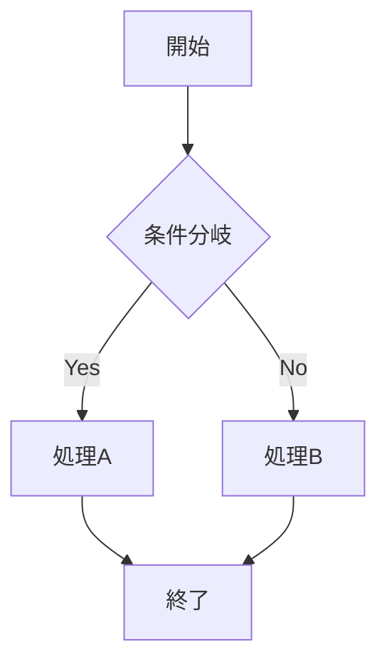

# 設計書-Javaプログラム突合 AIレビュアー 仕様書

**バージョン: 0.7.0**

## 1. 概要

### 1.1 目的

設計書（Excel形式）とプログラムコードをAIで突合し、整合性を検証するWebアプリケーション。
レビュー結果をマークダウン形式で出力する。

### 1.2 解決する課題

- 設計書とコードの乖離を早期発見
- 人手によるレビュー工数の削減
- レビュー品質の均一化

### 1.3 システム構成

```
┌─────────────────────────────────────────────────────────────┐
│                      フロントエンド                          │
│           (Vite + React + TypeScript + Tailwind CSS)        │
│                                                             │
│  設定ファイル (reviewer-config.md) 管理                      │
│  - ユーザーLLM設定（Bedrock/Anthropic/OpenAI）              │
│  - 設計書種別と注意事項                                      │
└─────────────────────────────────────────────────────────────┘
                              │
                              ▼
┌─────────────────────────────────────────────────────────────┐
│                       バックエンド                           │
│                    (Python / FastAPI)                       │
│  ┌─────────────────┐  ┌─────────────────┐  ┌─────────────┐ │
│  │   MarkItDown    │  │ add-line-numbers │  │ LLMサービス │ │
│  │  (Excel→MD変換) │  │  (行番号付与)    │  │ (抽象化)    │ │
│  └─────────────────┘  └─────────────────┘  └─────────────┘ │
│                                                   │         │
│                              ┌────────────────────┼─────┐   │
│                              │                    │     │   │
│                              ▼                    ▼     ▼   │
│                       ┌──────────┐ ┌──────────┐ ┌────────┐ │
│                       │ Bedrock  │ │Anthropic │ │ OpenAI │ │
│                       │ Service  │ │ Service  │ │Service │ │
│                       └──────────┘ └──────────┘ └────────┘ │
└─────────────────────────────────────────────────────────────┘
                              │
       ┌──────────────────────┼──────────────────────┐
       ▼                      ▼                      ▼
┌─────────────┐       ┌─────────────┐       ┌─────────────┐
│ AWS Bedrock │       │  Anthropic  │       │   OpenAI    │
│(Claude系)   │       │   API       │       │    API      │
└─────────────┘       └─────────────┘       └─────────────┘
```

**LLM呼び出しの優先順位:**

1. リクエストにユーザーLLM設定が含まれる場合 → その設定を使用
2. リクエストにLLM設定が含まれない場合 → システムLLM（環境変数のBedrock）を使用

### 1.4 ドメイン設計

#### 1.4.1 ドメイン構成

| 項目 | 値 |
|------|-----|
| ドメイン名 | example.com |
| レコードタイプ | A (エイリアス) |
| ターゲット | Application Load Balancer |

#### 1.4.2 DNS設定（Route 53）

```
example.com
  ├── タイプ: A（エイリアス）
  ├── エイリアスターゲット: ALB の DNS 名
  └── ルーティングポリシー: シンプル
```

#### 1.4.3 URL構成

| パス | 用途 | 配信元 |
|------|------|--------|
| https://example.com/ | フロントエンド（HTML/CSS/JS） | nginx（静的ファイル） |
| https://example.com/api/* | バックエンドAPI | nginx → uvicorn（プロキシ） |
| https://example.com/health | ヘルスチェック（ALB用） | nginx → uvicorn（認証除外） |
| https://example.com/api/test-connection | LLM接続テスト | nginx → uvicorn（プロキシ） |

#### 1.4.4 セキュリティ

| 項目 | 設定 |
|------|------|
| プロトコル | HTTPS のみ（HTTP は 443 にリダイレクト） |
| 証明書 | AWS Certificate Manager (ACM) |
| 認証 | Basic認証（nginx レベル） |
| CORS | `https://example.com` のみ許可（本番環境） |

---

## 2. 機能要件

### 2.1 入力ファイル

| 項目 | 説明 | 形式 | 制限 |
|------|------|------|------|
| 設計書 | レビュー対象の設計書（複数選択可） | Excel (.xlsx, .xls) | 各ファイル最大10MB |
| プログラム | 設計書に対応するコード（複数選択可） | 任意のテキストファイル | 各ファイル最大5MB |

**複数ファイル選択時の動作:**

- 設計書・プログラムそれぞれ複数ファイルを同時に選択可能
- 各ファイルは順次変換APIに送信され、結果が連結される
- 連結時は各ファイルにレベル1見出し（`# 設計書: ファイル名` / `# プログラム: ファイル名`）が付与される
- ファイル間は水平線（`---`）で区切られる

### 2.2 前処理機能

#### 2.2.1 設計書変換（Excel → Markdown）

ExcelファイルをMarkdown形式に変換する。以下の変換ツールから選択可能。

**利用可能な変換ツール:**

| ツール名 | 表示名 | 説明 | 用途 |
|---------|--------|------|------|
| [MarkItDown](https://github.com/microsoft/markitdown) | MarkItDown | Microsoft製の汎用ファイル→Markdown変換ツール | 汎用的な変換（デフォルト） |
| [excel2md](../../excel2md/) | excel2md (CSV) | Excelの印刷領域を解析してCSV形式で出力するツール（v1.7）。概要セクションあり、検証用メタデータなし | AI向けの構造化データ出力（トークン数削減） |
| [excel2md](../../excel2md/) | excel2md (CSV+Mermaid) | excel2md (CSV) に加え、シェイプからMermaidフローチャートを出力するツール（v1.7） | フローチャートを含む設計書向け |

| 項目 | 内容 |
|------|------|
| 処理場所 | バックエンド（Python） |
| 入力 | Excel (.xlsx, .xls) |
| 出力 | Markdown形式テキスト |
| 処理内容 | 選択したツールに応じてExcelをMarkdown形式に変換 |

**MarkItDown変換例:**

```markdown
## Sheet1

| 列A | 列B | 列C |
|-----|-----|-----|
| データ1 | データ2 | データ3 |
```

**excel2md (CSV) 変換例:**

excel2md v1.7をCSVマークダウン出力モードで実行する。概要セクションは出力し、検証用メタデータは出力しない（`--no-csv-include-metadata`）。

````markdown
# CSV出力: spec.xlsx

## 概要

### ファイル情報

- 元のExcelファイル名: spec.xlsx
- シート数: 1
- 生成日時: 2024-12-10 14:30:00

### このファイルについて

このCSVマークダウンファイルは、AIがExcelの内容を理解できるよう...

---

## Sheet1

```csv
列A,列B,列C
データ1,データ2,データ3
```
````

**excel2md (CSV+Mermaid) 変換例:**

excel2md (CSV) に加え、シェイプからMermaidフローチャートを出力する（`--mermaid-enabled --mermaid-detect-mode shapes`）。

````markdown
# CSV出力: spec.xlsx

## Sheet1



```csv
列A,列B,列C
データ1,データ2,データ3
```
````

※ excel2mdの詳細な仕様については [excel2md/v1.7/spec.md](../../excel2md/v1.7/spec.md) を参照

#### 2.2.2 プログラム変換（行番号付与）

[add-line-numbers](https://github.com/elvezjp/add-line-numbers) を使用してテキストファイルに行番号を付与する。

| 項目 | 内容 |
|------|------|
| 処理場所 | バックエンド（Python） |
| 入力 | 任意のテキストファイル |
| 出力 | 行番号付きテキスト |
| 処理内容 | add-line-numbers の `add_line_numbers_to_file` 関数を使用して行番号を付与 |
| 行番号形式 | 右揃え4桁 + コロン + スペース（例: `   1: `） |

**変換例:**

```
   1: function calculateTotal(items) {
   2:   let total = 0;
   3:   for (const item of items) {
   4:     total += item.price;
   5:   }
   6:   return total;
   7: }
```

※ 行番号を付与することで、AIがレビュー結果で具体的な行を指摘できる

#### 2.2.3 設計書メタデータ（役割・種別）

設計書ファイルには、Markdown変換時に役割と種別のメタデータを付与する。
これらのメタデータは変換後のマークダウンにファイル名と共に記載する。
役割と種別について特別な処理は実装しないが、システムプロンプトに指示を記載することでAIが活用できるようにする。

**役割:**

複数の設計書をアップロードした場合、メイン設計書を1つだけ選択できる。選択されなかった設計書は「参照」として扱われる。

| 値 | 説明 |
|-----|------|
| メイン | AIが突合レビューの主対象とする設計書（1つのみ選択可能） |
| 参照 | 必要に応じてAIが参照する補助的な設計書（コーディング規約、ガイドライン等） |

※ 設計書が1つだけの場合は、自動的にメインとして扱う

**種別:**

設計書の内容・用途を示す分類。AIがレビュー時に文書の性質を理解するための情報として使用できる。

| 種別 | 説明 |
|------|------|
| 設計書 | 標準的な機能・仕様を記述した文書 |
| 要件定義書 | システムに求められる要件を定義した文書 |
| 処理ロジック | 具体的な処理手順やアルゴリズムを記述した文書 |
| 処理フロー | 処理の流れを図や手順で示した文書（ただし図形はマークダウン変換対象外） |
| コーディング規約 | コードの書き方に関するルールを定めた文書 |
| ネーミングルール | 変数名・関数名・クラス名等の命名規則を定めた文書 |
| 製造ガイド | 実装時の注意事項や手順を示したガイドライン文書 |
| 設計ガイド | 設計時の方針や注意事項を示したガイドライン文書 |
| 設計書とソースのマッピング | 設計書の項目とソースコードの対応関係を示した文書 |

**種別ごとの注意事項:**

種別に応じた注意事項を設定し、マークダウン変換時に自動付与できる。注意事項はシステムプロンプトのデフォルト値で「各設計書ファイルに付与されている注意事項も参照すること」と指示されており、AIがレビュー時に活用する。

| 種別 | デフォルト注意事項 |
|------|-------------------|
| 設計書 | 機能仕様が正しく実装されているかを確認してください |
| 要件定義書 | 要件が漏れなく実装されているかを確認してください |
| 処理ロジック | 処理手順やアルゴリズムが正しく実装されているかを確認してください |
| 処理フロー | 処理の流れが正しく実装されているかを確認してください |
| コーディング規約 | コードがこの規約に準拠しているかを確認してください |
| ネーミングルール | 変数名・関数名・クラス名がこのルールに準拠しているかを確認してください |
| 製造ガイド | このガイドラインに従って実装されているかを確認してください |
| 設計ガイド | この設計方針に従って実装されているかを確認してください |
| 設計書とソースのマッピング | このマッピングに基づいて突合を行ってください |

**マークダウン変換時の動作:**

変換後のマークダウンに、種別に応じた注意事項を自動付与する：

```markdown
# 設計書: sample.xlsx
- 役割: メイン
- 種別: 設計書
- 注意事項: 機能仕様が正しく実装されているかを確認してください

(変換内容)

---

# 設計書: coding-rules.xlsx
- 役割: 参照
- 種別: コーディング規約
- 注意事項: コードがこの規約に準拠しているかを確認してください

(変換内容)
```

**設計書種別の設定管理:**

設計書種別と注意事項は、設定ファイル（`reviewer-config.md`）の `specTypes` セクションで管理される（詳細は「2.6 設定ファイル管理」を参照）。

| 管理方法 | 説明 |
|---------|------|
| 設定ファイル | `reviewer-config.md` の `specTypes` セクションにテーブル形式で定義 |
| 設定モーダル | 設定ファイルから読み込んだ内容を表示（読み取り専用） |
| デフォルト値 | 設定ファイルが未設定の場合、デフォルトの9種別を使用 |

**設定ファイルでの定義形式:**

```markdown
## specTypes

| type | note |
|------|------|
| 設計書 | 機能仕様が正しく実装されているかを確認してください |
| 要件定義書 | 要件が漏れなく実装されているかを確認してください |
| 処理ロジック | 処理手順やアルゴリズムが正しく実装されているかを確認してください |
| 処理フロー | 処理の流れが正しく実装されているかを確認してください |
| コーディング規約 | コードがこの規約に準拠しているかを確認してください |
| ネーミングルール | 変数名・関数名・クラス名がこのルールに準拠しているかを確認してください |
| 製造ガイド | このガイドラインに従って実装されているかを確認してください |
| 設計ガイド | この設計方針に従って実装されているかを確認してください |
| 設計書とソースのマッピング | このマッピングに基づいて突合を行ってください |
```

※ 設定ファイル未設定時はデフォルト値が使用される

#### 2.2.4 Markdown整理（AI整理機能）

設計書のフォーマットが揺れていると、SpecItem抽出や検索の再現性が下がる。先にAIで「整理済みMarkdown」へ正規化する工程を挟むことで、後工程の安定性を高める。

| 項目 | 内容 |
|------|------|
| 処理場所 | バックエンド（Python） + LLM |
| 入力 | 変換後のMarkdown + 整理方針 |
| 出力 | 整理済みMarkdown |
| 処理内容 | AIを使用して、原文の意味を変えずに構造を整理する |

**目的:**

- 入力のばらつきを抑え、一定の観点で構造化したMarkdownを作る
- SpecItem抽出や検索の前処理として安定したテキストを提供する
- 原文トレース可能性を担保しつつ、運用負荷を下げる

**非目的:**

- 内容の要約や解釈の追加はしない（改変禁止）
- 実装の詳細設計や工数見積もりまでは扱わない

**整理方針テンプレ例:**

```
以下のルールでMarkdownを構造化してください。
- 要約や推測は禁止。原文の意味を変えない。
- 内容を「要件」「条件」「例外」「境界値」「前提」に再分類する。
- 見出しは原文の章立てを維持し、各項目に原文参照IDを付与する。
- 表は「入力/条件/出力/備考」の構造に変換する。
```

**参照ID形式:**

整理後Markdownには原文との対応を追跡できるよう参照IDを付与する。

| 形式 | 例 | 説明 |
|------|-----|------|
| 章/節/段落 | `[ref:S2-1-P3]` | セクション2の小節1の3番目の段落 |
| 表行 | `[ref:T4-R7]` | 表4の7行目（ヘッダ除く） |
| 原文引用付き | `[ref:S2-1-P3] 原文の該当文...` | 参照IDと原文の引用 |

**失敗パターンと対応:**

| パターン | 検出方法 | ユーザーへの表示 | 対応 |
|---|---|---|---|
| トークン超過 | API応答コード / 入力文字数の事前チェック | 「入力が長すぎます」 | 事前に推定トークン数を表示 |
| APIエラー（5xx） | API応答コード | 「サーバーエラーが発生しました」 | 自動リトライ（最大1回） |
| タイムアウト | 応答時間 > 180秒 | 「タイムアウトしました」 | 自動リトライ（最大1回） |
| 改変検出 | 原文との差分率 > 閾値 | 「AIが原文を大きく改変した可能性があります」 | Diff表示で確認を促す |
| 参照ID欠落 | 出力に `[ref:` が含まれない | 「一部の項目に参照IDが付与されていません」 | 警告表示のみ |

**ファイル単位の整理実行:**

設計書1ファイルごとにAPIを実行し、完了後に再結合する方式を採用。これにより：

- メタ情報（ファイル名、役割、種別、注意事項）がAI整理の対象にならない
- 各ファイルの整理結果が個別に反映され、レビュー実行に正しく渡される
- ファイルごとに異なるツール（markitdown, excel2md等）に応じた前処理が可能

**ツールごとの前処理:**

| ツール | 前処理内容 |
|--------|-----------|
| markitdown | なし（そのまま整理） |
| excel2md | 概要セクション（自動生成される説明文）を削除してから整理 |
| excel2md_mermaid | 概要セクションを削除してから整理 |

### 2.3 システムプロンプト設定

AIへの指示内容をユーザーがカスタマイズ可能。以下の4項目を編集できる：

| 項目 | 説明 | デフォルト値 |
|------|------|-------------|
| 役割 | AIの役割定義 | あなたは設計書とプログラムコードを突合し、整合性を検証するレビュアーです。 |
| 目的 | タスク内容とレビュー観点 | （後述） |
| 出力形式 | 出力フォーマット指定 | （後述） |
| 注意事項 | 制約・判断基準 | （後述） |

**目的のデフォルト値:**

```
メイン設計書とプログラムを突合して、設計書の内容がプログラムに正しく実装されているかを検証し、差異や問題点を報告してください。

以下の観点でレビューを行ってください：
1. 網羅性: 設計書に記載された処理や機能が実装されているか
2. 整合性: 関数名・変数名・データ形式・処理フローが一致しているか
3. 例外処理: 設計書に記載されたエラー処理が実装されているか
4. 制約条件: 設計書に記載された制約条件がコードに反映されているか
```

**出力形式のデフォルト値:**

```
マークダウン形式で、以下の順に出力してください：
1. サマリー（突合日時、ファイル名、総合判定）
2. 突合結果一覧（テーブル形式）
3. 詳細（問題点と推奨事項）
```

**注意事項のデフォルト値:**

```
- メイン設計書の内容について突合してください。
- 判定は「OK」「NG」「要確認」の3段階で行ってください
- 重要度が高い問題を優先して報告してください。
- 設計書を引用する際は、見出し番号や項目番号を明示してください。
- プログラムを引用する際は、行番号を必ず添えてください。
- 各設計書の冒頭に記載されている役割、種別、注意事項を考慮してください。
- メイン以外の設計書は必要な場合に参照してください。
```

### 2.4 レビュー実行

変換済みの設計書（Markdown）とプログラム（行番号付き）、およびシステムプロンプトをLLMに送信し、突合レビューを実行する。

#### 2.4.1 複数回実行

レビュー実行ボタンを1回押すと、同じ入力（設計書・プログラム・システムプロンプト）で2回のレビューを直列実行する。

**目的:**

- LLMの出力は同じ入力でも毎回異なる結果になる可能性がある
- 複数回実行することで、レビュー結果の信頼性・網羅性を向上
- 1回目で見落とした指摘が2回目で検出される可能性がある

**実行方式:**

| 項目 | 内容 |
|------|------|
| 実行回数 | 2回（固定） |
| 実行方式 | 直列実行（1回目完了後に2回目を実行） |
| レビュー実行日時 | 各回のAPIリクエスト送信時点の日時（1回目・2回目で個別） |

**UI表示:**

| 場所 | 表示内容 |
|------|----------|
| レビュー実行ボタン下 | 「※ 同じ設定でレビューを2回実行します。それぞれ個別に結果を確認できます。」 |
| ローディング画面 | 「AIがレビューを実行中...」「N回目のレビューを実行しています」 |

#### 2.4.2 LLM呼び出しの優先順位

1. リクエストにユーザーLLM設定が含まれる場合 → ユーザー指定のプロバイダー（Bedrock/Anthropic/OpenAI）を使用
2. リクエストにLLM設定が含まれない場合 → システムLLM（環境変数で設定されたBedrock）を使用

### 2.5 出力

マークダウン形式のレビューレポートを出力。2回分の結果をタブ切り替えで表示し、以下の操作が可能：

- 画面上でのプレビュー表示（タブ切り替えで1回目・2回目を個別に表示）
- クリップボードへのコピー（各回ごと）
- ファイルとしてダウンロード（各回ごと）
- レビュー実行データ一式ダウンロード（ZIP形式、各回ごと）

#### 2.5.0 結果表示（タブ切り替え）

2回分のレビュー結果をタブ切り替えで表示する。各タブには独立した結果一式（簡易判定、レビュー情報、詳細レポート、一式ダウンロード）が含まれる。

**タブUI:**

| 項目 | 内容 |
|------|------|
| タブ位置 | レビュー結果画面のヘッダー内（「レビュー結果」見出しと「戻る」ボタンの下） |
| タブラベル | 「1回目」「2回目」 |
| 説明文 | 「※ 同じ設定で2回レビューを実行しました。それぞれ個別に結果を確認できます。」 |
| デフォルト表示 | 1回目のタブがアクティブ |

**各タブの内容:**

| セクション | 説明 |
|-----------|------|
| 簡易判定 | キーワードに基づく判定結果（OK/要確認/問題あり） |
| レビュー情報 | バージョン、モデルID、実行日時、トークン数、対象ファイル一覧 |
| 詳細レポート | AIによるレビュー結果（コピー・ダウンロードボタン付き） |
| 一式ダウンロード | ZIP形式でレビュー実行データをダウンロード |

**レポート構成:**

レビューレポートは以下の2部構成で出力される：

1. **レビュー情報（バックエンドで自動付与）**: レビュー実行時のメタ情報
2. **レビュー結果（LLM出力）**: AIによるレビュー内容

**レビュー情報に含まれる項目:**

| 項目 | 説明 |
|------|------|
| バージョン | アプリケーションのバージョン番号 |
| モデルID | 使用したAIモデルのID |
| レビュー実行日時 | レビューAPIが実行された日時（YYYY/MM/DD HH:MM:SS形式） |
| 設計書 | 対象の設計書ファイル一覧（役割・種別・ツール付き） |
| プログラム | 対象のプログラムファイル一覧 |
| 入力トークン数 | Bedrock APIに送信されたトークン数 |
| 出力トークン数 | Bedrock APIから返されたトークン数 |

※ レビュー情報はバックエンドで自動的に付与され、LLMの出力には依存しない
※ トークン数はBedrockのレスポンスから取得。取得できない場合は推定値を使用

**出力形式例:**

```markdown
# 設計書-Javaプログラム突合 AIレビュアー レビューレポート

## レビュー情報

| 項目 | 内容 |
|------|------|
| バージョン | v0.7.0 |
| モデルID | claude-haiku-4-5-20251001 |
| レビュー実行日時 | 2024/12/21 14:30 |
| 入力トークン数 | 12,345 |
| 出力トークン数 | 1,234 |

### 設計書

| ファイル名 | 役割 | 種別 | ツール |
|-----------|------|------|--------|
| spec.xlsx | メイン | 設計書 | MarkItDown |
| api-spec.xlsx | 参照 | 要件定義書 | excel2md |

### プログラム

| ファイル名 |
|-----------|
| main.py |
| util.py |

---

## AIによるレビュー結果

以下はAIが出力したレビュー結果です。

### 突合結果一覧

| # | 項目 | 判定 | 詳細 |
|---|------|------|------|
| 1 | ユーザー認証機能 | OK | 設計書通りに実装 |
| 2 | 関数名 | NG | 設計書: checkUser / 実装: validateUser |

### 問題点

#### 1. 関数名の不一致 (重要度: 中)
- 設計書: `checkUser()`
- 実装: `validateUser()` (42行目)
- 推奨: 設計書に合わせて関数名を変更

### 推奨事項
...
```

#### 2.5.1 レビュー実行データ一式ダウンロード

レビュー実行時の入出力データをZIP形式で一括ダウンロードできる。レビュー実行の状況を再現・記録するために使用する。各タブ（1回目・2回目）ごとに個別にダウンロード可能。

**ダウンロードファイル名:**

`YYYYMMDD-HHMM-NNN-review-data.zip`

| 項目 | 説明 |
|------|------|
| YYYYMMDD-HHMM | レビュー実行日時（ブラウザのローカルタイム、秒なし） |
| NNN | 実行番号（3桁ゼロ埋め: 001, 002, ...） |

例:
- 1回目: `20251228-1430-001-review-data.zip`
- 2回目: `20251228-1430-002-review-data.zip`

※ 再ダウンロードしても同じファイル名になる（レビュー実行日時は固定）

**ZIP内の同梱ファイル:**

| ファイル名 | 説明 |
|-----------|------|
| README.md | レビュー情報と同梱ファイルの説明 |
| system-prompt.md | システムプロンプト（役割・目的・出力形式・注意事項） |
| spec-markdown.md | 変換後の設計書（マークダウン形式） |
| code-numbered.txt | 行番号付きプログラム |
| review-result.md | AIレビュー結果 |

**README.mdの内容:**

```markdown
# レビュー実行データ（1回目）

このZIPファイルには、AIレビュー実行時の入出力データが含まれています。

## レビュー情報

| 項目 | 内容 |
|------|------|
| バージョン | v0.7.0 |
| モデルID | claude-3-5-sonnet-20241022 |
| レビュー実行日時 | 2024/12/28 14:30 |
| 実行回数 | 1回目 |
| 入力トークン数 | 12,345 |
| 出力トークン数 | 1,234 |

### 設計書

  - spec.xlsx（メイン / 設計書 / MarkItDown）
  - api-spec.xlsx（参照 / 要件定義書 / excel2md）

### プログラム

  - main.py
  - util.py

## 同梱ファイル

| ファイル名 | 説明 |
|-----------|------|
| README.md | このファイル（レビュー情報とファイル説明） |
| system-prompt.md | システムプロンプト（役割・目的・出力形式・注意事項） |
| spec-markdown.md | 変換後の設計書（マークダウン形式） |
| code-numbered.txt | 行番号付きプログラム |
| review-result.md | AIレビュー結果 |
```

### 2.6 設定ファイル管理

ユーザー独自のLLM設定と設計書種別を管理するための設定ファイル機能。

設定ファイルジェネレーターの詳細は [config-file-generator-spec.md](config-file-generator-spec.md) を参照。

#### 2.6.1 設定ファイル概要

**方式概要:**

- 設定ファイル（`reviewer-config.md`）は設定ファイルジェネレーター（`/config-file-generator/`）で生成する
- ユーザーがローカルPCに設定ファイルを保存・管理する
- 使用時にファイルをアップロードまたはドラッグ&ドロップで読み込む
- オプションでローカルストレージにも保存可能（平文保存、ユーザーの選択による）

**ファイル名:** `reviewer-config.md`

**セキュリティ特性:**

| 観点 | 説明 |
|------|------|
| サーバー側永続化 | なし（リクエスト時のみ使用） |
| APIキー管理責任 | ユーザー側（ローカルファイル） |
| ローカルストレージ保存時 | 平文保存（ユーザーが選択した場合のみ） |
| 暗号化機構 | 不要（実装・運用の簡素化） |

**ローカルストレージ保存のリスクと注意事項:**

- ローカルストレージに保存した場合、同一オリジンからのみアクセス可能だが、ブラウザ拡張からは読み取られる可能性がある
- 共有PCでの利用は非推奨であることをUIで明示する
- 保存した設定をクリアする機能を提供する

**許容する限界:** ブラウザ拡張が入力時点でキーストロークを監視する攻撃や、ローカルストレージを読み取る攻撃は防げない（ユーザーへの注意喚起で対応）

#### 2.6.2 設定ファイルの構造

設定ファイルはMarkdown形式で記述する。以下の4つのセクションで構成される：

**キー命名規則:**

- 基本はキャメルケース（camelCase）で記述する
- スネークケース（snake_case）も許容する（後方互換性のため）
- 例: `apiKey` / `api_key`, `accessKeyId` / `access_key_id`, `maxTokens` / `max_tokens`

- `info`: 設定ファイル情報（バージョン、作成日時）
- `llm`: LLMプロバイダー設定（1つのプロバイダーの認証情報と複数モデル）
- `specTypes`: 設計書種別と注意事項
- `systemPrompts`: システムプロンプトのプリセット定義

**設定ファイル全体構造:**

```markdown
# Reviewer Config

## info

- version: v0.4.0
- created_at: 2025-01-15T10:30:00+09:00

## llm

- provider: bedrock
- accessKeyId: YOUR_ACCESS_KEY_ID
- secretAccessKey: YOUR_SECRET_ACCESS_KEY
- region: us-east-1
- maxTokens: 16384
- models:
  - anthropic.claude-4-5-sonnet-20241022-v2:0
  - anthropic.claude-4-5-haiku-20241022-v1:0

## specTypes

| type | note |
|------|------|
| 設計書 | 機能仕様が正しく実装されているかを確認してください |
| 要件定義書 | 要件が漏れなく実装されているかを確認してください |
| 処理ロジック | 処理手順やアルゴリズムが正しく実装されているかを確認してください |
| 処理フロー | 処理の流れが正しく実装されているかを確認してください |
| コーディング規約 | コードがこの規約に準拠しているかを確認してください |
| ネーミングルール | 命名規則に従っているかを確認してください |
| 製造ガイド | このガイドラインに従って実装されているかを確認してください |
| 設計ガイド | この設計方針に従って実装されているかを確認してください |
| 設計書とソースのマッピング | このマッピングに基づいて突合を行ってください |

## systemPrompts

### 標準レビュープリセット

#### role

あなたは設計書とプログラムコードを突合し、整合性を検証するレビュアーです。

#### purpose

設計書の内容がプログラムに正しく実装されているかを検証し、差異や問題点を報告してください。

以下の観点でレビューを行ってください：
1. 機能網羅性: 設計書に記載された機能がコードに実装されているか
2. 仕様整合性: 関数名・変数名・データ型・処理フローが設計書と一致しているか
3. エラー処理: 設計書に記載されたエラー処理が実装されているか
4. 境界値・制約: 設計書に記載された制約条件がコードに反映されているか

#### format

マークダウン形式で、以下の順に出力してください：
1. サマリー（突合日時、ファイル名、総合判定）
2. 突合結果一覧（テーブル形式）
3. 詳細（問題点と推奨事項）

#### notes

- メイン設計書の内容について突合してください。
- 判定は「OK」「NG」「要確認」の3段階で行ってください
- 重要度が高い問題を優先して報告してください。
- 設計書を引用する際は、見出し番号や項目番号を明示してください。
- プログラムを引用する際は、行番号を必ず添えてください。
- 各設計書の冒頭に記載されている役割、種別、注意事項を考慮してください。
- メイン以外の設計書は必要な場合に参照してください。
```

**systemPromptsの補足:**

- `systemPrompts` が存在する場合は、そのプリセットがデフォルトのシステムプロンプトより優先される
- 見出し+セクション形式で記述し、複数行テキストをそのまま記載可能
- `### プリセット名` でプリセットを定義し、`#### フィールド名` で各項目を記述

#### 2.6.3 プロバイダー別のLLM設定フォーマット

**Anthropic:**

```markdown
## llm

- provider: anthropic
- apiKey: YOUR_ANTHROPIC_API_KEY
- maxTokens: 16384
- models:
  - claude-sonnet-4-20250514
  - claude-haiku-4-20250514
```

**Bedrock:**

```markdown
## llm

- provider: bedrock
- accessKeyId: YOUR_ACCESS_KEY_ID
- secretAccessKey: YOUR_SECRET_ACCESS_KEY
- region: us-east-1
- maxTokens: 16384
- models:
  - anthropic.claude-4-5-sonnet-20241022-v2:0
  - anthropic.claude-4-5-haiku-20241022-v1:0
```

**OpenAI:**

```markdown
## llm

- provider: openai
- apiKey: YOUR_OPENAI_API_KEY
- maxTokens: 16384
- models:
  - gpt-5.2
  - gpt-5.2-chat-latest
  - gpt-5.2-pro
  - gpt-5.1
  - gpt-4o
  - gpt-4o-mini
```

**各プロバイダーの必須フィールド:**

| プロバイダー | 必須フィールド |
|-------------|---------------|
| anthropic | `apiKey`, `maxTokens`, モデルリスト |
| openai | `apiKey`, `maxTokens`, モデルリスト |
| bedrock | `accessKeyId`, `secretAccessKey`, `region`, `maxTokens`, モデルリスト |

#### 2.6.4 設定状態の管理

設定ファイルとローカルストレージの関係を以下のように管理する。

**状態の種類:**

| 状態 | ローカルストレージ | メモリ（現在の設定） | 動作 |
|------|------------------|-------------------|------|
| 初期状態 | 空 | null | システムLLMを使用 |
| ファイルアップロード後（未保存） | 空 | アップロード内容 | メモリの設定を使用。リロードで消える |
| 保存済み（アップロードなし） | 保存済み設定 | ページ読込時に復元 | 保存済み設定を使用 |
| 保存済み + 新規アップロード | 古い保存済み設定 | 新しいアップロード内容 | メモリ優先。リロードで保存済みに戻る |

**ページ読込時の動作:**

1. ローカルストレージに保存済み設定があるか確認
2. 保存済み設定がある場合:
   - メモリに復元
   - UIに設定内容を反映（プロバイダー、モデル一覧、設計書種別）
   - 「ブラウザに設定が保存されています」と表示
3. 保存済み設定がない場合:
   - 初期状態のUIを表示

**システムプロンプトプリセットの復元:**

- 直近で選択したプリセット名をローカルストレージに保存し、次回ロード時に復元する
- 設定ファイルに `systemPrompts` がある場合は、そのプリセット一覧を優先して表示する

**ファイルアップロード時の動作:**

1. アップロードしたファイルをパースしてメモリに格納
2. UIに新しい設定内容を反映
3. ローカルストレージは更新しない（明示的に「保存」ボタンを押すまで）
4. 保存状態の表示を更新:
   - 保存済み設定がある場合: 「変更した設定はブラウザには保存されていません」と表示
   - 保存済み設定がない場合: 特に表示なし

**保存状態の表示:**

UIに現在の保存状態を表示する:

| 状態 | 表示 |
|------|------|
| 保存済み設定あり（変更なし） | 「ブラウザに設定が保存されています（次回自動読込）」 |
| 保存済み設定あり + 新規アップロード | 「現在の設定はブラウザに保存されていません」 |
| 保存済み設定なし | 表示なし |

#### 2.6.5 モデル選択

設定ファイルで定義された複数モデルから、使用するモデルを選択できる。

**ローカルストレージへの保存:**

- モデル選択は設定ファイルとは別に、ローカルストレージに `provider:model` の形式で保存する
- 例: `anthropic:claude-sonnet-4-20250514`, `bedrock:anthropic.claude-4-5-sonnet-20241022-v2:0`

**モデル選択のフォールバックロジック:**

1. ローカルストレージに保存済みの `provider:model` が、現在の設定ファイルに存在する場合 → その組み合わせを使用
2. 保存済みの組み合わせが設定ファイルに存在しない場合 → 設定ファイルのモデルリストの先頭を使用
3. 設定ファイルが未設定、またはモデルリストが空の場合 → システムLLMを使用

**システムLLMへのフォールバック:**

- フロントエンドはシステムLLMの情報を持たない
- API実行時にLLM設定（`provider`, `model`, 認証情報）が渡されなかった場合、バックエンドはシステムLLM（環境変数で設定されたBedrock）を使用する
- 将来的にはユーザーのLLM設定を必須にする可能性がある

**モデル選択変更時の動作:**

- モデル選択を変更した場合、選択したモデルをローカルストレージに自動保存する
- 保存形式: `provider:model`（例: `anthropic:claude-sonnet-4-20250514`）
- 設定ファイル全体の保存とは独立して、モデル選択のみ自動保存される

### 2.7 プリセットライブラリ

用途に応じたシステムプロンプトと設計書種別の組み合わせをワンクリックで適用できるプリセット機能。

#### 2.7.1 概要

プリセットライブラリは、レビュー対象の技術領域（React/TypeScript、SQL、OpenAPI等）に最適化されたシステムプロンプトと設計書種別の設定を提供する。

**主な機能:**

- 組み込みプリセット: アプリケーションに内蔵された7種類のプリセット
- ワンクリック適用: 選択したプリセットでシステムプロンプトと設計書種別を一括更新
- 検索・フィルタ: タグやキーワードでプリセットを検索
- 設定ファイルプリセットとの併用: 設定ファイルで定義したカスタムプリセットも利用可能

#### 2.7.2 組み込みプリセット一覧

| ID | 名前 | 説明 | タグ |
|----|------|------|------|
| react-ts | React/TypeScript レビュー | React + TypeScript プロジェクト向け | フロントエンド, React, TypeScript |
| sql-db | SQL/データベース レビュー | SQL・データベース設計のレビュー向け | バックエンド, データベース, SQL |
| openapi | OpenAPI/REST API レビュー | REST API仕様と実装の突合向け | API, OpenAPI, REST |
| test-code | テストコード レビュー | テストコードの網羅性・品質確認向け | テスト, 品質保証 |
| security | セキュリティ重視 レビュー | セキュリティ観点での脆弱性チェック向け | セキュリティ, 脆弱性 |
| error-handling | エラー処理 レビュー | 例外処理・エラーハンドリングの確認向け | エラー処理, 例外 |
| batch-etl | バッチ/ETL処理 レビュー | バッチ処理・ETLジョブの設計書突合向け | バッチ, ETL, データ処理 |

**各プリセットの構成:**

| 項目 | 説明 |
|------|------|
| id | プリセット識別子（一意） |
| name | 表示名 |
| description | プリセットの説明 |
| tags | 検索・フィルタ用タグ（複数可） |
| systemPrompt | システムプロンプト設定（role, purpose, format, notes） |
| specTypes | 設計書種別と注意事項の配列 |

#### 2.7.3 プリセット適用時の動作

プリセットを適用すると、以下の設定が更新される：

1. **システムプロンプト**: role, purpose, format, notes の4項目
2. **設計書種別**: プリセットに含まれる種別と注意事項で上書き

**適用後の状態:**

- メイン画面のシステムプロンプトセクションに反映
- 設計書ファイルリストの種別ドロップダウンにプリセットの種別が表示
- トースト通知: 「プリセット「{プリセット名}」を適用しました（設計書種別も更新されました）」

#### 2.7.4 プリセット名の衝突回避

設定ファイルで定義したカスタムプリセットと組み込みプリセットの名前が重複する可能性があるため、以下のルールで衝突を回避する：

**サフィックス付与:**

- 設定ファイルから読み込んだプリセットには、名前の末尾に `(設定ファイル)` を自動付与
- 例: 設定ファイルに「標準レビュー」というプリセットがある場合 → 「標準レビュー (設定ファイル)」として表示

**優先順位:**

- プリセットセレクターには組み込みプリセットが先に表示され、設定ファイルのプリセットは後に表示される
- 同名のプリセットが存在する場合でも、サフィックスにより区別可能

---

## 3. 画面構成

### 3.1 メイン画面

設計書・プログラムのアップロード、変換、システムプロンプト設定、レビュー実行を行う画面。

**構成要素:**

1. **ヘッダー**
   - タイトル: 「設計書-Javaプログラム突合 AIレビュアー」
   - 設定ボタン（歯車アイコン）

2. **設計書セクション**
   - ファイル選択ボタン（複数選択対応）
   - 選択中ファイル名表示（複数ファイルはカンマ区切り）
   - 詳細設定（ファイル選択後に表示）
     - 一括設定: 全ファイルに同じツールを一括適用するボタン
     - 各ファイルごとの設定:
       - メイン: ラジオボタンでメイン設計書を1つだけ選択（最初のファイルがデフォルトでメイン）
       - 種別: 設計書/要件定義書/処理ロジック/処理フロー/コーディング規約/ネーミングルール/製造ガイド/設計ガイド/設計書とソースのマッピング（デフォルト: 設計書）
       - ツール: 変換ツール選択（MarkItDown / excel2md (CSV) / excel2md (CSV+Mermaid)、デフォルト: MarkItDown）
     - **変更時の動作**: 変換済みの場合、メイン・種別・ツールを変更すると変換結果がクリアされ、再変換が必要になる
   - 注記テキスト: 「※ メイン設計書を対象に突合し、それ以外は必要に応じて参照されます。種別ごとの注意事項が変換後マークダウンに付与されます。特別な処理を指示したい場合はシステムプロンプトを編集してください。」
   - 「マークダウンに変換」ボタン
   - 「ダウンロード」ボタン（変換後のMDファイル、ファイル名: `spec-markdown.md`）
   - ステータス表示（変換中/変換済み）
   - ツール説明リスト:
     - MarkItDown: Microsoft MarkItDownの仕様に準拠した変換を行います
     - excel2md (CSV): シート全体をCSVブロックとして変換します（トークン数削減）
     - excel2md (CSV+Mermaid): CSVブロック + Mermaidフローチャートを出力します
   - 変換結果プレビュー（折りたたみ）
   - **Markdown整理機能**（変換完了後に表示）
     - 「AIでMarkdownを整理する」ボタン
     - 推定トークン数表示（整理対象のMarkdown）
     - 説明テキスト: 「AIを使用してMarkdownの構造を整理します。原文の意味は変更されません。トークン数が多い場合は処理に時間がかかったり、エラーになる可能性があります。」
     - 整理方針入力エディットボックス（テンプレボタン付き）
       - テンプレボタン: 「要件/条件/例外/境界値」などのプリセットを選択可能
       - デフォルトテンプレを表示（編集可能）
     - 「整理を実行」ボタン
     - Diff表示領域（整理前後の比較）
       - react-diff-viewerを使用した差分表示
       - 左右分割（Split）表示
     - 「整理結果を採用」ボタン（採用時に各ファイルのmarkdownを更新）
     - 「整理結果を破棄」ボタン

3. **プログラムセクション**
   - ファイル選択ボタン（複数選択対応）
   - 選択中ファイル名表示（複数ファイルはカンマ区切り）
   - 「add-line-numbersで変換」ボタン
   - 「ダウンロード」ボタン（行番号付きファイル、ファイル名: `code-numbered.txt`）
   - ステータス表示
   - 変換結果プレビュー（折りたたみ）

4. **システムプロンプト設定セクション**（折りたたみ）
   - 役割（テキストエリア）
   - 目的（テキストエリア）
   - 出力形式（テキストエリア）
   - 注意事項（テキストエリア）

5. **推定入力トークン数表示**
   - 設計書・プログラムの変換完了後に表示
   - 文字数から推定トークン数を算出（算出方法: `日本語文字数 ÷ 1.5 + その他文字数 ÷ 4`）
     - 日本語: 約1.5文字/トークン（ひらがな、カタカナ、漢字）
     - その他: 約4文字/トークン（英数字、記号、スペース等）
     - 算出方法を表示して概算であることを説明
   - 100,000トークン以上の場合は警告表示: 「トークン数が多いため、処理に時間がかかったり、エラーになる可能性があります。」

6. **レビュー実行ボタン**

### 3.2 ローディング画面

レビュー実行中に表示。スピナーと「AIがレビューを実行中...」メッセージを表示。

### 3.3 結果画面

レビュー結果を表示する画面。

**構成要素:**

1. **ヘッダー**
   - タイトル: 「レビュー結果」
   - 戻るボタン

2. **簡易判定**
   - レビュー結果の冒頭に表示
   - AIの出力テキストをキーワード解析し、問題の有無を判定
   - 判定結果: 「問題あり」「問題なし」「確認が必要」のいずれか
   - 注意書き: 「※ この判定はキーワードに基づく簡易的なものです。AIの出力によっては正しく判定されない場合があります。詳細レポートを確認してください。」

3. **レビュー情報**
   - バージョン
   - モデルID
   - レビュー実行日時
   - 入力トークン数 / 出力トークン数
   - 対象設計書一覧（ファイル名、役割、種別、ツール）
   - 対象プログラム一覧（ファイル名）

4. **詳細レポート**
   - マークダウン形式のレポート表示（レビュー情報 + LLM出力）
   - コピーボタン（枠内）
   - ダウンロードボタン（枠内）

5. **レビュー実行データ一式ダウンロード**
   - 説明テキスト: 「レビュー実行の入出力データを一式ダウンロードできます。」
   - ダウンロード内容一覧（テーブル形式）
   - 「一式ダウンロード（ZIP）」ボタン

**画面イメージ:**

```
┌─────────────────────────────────────────────────────────────┐
│ [←] レビュー結果                                            │
├─────────────────────────────────────────────────────────────┤
│ ■ 簡易判定                                                  │
│   ┌───────────────────────────────────────────────────┐    │
│   │ ⚠️ 確認が必要                                      │    │
│   │ NG: 2件 / 要確認: 1件                             │    │
│   └───────────────────────────────────────────────────┘    │
│   ※ この判定はキーワードに基づく簡易的なものです。         │
│     AIの出力によっては正しく判定されない場合があります。   │
│     詳細レポートを確認してください。                       │
├─────────────────────────────────────────────────────────────┤
│ ■ レビュー情報                                              │
│   バージョン: v0.3.0                                        │
│   モデルID: claude-haiku-4-5-20251001                       │
│   レビュー実行日時: 2024/12/21 14:30                        │
│   トークン数: 入力 12,345 / 出力 1,234                      │
│                                                             │
│   設計書:                                                   │
│   ┌────────────────┬────────┬────────────┬────────────┐    │
│   │ ファイル名      │ 役割    │ 種別        │ ツール      │    │
│   ├────────────────┼────────┼────────────┼────────────┤    │
│   │ spec.xlsx      │ メイン  │ 設計書      │ MarkItDown │    │
│   │ api-spec.xlsx  │ 参照    │ 要件定義書  │ excel2md   │    │
│   └────────────────┴────────┴────────────┴────────────┘    │
│                                                             │
│   プログラム:                                               │
│   ┌────────────────┐                                        │
│   │ ファイル名      │                                        │
│   ├────────────────┤                                        │
│   │ main.py        │                                        │
│   │ util.py        │                                        │
│   └────────────────┘                                        │
├─────────────────────────────────────────────────────────────┤
│ ■ 詳細レポート                                              │
│                                                             │
│ （マークダウン形式のレポート）                                │
│                                                             │
│                              [コピー] [ダウンロード]         │
├─────────────────────────────────────────────────────────────┤
│ ■ レビュー実行データ一式ダウンロード                         │
│                                                             │
│   レビュー実行の入出力データを一式ダウンロードできます。     │
│                                                             │
│   ダウンロード内容:                                         │
│   ┌──────────────────────┬──────────────────────────────┐   │
│   │ ファイル名            │ 説明                          │   │
│   ├──────────────────────┼──────────────────────────────┤   │
│   │ README.md            │ レビュー情報と同梱ファイルの説明│   │
│   │ system-prompt.md     │ システムプロンプト             │   │
│   │ spec-markdown.md     │ 変換後の設計書                 │   │
│   │ code-numbered.txt    │ 行番号付きプログラム           │   │
│   │ review-result.md     │ AIレビュー結果                 │   │
│   └──────────────────────┴──────────────────────────────┘   │
│                                                             │
│                    [一式ダウンロード（ZIP）]                 │
└─────────────────────────────────────────────────────────────┘
```

**簡易判定のロジック:**

レビュー結果テキストから以下のキーワードを検出し、判定を行う：

| キーワード | 意味 |
|-----------|------|
| NG, ❌ | 問題あり |
| 要確認, ⚠️ | 確認が必要 |
| OK, ✅ | 問題なし |

**判定ルール:**

1. NGキーワード（NG, ❌）が1件以上 → 「問題あり」（赤色表示）
2. NGなし、かつ要確認キーワード（要確認, ⚠️）が1件以上 → 「確認が必要」（黄色表示）
3. いずれも検出されない → 「問題なし」（緑色表示）

※ キーワード検出は大文字・小文字を区別しない
※ 「NG」「OK」は単語境界を考慮して検出する（例: 「ONGOING」の中の「NG」は検出しない）
※ 検出件数も併せて表示する（例：「NG: 2件 / 要確認: 1件」）

### 3.4 バージョン切替UI

画面上部中央にピル型ボタンを配置し、クリックでバージョン選択バルーンを表示する。

**画面イメージ:**

```
┌─────────────────────────────────────────────────────────────┐
│                    ( v0.3.0 > )                         [⚙️] │
├─────────────────────────────────────────────────────────────┤
│         設計書-Javaプログラム突合 AIレビュアー                │
└─────────────────────────────────────────────────────────────┘
                         ↑
               クリックでバルーン展開
```

**バージョン選択バルーン:**

```
                    ( v0.3.0 > )
                         │
                        ▼
              ┌─────────────────────┐
              │  v0.3.0（最新）   ✓ │  ← 選択中
              │─────────────────────│
              │  v0.2.5             │
              │─────────────────────│
              │  v0.1.1             │
              └─────────────────────┘
```

**UIの詳細:**

| 要素 | 説明 |
|-----|------|
| バージョンボタン | ピル型ボタン（角丸の楕円形）、バージョン番号 + 矢印アイコン |
| バルーン | 吹き出し形式（上部に三角形ポインタ）、大きな角丸、影付き |
| バージョン項目 | バージョン番号のみ（最新版には「（最新）」ラベル付与） |
| 選択中マーク | ✓ アイコンを右端に表示 |

**動作:**

1. バージョン選択時にCookie（`app_version`）を設定してページリロード
2. Nginxがmapディレクティブを使用してCookie値に応じたバックエンドポート/フロントエンドパスにルーティング
3. APIエンドポイントは `/api/*` のまま変更しない

### 3.5 設定モーダル

設定ファイルのアップロード、LLM設定、設計書種別を管理するモーダル。

**構成要素:**

1. **プログラム情報**
   - プログラム名: spec-code-ai-reviewer
   - バージョン: HTMLにハードコード（バックエンド未接続時も表示可能にするため）
   - コピーライト: © 株式会社エルブズ (elvez.co.jp)

2. **設定ファイル**
   - ファイルアップロード領域（ファイル選択ボタン + ドラッグ&ドロップ対応）
   - 読み込み成功時: ファイル名と各セクションの更新結果を表示
     - 「・LLM設定を更新しました」（緑色）/ 「・LLM設定は更新されませんでした」（グレー）
     - 「・設計書種別と注意事項を更新しました」（緑色）/ 「・設計書種別と注意事項は更新されませんでした」（グレー）
   - 保存状態の表示:
     - 「ブラウザに設定が保存されています（次回自動読込）」（保存済み、変更なし）
     - 「現在の設定はブラウザに保存されていません」（保存済み + 新規アップロード後）
   - 「設定をブラウザに保存」ボタン
   - 「保存した設定をクリア」ボタン
   - 説明文: 「保存しなくてもアップロードした設定で利用可能です。」
   - 注意文: 「保存された設定はブラウザ拡張機能で読み込まれる場合があります。共有PCの場合は利用後に設定をクリアしてください。」

3. **LLM設定**
   - プロバイダー名の表示（設定ファイルから読み込み、読み取り専用）
   - 出力最大トークン数の表示（設定ファイルで指定されている場合のみ表示、読み取り専用）
     - システムLLM使用時は非表示（バックエンドで設定されるため）
   - 使用モデルドロップダウン（設定ファイルで定義されたモデル一覧を表示）
   - 接続テストボタン（選択中のプロバイダー+モデルで疎通確認）
   - 接続結果の表示（「接続成功」/ エラーメッセージ）

4. **設計書種別と注意事項**
   - 設定ファイルから読み込んだ内容をテーブル表示（読み取り専用）
   - 説明文: 「設定ファイルから読み込まれた内容です。」

**画面イメージ:**

```
┌─────────────────────────────────────────────────────────────┐
│ ⚙️ 設定                                                  [×]│
├─────────────────────────────────────────────────────────────┤
│ ■ プログラム情報                                            │
│   プログラム名: spec-code-ai-reviewer                          │
│   バージョン: v0.7.0                                        │
│   © 株式会社エルブズ (elvez.co.jp)                          │
├─────────────────────────────────────────────────────────────┤
│ ■ 設定ファイル                                              │
│   マークダウンで設定を一括管理します。                       │
│  ┌─────────────────────────────────────────────────────┐    │
│  │       [設定ファイルジェネレーターで作成]（青）        │    │
│  └─────────────────────────────────────────────────────┘    │
│  ┌─────────────────────────────────────────────────────┐    │
│  │  [設定ファイルを選択]                                │    │
│  │  または ここにドラッグ&ドロップ                       │    │
│  └─────────────────────────────────────────────────────┘    │
│                                                             │
│  reviewer-config.md                                          │
│  ・LLM設定を更新しました（緑）                               │
│  ・設計書種別と注意事項を更新しました（緑）                  │
│                                                             │
│  ブラウザに設定が保存されています（次回自動読込）            │
│  （または）                                                  │
│  現在の設定はブラウザに保存されていません                    │
│                                                             │
│  [設定をブラウザに保存]          [保存した設定をクリア]      │
│  ※ 保存しなくてもアップロードした設定で利用可能です。       │
│  ※ 保存された設定はブラウザ拡張機能で読み込まれる           │
│     場合があります。共有PCの場合は利用後に設定を            │
│     クリアしてください。                                    │
├─────────────────────────────────────────────────────────────┤
│ ■ LLM設定                                                   │
│  ┌─────────────────────────────────────────────────────┐    │
│  │ LLM未設定のため、システムのデフォルトモデルを使用   │    │
│  │ します。独自のAPIキーを使用する場合は、設定ファイル │    │
│  │ をアップロードしてください。                         │    │
│  └─────────────────────────────────────────────────────┘    │
│  （↑設定ファイル読み込み後は非表示）                        │
│                                                             │
│   プロバイダー: anthropic（未設定時は「-」）                │
│                                                             │
│   出力最大トークン数: 16,384                                │
│   （↑設定ファイルで指定時のみ表示、システムLLM時は非表示） │
│                                                             │
│   使用モデル: [claude-sonnet-4-20250514        ▼]           │
│               ├ claude-sonnet-4-20250514                    │
│               └ claude-haiku-4-20250514                     │
│   （未設定時は「システムのデフォルトモデルを使用」選択不可）│
│                                                             │
│   [接続テスト]  ✓ 接続成功                                  │
├─────────────────────────────────────────────────────────────┤
│ ■ 設計書種別と注意事項                                      │
│   ※ 設定ファイルから読み込まれた内容です。                  │
│   ┌──────────────────────┬────────────────────────────────┐│
│   │ 種別                  │ 注意事項                       ││
│   ├──────────────────────┼────────────────────────────────┤│
│   │ 設計書                │ 機能仕様が正しく...            ││
│   │ 要件定義書            │ 要件が漏れなく...              ││
│   │ ...                   │ ...                            ││
│   └──────────────────────┴────────────────────────────────┘│
└─────────────────────────────────────────────────────────────┘
```

**接続テストの動作:**

接続テストボタンを押すと、選択中のプロバイダーとモデルで `POST /api/test-connection` に接続テストを実行する。

| 状態 | 表示 |
|------|------|
| テスト中 | 「接続テスト中...」（グレー） |
| 成功 | 「✓ 接続成功」（緑色） |
| 失敗 | 「✗ 接続失敗: {エラーメッセージ}」（赤色） |

**設定未読込時のUI:**

設定ファイルが読み込まれていない場合:
- 通知ボックス: 「LLM未設定のため、システムのデフォルトモデルを使用します。独自のAPIキーを使用する場合は、設定ファイルをアップロードしてください。」
- プロバイダー: 「-」と表示
- 使用モデル: 「システムのデフォルトモデルを使用」と表示（選択不可）
- 接続テスト: ボタンは押せるが、システムLLMでのテストとなる
- 設計書種別: デフォルト値を表示

### 3.6 プリセットライブラリ画面

プリセットを一覧表示し、検索・フィルタ・適用ができる画面。メイン画面のヘッダーにある「プリセット」リンクから遷移する。

**URL:** `/presets`

**構成要素:**

1. **ヘッダー**
   - タイトル: 「プリセットライブラリ」
   - サブタイトル: 「用途に合わせたプリセットをワンクリックで適用できます。」
   - 戻るリンク: 「← レビュー画面に戻る」

2. **検索・フィルタセクション**
   - キーワード検索: 入力欄（プレースホルダー: 「キーワードで検索」）
   - タグフィルタ: ピル型ボタン（「すべて」「フロントエンド」「バックエンド」等）
   - リセットボタン: 「フィルタをリセット」

3. **プリセット一覧**
   - カード形式（2列グリッドレイアウト）
   - 各カードの構成:
     - プリセット名（見出し）
     - 説明文
     - タグ（ピル形式、複数表示）
     - システムプロンプト詳細（折りたたみ、クリックで展開）
       - 役割、目的、フォーマット、注意事項の4項目を表示
     - 「このプリセットを使う」ボタン

**画面イメージ:**

```
┌─────────────────────────────────────────────────────────────┐
│ プリセットライブラリ              ← レビュー画面に戻る      │
│ 用途に合わせたプリセットをワンクリックで適用できます。      │
├─────────────────────────────────────────────────────────────┤
│ ┌────────────────────────────────────────────────────────┐  │
│ │ [キーワードで検索                    ] [フィルタリセット]│  │
│ │                                                        │  │
│ │ (すべて) (フロントエンド) (バックエンド) (API) (テスト) │  │
│ └────────────────────────────────────────────────────────┘  │
├─────────────────────────────────────────────────────────────┤
│ ┌────────────────────────┐  ┌────────────────────────┐      │
│ │ React/TypeScript        │  │ SQL/データベース       │      │
│ │ レビュー                │  │ レビュー               │      │
│ │                         │  │                        │      │
│ │ React + TypeScript      │  │ SQL・データベース設計の│      │
│ │ プロジェクト向け        │  │ レビュー向け           │      │
│ │                         │  │                        │      │
│ │ [フロントエンド][React] │  │ [バックエンド][SQL]    │      │
│ │ [TypeScript]            │  │ [データベース]         │      │
│ │                         │  │                        │      │
│ │ ▶ システムプロンプトを  │  │ ▶ システムプロンプトを │      │
│ │   見る（4項目）         │  │   見る（4項目）        │      │
│ │                         │  │                        │      │
│ │       [このプリセットを使う]│       [このプリセットを使う]│
│ └────────────────────────┘  └────────────────────────┘      │
│                                                             │
│ ┌────────────────────────┐  ┌────────────────────────┐      │
│ │ OpenAPI/REST API        │  │ テストコード           │      │
│ │ レビュー                │  │ レビュー               │      │
│ │ ...                     │  │ ...                    │      │
│ └────────────────────────┘  └────────────────────────┘      │
└─────────────────────────────────────────────────────────────┘
```

**動作:**

1. **検索**: 入力したキーワードでプリセット名、説明、タグを検索
2. **タグフィルタ**: 選択したタグを含むプリセットのみ表示
3. **詳細表示**: 「システムプロンプトを見る」をクリックで展開/折りたたみ
4. **適用**: 「このプリセットを使う」クリックでプリセットを適用し、メイン画面に戻る
5. **適用後のトースト**: メイン画面に「プリセット「{名前}」を適用しました」と表示

**メイン画面からの導線:**

メイン画面のヘッダーに「プリセット」リンク（本アイコン付き）を配置。クリックでプリセットライブラリ画面に遷移する。

```
┌─────────────────────────────────────────────────────────────┐
│  ( v0.7.0 )       設計書-Javaプログラム突合 AIレビュアー     │
│                                    📖 プリセット  [⚙️]      │
└─────────────────────────────────────────────────────────────┘
```

---

## 4. API設計

### 4.1 エンドポイント一覧

| メソッド | パス | 説明 |
|----------|------|------|
| POST | `/api/convert/excel-to-markdown` | Excel→Markdown変換 |
| POST | `/api/convert/add-line-numbers` | 行番号付与 |
| GET | `/api/convert/available-tools` | 利用可能な変換ツール一覧取得 |
| POST | `/api/organize-markdown` | Markdown整理（AI整理機能） |
| POST | `/api/review` | レビュー実行 |
| POST | `/api/test-connection` | LLM接続テスト |
| GET | `/health` | ヘルスチェック（ALB用） |

### 4.2 API詳細

#### POST /api/convert/excel-to-markdown

Excelファイルを受け取り、指定された変換ツールでMarkdown形式に変換する。

**リクエスト:**

```
Content-Type: multipart/form-data

file: <Excelファイル>
tool: <変換ツール名（任意、デフォルト: markitdown）>
```

| パラメータ | 必須 | 説明 |
|-----------|------|------|
| file | ○ | Excelファイル (.xlsx, .xls) |
| tool | - | 変換ツール名。`/api/convert/available-tools` で取得可能な値を指定。未指定時は `markitdown` |

**レスポンス:**

```json
{
  "success": true,
  "markdown": "## Sheet1\n\n| 列A | 列B |\n|-----|-----|\n...",
  "filename": "spec.xlsx"
}
```

**エラーレスポンス:**

```json
{
  "success": false,
  "error": "ファイル形式が不正です"
}
```

#### GET /api/convert/available-tools

利用可能な変換ツールの一覧を取得する。

**レスポンス:**

```json
{
  "tools": [
    {
      "name": "markitdown",
      "display_name": "MarkItDown"
    },
    {
      "name": "excel2md",
      "display_name": "excel2md (CSV)"
    },
    {
      "name": "excel2md_mermaid",
      "display_name": "excel2md (CSV+Mermaid)"
    }
  ]
}
```

| フィールド | 説明 |
|-----------|------|
| name | APIに渡すツール識別子 |
| display_name | UI表示用のツール名 |

**ツール識別子一覧:**

| name | display_name | 説明 |
|------|--------------|------|
| markitdown | MarkItDown | Microsoft製の汎用変換ツール（デフォルト） |
| excel2md | excel2md (CSV) | Excelの印刷領域をCSV形式で出力するツール（概要あり、メタデータなし） |
| excel2md_mermaid | excel2md (CSV+Mermaid) | excel2md (CSV) + シェイプからMermaidフローチャートを出力 |

#### POST /api/convert/add-line-numbers

テキストファイルを受け取り、行番号を付与する。

**リクエスト:**

```
Content-Type: multipart/form-data

file: <プログラムファイル>
```

**レスポンス:**

```json
{
  "success": true,
  "content": "   1: function foo() {\n   2:   return 'bar';\n   3: }",
  "filename": "main.js",
  "lineCount": 3
}
```

#### POST /api/organize-markdown

AIを使用してMarkdownを整理する。設計書1ファイルごとに呼び出す。

**リクエスト:**

```json
{
  "markdown": "## 会員登録\nユーザーはメールアドレスとパスワードを入力して登録する。\n...",
  "policy": "以下のルールでMarkdownを構造化してください。\n- 要約や推測は禁止。原文の意味を変えない。\n...",
  "source": {
    "filename": "spec.xlsx",
    "tool": "excel2md"
  },
  "llmConfig": {
    "provider": "anthropic",
    "model": "claude-sonnet-4-20250514",
    "apiKey": "sk-ant-...",
    "maxTokens": 16384
  }
}
```

| フィールド | 必須 | 説明 |
|-----------|------|------|
| markdown | ○ | 整理対象のMarkdown（1ファイル分、メタ情報なし） |
| policy | ○ | 整理方針（AIへの指示） |
| source | - | ソース情報（ファイル名、使用ツール）。前処理に使用 |
| source.filename | - | 元ファイル名 |
| source.tool | - | 変換に使用したツール（markitdown / excel2md / excel2md_mermaid） |
| llmConfig | - | LLM設定（省略時はシステムLLMを使用） |

**前処理:**

`source.tool` の値に応じて、整理前に前処理を実行する：

| ツール | 前処理内容 |
|--------|-----------|
| markitdown | なし |
| excel2md | 概要セクション（`## 概要` から `---` まで）を削除 |
| excel2md_mermaid | 概要セクションを削除 |

**レスポンス（成功時）:**

```json
{
  "success": true,
  "organizedMarkdown": "## 会員登録\n### 要件\n- [ref:S1-P1] ユーザーはメールアドレスとパスワードを入力して登録する。\n...",
  "inputTokens": 1500,
  "outputTokens": 2000
}
```

| フィールド | 説明 |
|-----------|------|
| success | 処理成功フラグ |
| organizedMarkdown | 整理後のMarkdown |
| inputTokens | 入力トークン数 |
| outputTokens | 出力トークン数 |

**レスポンス（失敗時）:**

```json
{
  "success": false,
  "error": "タイムアウトしました。入力を短くするか、再試行してください。",
  "errorType": "timeout"
}
```

| errorType | 説明 |
|-----------|------|
| timeout | タイムアウト（180秒超過） |
| token_limit | トークン数超過 |
| api_error | APIエラー（5xx等） |
| validation_error | バリデーションエラー |

**タイムアウトとリトライ:**

- タイムアウト: 180秒
- 自動リトライ: APIエラー（5xx）またはタイムアウト時に最大1回リトライ
- リトライ間隔: 1秒

#### POST /api/review

変換済みのデータとシステムプロンプトを受け取り、AIレビューを実行する。

**リクエスト:**

```json
{
  "specMarkdown": "# 設計書: spec1.xlsx\n\n...",
  "specFilename": "spec1.xlsx",
  "codeWithLineNumbers": "   1: function...\n   2: ...",
  "codeFilename": "main.js",
  "designs": [
    {
      "filename": "spec1.xlsx",
      "content": "## Sheet1\n\n| 列A | 列B |...",
      "isMain": true,
      "type": "設計書",
      "tool": "markitdown"
    },
    {
      "filename": "spec2.xlsx",
      "content": "## API仕様\n\n...",
      "isMain": false,
      "type": "要件定義書",
      "tool": "excel2md"
    }
  ],
  "codes": [
    {
      "filename": "main.js",
      "contentWithLineNumbers": "   1: function...\n   2: ..."
    },
    {
      "filename": "util.js",
      "contentWithLineNumbers": "   1: ...\n   2: ..."
    }
  ],
  "systemPrompt": {
    "role": "あなたは...",
    "purpose": "設計書の内容が...",
    "format": "マークダウン形式で...",
    "notes": "- 設計書に明記されていない..."
  },
  "llmConfig": {
    "provider": "anthropic",
    "model": "claude-sonnet-4-20250514",
    "apiKey": "sk-ant-...",
    "maxTokens": 16384
  },
  "executedAt": "2024/12/21 14:30"
}
```

**フィールド説明:**

| フィールド | 必須 | 説明 |
|-----------|------|------|
| specMarkdown | △ | 設計書のMarkdown（後方互換用、`designs`がない場合に使用） |
| specFilename | △ | 設計書のファイル名（後方互換用） |
| designs | △ | 設計書ファイルの構造化リスト（推奨） |
| codeWithLineNumbers | △ | 行番号付きコード（後方互換用、`codes`がない場合に使用） |
| codeFilename | △ | コードのファイル名（後方互換用） |
| codes | △ | コードファイルの構造化リスト（推奨） |
| systemPrompt | ○ | システムプロンプト設定 |
| llmConfig | - | LLM設定（省略時はシステムLLMを使用） |
| executedAt | - | レビュー実行日時（YYYY/MM/DD HH:MM:SS形式）。省略時はサーバー側で現在日時を設定 |

※ `designs` または `specMarkdown` のいずれかが必須
※ `codes` または `codeWithLineNumbers` のいずれかが必須
※ `executedAt` は各回のAPIリクエスト送信時に個別の実行日時を設定するために使用（フロントエンドから指定）

**llmConfigフィールドの詳細:**

| プロパティ | 必須 | 説明 | スネークケースエイリアス |
|-----------|------|------|------------------------|
| provider | ○ | プロバイダー名（`anthropic` / `bedrock` / `openai`） | - |
| model | ○ | 使用するモデルID | - |
| apiKey | △ | Anthropic/OpenAI用APIキー（providerがanthropic/openaiの場合は必須） | `api_key` |
| accessKeyId | △ | AWS Access Key ID（providerがbedrockの場合は必須） | `access_key_id` |
| secretAccessKey | △ | AWS Secret Access Key（providerがbedrockの場合は必須） | `secret_access_key` |
| region | △ | AWSリージョン（providerがbedrockの場合は必須） | - |
| maxTokens | - | 最大トークン数。デフォルト: 16384 | `max_tokens` |

※ キャメルケースが基本。スネークケースエイリアスも受け付ける（後方互換性のため）。

**llmConfigの例（プロバイダー別）:**

Anthropic:
```json
{
  "provider": "anthropic",
  "model": "claude-sonnet-4-20250514",
  "apiKey": "sk-ant-...",
  "maxTokens": 16384
}
```

Bedrock:
```json
{
  "provider": "bedrock",
  "model": "anthropic.claude-4-5-sonnet-20241022-v2:0",
  "accessKeyId": "AKIA...",
  "secretAccessKey": "...",
  "region": "us-east-1",
  "maxTokens": 16384
}
```

OpenAI:
```json
{
  "provider": "openai",
  "model": "gpt-5.2",
  "apiKey": "sk-...",
  "maxTokens": 16384
}
```

**LLM呼び出しの優先順位:**

1. `llmConfig` が指定されている場合 → その設定を使用
2. `llmConfig` が指定されていない場合 → システムLLM（環境変数で設定されたBedrock）を使用

**designsフィールドの詳細:**

| プロパティ | 必須 | 説明 |
|-----------|------|------|
| filename | ○ | 設計書のファイル名 |
| content | ○ | 設計書のMarkdown内容 |
| isMain | - | メイン設計書かどうか（true/false）。デフォルト: false（最初のファイルがtrue） |
| type | - | 種別（設計書/要件定義書/処理ロジック/処理フロー/コーディング規約/ネーミングルール/製造ガイド/設計ガイド/設計書とソースのマッピング）。デフォルト: 設計書 |
| tool | - | 変換に使用したツール（markitdown/excel2md）。デフォルト: markitdown |

**isMainとroleの使い分け:**

- `isMain`（boolean）: リクエスト/レスポンス両方で使用。プログラム的な判定・ソート処理に使用
- `role`（string）: レスポンスのみで使用。表示用ラベル（"メイン" / "参照"）。isMainから導出される
- フロントエンドでは`isMain`で判定ロジックを実装し、表示時は`role`を使用する

**複数ファイル時の注意:**

- `specMarkdown` / `codeWithLineNumbers`: フロントエンドで連結済みの文字列（各ファイルはレベル1見出しで区切り）
- `specFilename` / `codeFilename`: ファイル名のカンマ区切り文字列
- `codes`: 構造化された配列形式（推奨）。バックエンドでファイルごとに小見出し付きコードブロックを生成

**レスポンス:**

```json
{
  "success": true,
  "report": "# 設計書-Javaプログラム突合 AIレビュアー レビューレポート\n\n## レビュー情報\n\n| 項目 | 内容 |\n|------|------|\n| バージョン | v0.7.0 |\n| レビュー実行日時 | 2024/12/21 14:30 |\n\n### 設計書\n\n...\n\n---\n\n## AIによるレビュー結果\n\n以下はAIが出力したレビュー結果です。\n\n（LLM出力）\n...",
  "reviewMeta": {
    "version": "v0.3.0",
    "modelId": "claude-haiku-4-5-20251001",
    "executedAt": "2024/12/21 14:30",
    "designs": [
      {
        "filename": "spec.xlsx",
        "role": "メイン",
        "isMain": true,
        "type": "設計書",
        "tool": "MarkItDown"
      },
      {
        "filename": "api-spec.xlsx",
        "role": "参照",
        "isMain": false,
        "type": "要件定義書",
        "tool": "excel2md"
      }
    ],
    "programs": [
      {
        "filename": "main.py"
      },
      {
        "filename": "util.py"
      }
    ],
    "inputTokens": 12500,
    "outputTokens": 3200
  }
}
```

**レスポンスフィールド説明:**

| フィールド | 型 | 説明 |
|-----------|-----|------|
| success | boolean | 処理成功フラグ |
| report | string | レビュー情報 + LLM出力を結合したマークダウン形式のレポート |
| reviewMeta | object | レビュー実行時のメタ情報（フロントエンドでの表示用） |
| reviewMeta.version | string | アプリケーションのバージョン番号 |
| reviewMeta.modelId | string | 使用したAIモデルのID |
| reviewMeta.executedAt | string | レビュー実行日時（YYYY/MM/DD HH:MM:SS形式） |
| reviewMeta.designs | array | 対象設計書一覧（下記参照） |
| reviewMeta.designs[].filename | string | 設計書ファイル名 |
| reviewMeta.designs[].isMain | boolean | メイン設計書かどうか（ロジック用） |
| reviewMeta.designs[].role | string | 表示用役割ラベル（"メイン" または "参照"） |
| reviewMeta.designs[].type | string | 設計書種別 |
| reviewMeta.designs[].tool | string | 変換ツール名 |
| reviewMeta.programs | array | 対象プログラム一覧（filename） |
| reviewMeta.inputTokens | number | 入力トークン数（Bedrockレスポンスから取得） |
| reviewMeta.outputTokens | number | 出力トークン数（Bedrockレスポンスから取得） |

※ `report` にはバックエンドで「レビュー情報」セクションが自動的に付与され、その後にLLM出力が続く

**エラーレスポンス:**

```json
{
  "success": false,
  "error": "エラーメッセージ"
}
```

#### GET /health

サーバーの稼働状態を確認する。ALBヘルスチェック用のシンプルなエンドポイント。

**レスポンス:**

```json
{
  "status": "healthy",
  "version": "0.7.0"
}
```

※ `version` は `backend/pyproject.toml` の `version` フィールドから `importlib.metadata.version()` で取得する
※ LLM接続テストは行わない（ALBヘルスチェックでのコスト発生を防ぐため）
※ Basic認証除外（ALBからのアクセスを許可するため）

#### POST /api/test-connection

ユーザー指定のLLM設定で接続テストを実行する。設定モーダルの「接続テスト」ボタンから呼び出される。

接続テストでは、指定されたプロバイダーのAPIに対してごく短いメッセージでLLMを実行し、認証情報の有効性を検証する。

**実装上の注意（トークン数制限）:**
- Anthropic/Bedrock: `max_tokens=1` で接続テスト。
- OpenAI: GPT-5.2系のモデルでは `max_completion_tokens=1` だと出力トークン数不足でエラーになるため、`max_completion_tokens=16` 程度の余裕を持たせる。

**リクエスト:**

```json
{
  "provider": "anthropic",
  "model": "claude-sonnet-4-20250514",
  "apiKey": "sk-ant-..."
}
```

| フィールド | 必須 | 説明 |
|-----------|------|------|
| provider | ○ | プロバイダー名（anthropic / bedrock / openai） |
| model | ○ | テスト対象のモデルID |
| apiKey | △ | Anthropic/OpenAI用APIキー（該当プロバイダーの場合は必須） |
| accessKeyId | △ | AWS Access Key ID（bedrockの場合は必須） |
| secretAccessKey | △ | AWS Secret Access Key（bedrockの場合は必須） |
| region | △ | AWSリージョン（bedrockの場合は必須） |

**レスポンス（成功時）:**

```json
{
  "status": "connected",
  "provider": "anthropic",
  "model": "claude-sonnet-4-20250514"
}
```

**レスポンス（失敗時）:**

```json
{
  "status": "error",
  "provider": "anthropic",
  "model": "claude-sonnet-4-20250514",
  "error": "認証に失敗しました"
}
```

※ APIキーなどの認証情報はPOSTボディで送信（GETパラメータに含めない）
※ 認証情報はレスポンスやログに含めない（セキュリティ対策）

---

## 5. 処理フロー

### 5.1 全体フロー

```
[ユーザー]
    │
    ├─(1) 設計書(Excel)を選択（複数選択可）
    │         │
    │         ▼
    │   [フロントエンド: 各ファイルを順次処理]
    │         │
    │         ├─ ファイル1 → [バックエンド: MarkItDown] → Markdown
    │         ├─ ファイル2 → [バックエンド: MarkItDown] → Markdown
    │         └─ ...
    │         │
    │         ▼
    │   [フロントエンド: 結果を連結]
    │   "# 設計書: file1.xlsx\n\n{md1}\n\n---\n\n# 設計書: file2.xlsx\n\n{md2}"
    │         │
    │         ▼
    │   連結済みMarkdownを返却 ───► 画面に表示/ダウンロード可能
    │
    ├─(1.5) AIでMarkdownを整理（任意）
    │         │
    │         ▼
    │   [フロントエンド: 整理方針を入力]
    │         │
    │         ▼
    │   [フロントエンド: 各ファイルを順次処理]
    │         │
    │         ├─ ファイル1のMarkdown → [バックエンド: organize-markdown] → 整理済み
    │         ├─ ファイル2のMarkdown → [バックエンド: organize-markdown] → 整理済み
    │         └─ ...
    │         │
    │         ▼
    │   [フロントエンド: Diff表示（整理前後の比較）]
    │         │
    │         ▼
    │   採用/破棄を選択 ───► 採用時は各ファイルのmarkdownを更新
    │
    ├─(2) プログラムを選択（複数選択可）
    │         │
    │         ▼
    │   [フロントエンド: 各ファイルを順次処理]
    │         │
    │         ├─ ファイル1 → [バックエンド: add-line-numbers] → 行番号付き
    │         ├─ ファイル2 → [バックエンド: add-line-numbers] → 行番号付き
    │         └─ ...
    │         │
    │         ▼
    │   [フロントエンド: 結果を連結]
    │   "# プログラム: main.js\n\n{code1}\n\n---\n\n# プログラム: util.js\n\n{code2}"
    │         │
    │         ▼
    │   連結済みコードを返却 ─────► 画面に表示/ダウンロード可能
    │
    ├─(3) システムプロンプトを設定（任意）
    │
    └─(4) レビュー実行
              │
              ▼
        [バックエンド]
              │
              ├─ システムプロンプトを組み立て
              │
              ├─ ユーザーメッセージを構築
              │     ├─ 設計書（連結済みMarkdown）
              │     └─ プログラム（連結済み行番号付きコード）
              │
              └─ Bedrock APIを呼び出し
                      │
                      ▼
                [AWS Bedrock]
                (Claude Haiku 4.5)
                      │
                      ▼
              レビューレポートを返却
                      │
                      ▼
              [結果画面に表示]
```

### 5.2 Excel→Markdown変換処理

```python
# 処理の流れ（疑似コード）

1. ファイルを受信
2. ファイル形式を検証（.xlsx, .xls）
3. MarkItDownを使用して変換
   - from markitdown import MarkItDown
   - md = MarkItDown()
   - result = md.convert(file_path)
4. 変換結果（Markdown文字列）を返却
```

### 5.3 行番号付与処理

```python
# 処理の流れ（疑似コード）

1. ファイルを受信
2. 一時ファイルに保存
3. add-line-numbersを使用して変換
   - from add_line_numbers import add_line_numbers_to_file
   - add_line_numbers_to_file(input_path, output_path)
4. 変換結果を読み込んで返却
5. 一時ファイルを削除
```

### 5.4 Markdown整理処理

```python
# 処理の流れ（疑似コード）

1. リクエストを受信
   - markdown: 整理対象のMarkdown（1ファイル分）
   - policy: 整理方針
   - source: ソース情報（filename, tool）
   - llmConfig: LLM設定（省略時はシステムLLM）

2. 前処理（ツールに応じた処理）
   if source.tool in ['excel2md', 'excel2md_mermaid']:
       # 概要セクション（## 概要 から --- まで）を削除
       markdown = remove_overview_section(markdown)

3. システムプロンプトを構築
   system_prompt = """
   あなたはMarkdownドキュメントの構造を整理するアシスタントです。
   以下のルールに従ってMarkdownを整理してください。
   - 原文の意味を変えない（要約や解釈の追加は禁止）
   - 参照IDを付与して原文との対応を追跡可能にする
   """

4. ユーザーメッセージを構築
   user_message = f"""
   以下の整理方針に従って、Markdownを整理してください。

   ## 整理方針
   {policy}

   ## 対象Markdown
   {markdown}
   """

5. LLM APIを呼び出し
   - タイムアウト: 180秒
   - エラー時: 最大1回リトライ（5xx, timeout）

6. レスポンスを返却
   - organizedMarkdown: 整理後のMarkdown
   - inputTokens, outputTokens: トークン数
```

### 5.5 レビュー実行処理

```python
# 処理の流れ（疑似コード）

1. リクエストを受信

2. ファイルサイズのバリデーション
   - 設計書: 各ファイル10MB以下
   - コード: 各ファイル5MB以下
   - 超過時はエラーレスポンスを返却

3. システムプロンプトを組み立て
   system_prompt = f"""
   ## 役割
   {role}

   ## 目的
   {purpose}

   ## 出力形式
   {format}

   ## 注意事項
   {notes}
   """

4. 設計書ブロックを正規化
   - `designs` 配列がある場合はそのまま使用
   - `designs` がなく `specMarkdown` がある場合は配列形式に変換
   - どちらもない場合はバリデーションエラー

5. コードブロックを正規化
   - `codes` 配列がある場合はそのまま使用
   - `codes` がなく `codeWithLineNumbers` がある場合は配列形式に変換
   - どちらもない場合はバリデーションエラー

6. ユーザーメッセージを構築
   user_message = f"""
   以下の設計書とプログラムを突合レビューしてください。

   ## 設計書
   - 設計書: {designs[0].filename}（役割: メイン; 種別: {type}）
   - 設計書: {designs[1].filename}（役割: 参照; 種別: {type}）

   ## プログラム
   - プログラム: {codes[0].filename}
   - プログラム: {codes[1].filename}

   # 設計書詳細
   ## 設計書: {designs[0].filename}
   - 種別: {designs[0].type}
   - 役割: メイン

   {designs[0].content}

   # プログラム詳細
   ## プログラム: {codes[0].filename}

   ```
   {codes[0].contentWithLineNumbers}
   ```
   ...
   """

   ※ 設計書はメイン設計書を先頭に配置する
   ※ 複数設計書・コードファイルはファイルごとにセクションを生成
   ※ 参照ルール（引用形式など）はシステムプロンプトの注意事項で指定
   ※ レビュー方針（メイン設計書を重点的に確認する指示）はシステムプロンプトの注意事項で設定

7. Bedrock Converse APIを呼び出し
   - boto3.client('bedrock-runtime')
   - converse() でAnthropicモデル/Amazon Novaモデルを呼び出し

8. レスポンスをパースして返却
```

---

## 6. 技術スタック

### 6.1 フロントエンド

| 項目 | 技術 |
|------|------|
| 構成 | Vite + React + TypeScript |
| スタイリング | Tailwind CSS v4 |
| HTTPクライアント | fetch API |
| 状態管理 | React Hooks (useState, useReducer) |
| ルーティング | React Router v7 |
| アイコン | lucide-react |
| テスト | Vitest + Testing Library |

#### フロントエンドのアーキテクチャ

フロントエンドはfeature-basedアーキテクチャを採用し、以下の構成で実装する：

| ディレクトリ | 説明 |
|-------------|------|
| `src/core/` | 共通コンポーネント・フック・型定義 |
| `src/features/` | 機能別モジュール（reviewer, config-file-generator） |
| `src/pages/` | ページコンポーネント |
| `src/__tests__/` | テストファイル |

**主要なコンポーネント構成:**

| コンポーネント | 説明 |
|---------------|------|
| `core/components/ui/` | Button, Card, Modal, Table等の汎用UIコンポーネント |
| `core/components/shared/` | SettingsModal, TokenEstimator等の機能横断コンポーネント |
| `features/reviewer/` | レビュー機能（ファイル変換、レビュー実行、結果表示） |
| `features/config-file-generator/` | 設定ファイルジェネレーター機能 |

**主要なカスタムフック:**

| フック | 説明 |
|--------|------|
| `useSettings` | 設定ファイル・LLM設定の管理 |
| `useTokenEstimation` | トークン数の推定 |
| `useFileConversion` | ファイル変換処理 |
| `useReviewExecution` | レビュー実行処理 |
| `useZipExport` | ZIP形式でのエクスポート |

### 6.2 バックエンド

| 項目 | 技術 |
|------|------|
| 言語 | Python 3.10+ |
| フレームワーク | FastAPI |
| Excel変換 | markitdown (Microsoft) |
| 行番号付与 | add-line-numbers (elvezjp) |
| AWS SDK | boto3 |
| Anthropic SDK | anthropic |
| OpenAI SDK | openai |
| ASGI サーバー | uvicorn |

**LLMサービス抽象化:**

マルチプロバイダー対応のため、LLM呼び出しを抽象化するサービスレイヤーを追加する。

| サービス | 説明 |
|---------|------|
| llm_service | プロバイダー抽象化レイヤー。リクエストの`llmConfig`に応じて適切なプロバイダーを選択。`get_system_llm_config()`でシステムLLM設定を生成 |
| bedrock_service | AWS Bedrock (Converse API) への接続。Anthropic Claude系およびAmazon Novaモデルに対応 |
| anthropic_service | Anthropic API への直接接続 |
| openai_service | OpenAI API への接続 |

### 6.3 インフラ

| 項目 | 技術 |
|------|------|
| AI | AWS Bedrock / Anthropic API / OpenAI API（ユーザー選択） |
| システムLLM | AWS Bedrock (Claude Haiku 4.5) |
| 認証（システムLLM） | IAMロール（EC2インスタンスプロファイル） |
| 認証（ユーザーLLM） | リクエストごとにAPIキー/認証情報を受け取る |
| デプロイ | EC2 |

※ システムLLMのAWS認証はIAMロールを使用し、アクセスキーは使用しない
※ ユーザー指定の認証情報はリクエスト時のみ使用し、サーバーに永続化しない

### 6.4 環境変数

**システムLLM用（必須）:**

| 環境変数名 | 説明 | デフォルト値 |
|-----------|------|-------------|
| AWS_REGION | AWSリージョン（システムLLM用） | ap-northeast-1 |
| BEDROCK_MODEL_ID | システムLLMのモデルID | global.anthropic.claude-haiku-4-5-20251001-v1:0 |
| BEDROCK_MAX_TOKENS | システムLLMの最大トークン数 | 16384 |

※ ユーザーLLM設定用の環境変数は不要（リクエストごとに受け取る）

---

## 7. 非機能要件

### 7.1 パフォーマンス

| 項目 | 要件 |
|------|------|
| Excel変換 | 5秒以内（10MB以下のファイル） |
| 行番号付与 | 1秒以内（5MB以下のファイル） |
| レビュー実行 | 60秒以内（タイムアウト: 300秒） |

### 7.2 ファイルサイズ制限

| 項目 | 制限 |
|------|------|
| 設計書（Excel） | 最大10MB |
| プログラム | 最大5MB |

### 7.3 対応ブラウザ

- Chrome (最新版)
- Firefox (最新版)
- Safari (最新版)
- Edge (最新版)

### 7.4 セキュリティ

- ファイルはサーバーに一時保存後、処理完了時に削除
- AWS認証情報は環境変数またはIAMロールで管理（ハードコードしない）
- CORS設定により、許可されたオリジンからのみアクセス可能
- 入力ファイルのバリデーション（拡張子、MIMEタイプ、サイズ）

### 7.5 エラーハンドリング

| エラー種別 | 対応 |
|-----------|------|
| ファイル形式エラー | 「対応していないファイル形式です」を表示 |
| ファイルサイズ超過（設計書） | 「設計書 'ファイル名' のサイズが上限（10MB）を超えています。」を表示 |
| ファイルサイズ超過（コード） | 「プログラム 'ファイル名' のサイズが上限（5MB）を超えています。」を表示 |
| コードファイル未指定 | 「コードファイルが指定されていません。」を表示 |
| Bedrock API エラー | 「AI処理中にエラーが発生しました。しばらく待ってから再試行してください」を表示 |
| タイムアウト | 「処理がタイムアウトしました」を表示 |

---

## 8. ディレクトリ構成

本バージョン（v0.7.0）のディレクトリ構成を示す。

```
versions/v0.7.0/
├── frontend/                    # フロントエンド（Vite + React + TypeScript）
│   ├── package.json             # npm設定
│   ├── vite.config.ts           # Vite設定
│   ├── tsconfig.json            # TypeScript設定
│   ├── index.html               # エントリーポイントHTML
│   ├── src/
│   │   ├── main.tsx             # Reactエントリーポイント
│   │   ├── App.tsx              # ルートコンポーネント
│   │   ├── core/                # 共通コンポーネント・フック
│   │   │   ├── components/
│   │   │   │   ├── ui/          # Button, Card, Modal等
│   │   │   │   └── shared/      # SettingsModal, TokenEstimator等
│   │   │   ├── hooks/           # useSettings, useTokenEstimation等
│   │   │   └── types/           # 共通型定義
│   │   ├── features/            # 機能別モジュール
│   │   │   ├── reviewer/        # レビュー機能
│   │   │   │   ├── components/
│   │   │   │   ├── hooks/
│   │   │   │   ├── services/
│   │   │   │   └── types/
│   │   │   └── config-file-generator/  # 設定ファイルジェネレーター
│   │   │       ├── components/
│   │   │       ├── hooks/
│   │   │       ├── schema/
│   │   │       └── services/
│   │   ├── pages/               # ページコンポーネント
│   │   └── __tests__/           # テストファイル
│   └── dist/                    # ビルド出力（git管理外）
│
├── backend/                     # バックエンド
│   ├── pyproject.toml           # uv用プロジェクト設定
│   ├── .python-version          # Pythonバージョン指定
│   ├── tests/                   # 単体テスト
│   │   ├── test_schemas.py
│   │   ├── test_bedrock_service.py
│   │   ├── test_anthropic_service.py
│   │   ├── test_openai_service.py
│   │   ├── test_llm_service.py
│   │   ├── test_line_numbers_service.py
│   │   ├── test_markitdown_service.py
│   │   ├── test_markdown_tool_registry.py
│   │   ├── test_excel2md_tool.py
│   │   ├── test_excel2md_mermaid_tool.py
│   │   └── test_prompt_builder.py
│   └── app/
│       ├── __init__.py
│       ├── main.py              # FastAPIアプリケーション
│       ├── routers/
│       │   ├── __init__.py
│       │   ├── convert.py       # 変換API
│       │   └── review.py        # レビューAPI
│       ├── services/
│       │   ├── __init__.py
│       │   ├── markitdown_service.py
│       │   ├── line_numbers_service.py
│       │   ├── llm_service.py           # プロバイダー抽象化
│       │   ├── bedrock_service.py       # Bedrock (Converse API)
│       │   ├── anthropic_service.py     # Anthropic API
│       │   ├── openai_service.py        # OpenAI API
│       │   └── prompt_builder.py        # プロンプト組み立て
│       ├── markdown_tools/          # Markdown変換ツール
│       │   ├── __init__.py
│       │   ├── base.py              # 抽象基底クラス
│       │   ├── registry.py          # ツールレジストリ
│       │   ├── markitdown_tool.py   # MarkItDown実装
│       │   ├── excel2md_tool.py     # excel2md (CSV) 実装
│       │   └── excel2md_mermaid_tool.py  # excel2md (CSV+Mermaid) 実装
│       └── models/
│           ├── __init__.py
│           └── schemas.py       # Pydanticスキーマ
│
└── spec.md                      # 本仕様書
```

**v0.7.0での変更点:**

| 項目 | 変更内容 |
|------|----------|
| フロントエンド | 単一HTMLファイルからVite + React + TypeScriptに移行 |
| コンポーネント設計 | feature-basedアーキテクチャを採用 |
| スタイリング | Tailwind CSS CDNからTailwind CSS v4（ビルド統合）に移行 |
| アイコン | 絵文字からlucide-reactに統一 |
| テスト | フロントエンドにVitest + Testing Libraryを追加 |
| 新機能 | AIでMarkdownを整理する機能を追加（参照ID付与、Diff表示） |
| API | `/api/organize-markdown` エンドポイントを追加 |
| UI | 整理方針入力、Diff表示（react-diff-viewer）、採用/破棄ボタンを追加 |

※ リポジトリ全体の構成（マルチバージョン構成、共有リソース等）については [README.md](../../README.md) を参照

### 8.1 バージョン管理

アプリケーションのバージョン番号を一元管理する。

| 項目 | 内容 |
|------|------|
| 管理場所（バックエンド） | `backend/pyproject.toml` の `version` フィールド |
| 管理場所（フロントエンド） | `frontend/package.json` の `version` フィールド |
| バックエンド取得方法 | `importlib.metadata.version()` で取得し、FastAPI・ヘルスチェックAPIで使用 |
| フロントエンド取得方法 | 設定モーダルにハードコード（バックエンド未接続時も表示可能にするため） |

**バージョン更新手順:**

1. `backend/pyproject.toml` の `version` を更新
2. `frontend/package.json` の `version` を更新
3. `spec.md` 冒頭のバージョン番号を手動で更新

※ マルチバージョン運用（ポート割り当て、PM2設定、新バージョン追加手順等）については [README.md](../../README.md) を参照

---

## 9. ユースケース

### UC-01: 基本的な突合レビュー

**アクター:** 開発者 / レビュアー

**事前条件:**
- 設計書ファイル（Excel）が準備されている
- 対応するプログラムファイルが準備されている
- バックエンドサーバーが起動している
- AWS Bedrock への接続が可能

**基本フロー:**

1. ユーザーがメイン画面にアクセスする
2. ユーザーが設計書ファイル（Excel）をアップロードする
3. ユーザーが「MarkItDownで変換」ボタンを押す
4. システムがExcelをMarkdownに変換し、プレビューを表示する
5. ユーザーがプログラムファイルをアップロードする
6. ユーザーが「add-line-numbersで変換」ボタンを押す
7. システムが行番号を付与し、プレビューを表示する
8. （任意）ユーザーがシステムプロンプトを編集する
9. ユーザーが「レビュー実行」ボタンを押す
10. システムがローディング画面を表示する
11. システムがBedrock APIを呼び出し、レビューを実行する
12. システムが結果画面にレビューレポートを表示する
13. ユーザーがレビュー結果をコピーまたはダウンロードする

**事後条件:**
- マークダウン形式のレビューレポートが生成される

**代替フロー:**

- 3a. ファイル形式が不正な場合、エラーメッセージを表示
- 11a. Bedrock APIエラーの場合、エラーメッセージを表示して再試行を促す

---

## 10. 将来拡張（スコープ外）

- Git連携（差分レビュー）
- レビュー履歴の保存・比較
- カスタムレビュー観点の追加
- チーム共有機能
- PDF形式の設計書対応
- 非同期処理（WebSocket）によるストリーミング出力

---

## 11. デプロイ構成

デプロイおよび運用に関する詳細は、以下のドキュメントを参照。

| ドキュメント | 内容 |
|-------------|------|
| [README.md](../../README.md) | セットアップ、起動方法、マルチバージョン運用 |
| [EC2デプロイ仕様書](../../docs/ec2-deployment-spec.md) | EC2へのデプロイ構成詳細 |

---

## 12. 用語定義

| 用語 | 定義 |
|------|------|
| 突合 | 設計書とコードを照らし合わせて整合性を確認すること |
| 設計書 | システムの機能・仕様を記述したドキュメント |
| レビュー観点 | 突合時にチェックする項目のカテゴリ |
| MarkItDown | Microsoftが提供するファイル→Markdown変換ツール |
| add-line-numbers | テキストファイルに行番号を付与するツール |
| excel2md | Excelの印刷領域を解析してCSVマークダウン形式で出力するツール |
| Bedrock | AWSが提供する基盤モデル（LLM）サービス |

---

## 13. テスト要件

### 13.1 テスト方針

| 種別 | 目的 | 実行方法 |
|------|------|---------|
| バックエンド単体テスト | 各モジュールの関数レベルの動作検証 | pytest（自動） |
| フロントエンド単体テスト | カスタムフック・ユーティリティの動作検証 | Vitest（自動） |
| 試験項目表 | E2Eシナリオの手動確認 | 手動実行 |

※ LLM連携（Bedrock / Anthropic / OpenAI）は単体テストではモック化し、実環境テストは試験項目表で実施する

### 13.2 単体テスト

#### 13.2.1 バックエンド テスト対象モジュール

| モジュール | パス |
|-----------|------|
| スキーマ | backend/app/models/schemas.py |
| Bedrockサービス | backend/app/services/bedrock_service.py |
| 行番号サービス | backend/app/services/line_numbers_service.py |
| MarkItDownサービス | backend/app/services/markitdown_service.py |
| LLMサービス | backend/app/services/llm_service.py |
| Anthropicサービス | backend/app/services/anthropic_service.py |
| OpenAIサービス | backend/app/services/openai_service.py |
| プロンプトビルダー | backend/app/services/prompt_builder.py |

#### 13.2.1b フロントエンド テスト対象モジュール

| モジュール | パス |
|-----------|------|
| useModal | frontend/src/core/hooks/useModal.ts |
| useScreenManager | frontend/src/core/hooks/useScreenManager.ts |
| useSettings | frontend/src/core/hooks/useSettings.ts |
| useTokenEstimation | frontend/src/core/hooks/useTokenEstimation.ts |
| useFileConversion | frontend/src/features/reviewer/hooks/useFileConversion.ts |
| useZipExport | frontend/src/features/reviewer/hooks/useZipExport.ts |
| useConfigState | frontend/src/features/config-file-generator/hooks/useConfigState.ts |
| useValidation | frontend/src/features/config-file-generator/hooks/useValidation.ts |

#### 13.2.2 テストケース一覧

**schemas.py:**

| ID | 関数 | テスト内容 | 期待結果 |
|----|------|----------|---------|
| UT-SCH-001 | get_code_blocks() | codesフィールドからリスト取得 | CodeFileのリストを返す |
| UT-SCH-002 | get_code_blocks() | 旧形式(codeWithLineNumbers)からリスト取得 | 単一要素のリストを返す |
| UT-SCH-003 | get_design_blocks() | designsフィールドからリスト取得 | DesignFileのリストを返す |
| UT-SCH-004 | get_design_blocks() | 旧形式(specMarkdown)からリスト取得 | 単一要素のリストを返す |
| UT-SCH-005 | validate_code_sources() | codes/codeWithLineNumbers両方なし | ValidationError |
| UT-SCH-006 | validate_design_sources() | designs/specMarkdown両方なし | ValidationError |

**bedrock_service.py:**

| ID | 関数 | テスト内容 | 期待結果 |
|----|------|----------|---------|
| UT-BED-PROVIDER-001 | BedrockProvider.__init__() | IAMロール認証（accessKeyId/secretAccessKeyがNone） | 認証情報なしでboto3クライアント作成 |
| UT-BED-PROVIDER-002 | BedrockProvider.__init__() | ユーザー指定認証情報 | 認証情報付きでboto3クライアント作成 |
| UT-BED-PROVIDER-003 | test_connection() | Converse API呼び出しで接続確認 | {"status": "connected"}を返す |
| UT-BED-PROVIDER-004 | execute_review() | Converse APIでレビュー実行（モック） | ReviewResponseを返す |

※ プロンプト組み立て等の共通ロジックは prompt_builder.py でテスト

**line_numbers_service.py:**

| ID | 関数 | テスト内容 | 期待結果 |
|----|------|----------|---------|
| UT-LN-001 | add_line_numbers() | 通常のコード | 右揃え4桁+コロン+スペース形式 |
| UT-LN-002 | add_line_numbers() | 空ファイル | 空文字列、行数0 |
| UT-LN-003 | add_line_numbers() | 日本語含むコード | 正常に行番号付与 |

**markitdown_service.py:**

| ID | 関数 | テスト内容 | 期待結果 |
|----|------|----------|---------|
| UT-MD-001 | convert_excel_to_markdown() | 単一シートExcel | シート名見出し+テーブル |
| UT-MD-002 | convert_excel_to_markdown() | 複数シートExcel | 各シートの見出し+テーブル |
| UT-MD-003 | convert_excel_to_markdown() | 不正なファイル | エラーをスロー |

**markdown_tools/registry.py:**

| ID | 関数 | テスト内容 | 期待結果 |
|----|------|----------|---------|
| UT-REG-001 | get_markdown_tool() | デフォルト（引数なし） | MarkItDownToolを返す |
| UT-REG-002 | get_markdown_tool() | 明示的にmarkitdown指定 | MarkItDownToolを返す |
| UT-REG-003 | get_markdown_tool() | 明示的にexcel2md指定 | Excel2mdToolを返す |
| UT-REG-004 | get_markdown_tool() | 明示的にexcel2md_mermaid指定 | Excel2mdMermaidToolを返す |
| UT-REG-005 | get_markdown_tool() | 大文字小文字混在 | 正しくツールを返す |
| UT-REG-006 | get_markdown_tool() | 未知のツール名 | デフォルトにフォールバック |
| UT-REG-007 | get_available_tools() | ツール一覧取得 | markitdown、excel2md、excel2md_mermaidを含むリスト |

**markdown_tools/excel2md_tool.py:**

| ID | 関数 | テスト内容 | 期待結果 |
|----|------|----------|---------|
| UT-E2M-001 | convert() | 単一シートExcel | CSVマークダウン形式で出力（概要あり、メタデータなし） |
| UT-E2M-002 | convert() | 複数シートExcel | 各シートがCSVコードブロックで出力 |
| UT-E2M-003 | convert() | 不正なファイル | エラーをスロー |

**markdown_tools/excel2md_mermaid_tool.py:**

| ID | 関数 | テスト内容 | 期待結果 |
|----|------|----------|---------|
| UT-E2MM-001 | convert() | シェイプ付きExcel | CSVマークダウン + Mermaidフローチャートで出力 |
| UT-E2MM-002 | convert() | シェイプなしExcel | CSVマークダウンのみ出力（Mermaidなし） |
| UT-E2MM-003 | convert() | 不正なファイル | エラーをスロー |

**llm_service.py:**

| ID | 関数 | テスト内容 | 期待結果 |
|----|------|----------|---------|
| UT-LLM-001 | get_llm_provider() | llmConfig未指定 | BedrockProviderを返す（システムLLM設定を自動生成） |
| UT-LLM-002 | get_llm_provider() | provider="anthropic"指定 | AnthropicProviderを返す |
| UT-LLM-003 | get_llm_provider() | provider="openai"指定 | OpenAIProviderを返す |
| UT-LLM-004 | get_llm_provider() | provider="bedrock"指定 | BedrockProviderを返す |
| UT-LLM-005 | get_llm_provider() | 未知のprovider | ValueError例外 |
| UT-LLM-006 | get_system_llm_config() | システムLLM設定生成 | Bedrock用LLMConfigを返す（IAMロール認証用） |

**anthropic_service.py:**

| ID | 関数 | テスト内容 | 期待結果 |
|----|------|----------|---------|
| UT-ANT-001 | invoke() | 正常なリクエスト | レスポンス取得成功（モック） |
| UT-ANT-002 | invoke() | APIキー未設定 | AuthenticationError例外 |
| UT-ANT-003 | invoke() | 無効なモデルID | InvalidRequestError例外 |
| UT-ANT-004 | test_connection() | 正常な接続 | {"status": "connected"}を返す |
| UT-ANT-005 | test_connection() | 接続失敗 | {"status": "error", "message": ...}を返す |

**openai_service.py:**

| ID | 関数 | テスト内容 | 期待結果 |
|----|------|----------|---------|
| UT-OAI-001 | invoke() | 正常なリクエスト | レスポンス取得成功（モック） |
| UT-OAI-002 | invoke() | APIキー未設定 | AuthenticationError例外 |
| UT-OAI-003 | invoke() | 無効なモデルID | InvalidRequestError例外 |
| UT-OAI-004 | test_connection() | 正常な接続 | {"status": "connected"}を返す |
| UT-OAI-005 | test_connection() | 接続失敗 | {"status": "error", "message": ...}を返す |

**prompt_builder.py:**

| ID | 関数 | テスト内容 | 期待結果 |
|----|------|----------|---------|
| UT-PB-001 | build_system_prompt() | 全項目指定時のプロンプト生成 | 4セクション含むプロンプト |
| UT-PB-002 | build_user_message() | 単一ファイル | ファイル名とコードブロック含む |
| UT-PB-003 | build_user_message() | 複数ファイル | 各ファイルのセクション含む |
| UT-PB-004 | build_review_info_markdown() | 設計書・プログラム指定 | レビュー情報セクションのマークダウンを返す |
| UT-PB-005 | build_review_meta() | 設計書・プログラム指定 | executedAt, designs, programsを含む辞書を返す |

#### 13.2.3 テスト実行方法

**バックエンド:**

```bash
cd backend
uv run pytest tests/ -v
```

**フロントエンド:**

```bash
cd frontend
npm test           # watchモード
npm run test:run   # 単発実行
npm run test:coverage  # カバレッジ付き
```

### 13.3 試験項目表

試験結果はリポジトリルートの [`tests/`](../../tests/) ディレクトリに日付・通し番号付きファイルで保存する（詳細は [tests/README.md](../../tests/README.md) を参照）。

#### ファイル命名規則

- ファイル名形式: `YYYYMMDD###試験項目表.md`（###は3桁の通し番号）
- 例: `tests/20251221001試験項目表.md`、`tests/20251221002試験項目表.md`
- 同一日に複数回試験を実施する場合は通し番号をインクリメントする

#### ファイルヘッダ記載事項

試験項目表ファイルの冒頭には以下の情報を記載する:

```markdown
# 試験項目表

**試験日時:** YYYY-MM-DD HH:MM
**試験環境:** 本番 / 開発
**対象バージョン:** vX.X.X（試験時の最新バージョン）

---
```

#### 試験項目

AIエディタに指示して、以下の試験項目からファイルを作成し、結果を記録する。

※ 設定ファイルジェネレーターの試験項目は [config-file-generator-spec.md](config-file-generator-spec.md#e2e試験項目) を参照。

#### 13.3.1 変換機能テスト

| # | 試験項目 | 前提条件 | 操作手順 | 期待結果 | 結果 |
|---|---------|---------|---------|---------|------|
| E2E-CV-001 | Excel→Markdown変換（MarkItDown、単一ファイル） | サーバー起動済み | 1. Excelファイルを選択 2. ツール「MarkItDown」を選択 3. 変換ボタン押下 | Markdown形式で表示、ステータス「変換済み」 | |
| E2E-CV-002 | Excel→Markdown変換（MarkItDown、複数ファイル） | サーバー起動済み | 1. 複数Excelを選択 2. ツール「MarkItDown」を選択 3. 変換ボタン押下 | 各ファイルが見出し付きで連結表示 | |
| E2E-CV-002a | Excel→Markdown変換（excel2md (CSV)、単一ファイル） | サーバー起動済み | 1. Excelファイルを選択 2. ツール「excel2md (CSV)」を選択 3. 変換ボタン押下 | CSVマークダウン形式で表示、概要セクションあり、検証用メタデータなし | |
| E2E-CV-002b | Excel→Markdown変換（excel2md (CSV)、複数ファイル） | サーバー起動済み | 1. 複数Excelを選択 2. ツール「excel2md (CSV)」を選択 3. 変換ボタン押下 | 各ファイルがCSVマークダウン形式で連結表示 | |
| E2E-CV-002c | Excel→Markdown変換（excel2md (CSV+Mermaid)、単一ファイル） | サーバー起動済み | 1. シェイプ付きExcelファイルを選択 2. ツール「excel2md (CSV+Mermaid)」を選択 3. 変換ボタン押下 | CSVマークダウン形式 + Mermaidフローチャートで表示 | |
| E2E-CV-002d | Excel→Markdown変換（excel2md (CSV+Mermaid)、複数ファイル） | サーバー起動済み | 1. 複数Excelを選択 2. ツール「excel2md (CSV+Mermaid)」を選択 3. 変換ボタン押下 | 各ファイルがCSVマークダウン + Mermaid形式で連結表示 | |
| E2E-CV-003 | 行番号付与（単一ファイル） | サーバー起動済み | 1. コードファイルを選択 2. 変換ボタン押下 | 行番号付きで表示、ステータス「変換済み」 | |
| E2E-CV-004 | 行番号付与（複数ファイル） | サーバー起動済み | 1. 複数コードファイルを選択 2. 変換ボタン押下 | 各ファイルが見出し付きで連結表示 | |
| E2E-CV-005 | 変換結果ダウンロード | 変換完了済み | ダウンロードボタン押下 | MDファイルがダウンロードされる | |
| E2E-CV-006 | メイン・種別変更時の再変換 | 設計書変換完了済み | メイン選択または種別を変更 | 変換結果がクリアされ「⚠️ メイン設計書が変更されました。再変換してください。」または「⚠️ 種別が変更されました。再変換してください。」が表示される | |
| E2E-CV-007 | ツール変更時の再変換 | 設計書変換完了済み | ファイルのツール選択を変更 | 変換結果がクリアされ「⚠️ ツールが変更されました。再変換してください。」が表示される | |
| E2E-CV-008 | 一括ツール設定 | 複数設計書選択済み | 一括設定ボタンを押下 | 全ファイルのツールが一括で変更される | |
| E2E-CV-009 | 利用可能ツール一覧取得 | サーバー起動済み | ページ読み込み | ツール選択ドロップダウンに利用可能なツールが表示される | |
| E2E-CV-010 | 種別に応じた注意事項付与 | 種別を「コーディング規約」に設定 | マークダウンに変換 | 変換結果に「注意事項: コードがこの規約に準拠しているかを確認してください」が含まれる | |

#### 13.3.2 レビュー実行テスト

| # | 試験項目 | 前提条件 | 操作手順 | 期待結果 | 結果 |
|---|---------|---------|---------|---------|------|
| E2E-RV-001 | 単一ファイルレビュー | 設計書・コード各1ファイル変換済み | レビュー実行ボタン押下 | レビューレポートが表示される | |
| E2E-RV-002 | 複数ファイルレビュー | 設計書2ファイル、コード3ファイル変換済み | レビュー実行ボタン押下 | 全ファイルを対象としたレポートが表示 | |
| E2E-RV-003 | メイン設計書指定レビュー | 設計書にメイン/参照を設定 | レビュー実行ボタン押下 | 役割がレポートに反映 | |
| E2E-RV-004 | レポートコピー | レビュー完了済み | コピーボタン押下 | クリップボードにコピーされる | |
| E2E-RV-005 | レポートダウンロード | レビュー完了済み | ダウンロードボタン押下 | MDファイルがダウンロードされる | |
| E2E-RV-006 | 簡易判定表示 | レビュー完了済み | レビュー結果を確認 | 簡易判定セクションが表示される（問題あり:赤/確認が必要:黄/問題なし:緑、NG/要確認/OKの検出数表示） | |
| E2E-RV-007 | レビュー情報表示 | レビュー完了済み | レビュー結果を確認 | レビュー情報セクションにバージョン、モデルID、実行日時、入力/出力トークン数が表示される | |
| E2E-RV-008 | レポートヘッダ確認 | レビュー完了済み | ダウンロードしたMDファイルを確認 | 「設計書-Javaプログラム突合 AIレビュアー レビューレポート」タイトルとレビュー情報テーブルが含まれる | |
| E2E-RV-009 | レビュー実行データ一式ダウンロード | レビュー完了済み | 一式ダウンロードボタン押下 | YYYYMMDD-HHMM-NNN-review-data.zip がダウンロードされ、README.md, system-prompt.md, spec-markdown.md, code-numbered.txt, review-result.md が含まれる | |
| E2E-RV-010 | 一式ダウンロードのREADME確認 | レビュー完了済み | ZIPを展開しREADME.mdを確認 | レビュー情報（バージョン、モデルID、実行日時、トークン数）と同梱ファイル一覧が記載されている | |

#### 13.3.3 エラーハンドリングテスト

| # | 試験項目 | 前提条件 | 操作手順 | 期待結果 | 結果 |
|---|---------|---------|---------|---------|------|
| E2E-ER-001 | ファイルサイズ超過（設計書） | - | 10MB超のExcelを選択、レビュー実行 | 「設計書 'ファイル名' のサイズが上限（10MB）を超えています」表示 | |
| E2E-ER-002 | ファイルサイズ超過（コード） | - | 5MB超のファイルを選択、レビュー実行 | 「プログラム 'ファイル名' のサイズが上限（5MB）を超えています」表示 | |
| E2E-ER-003 | コードファイル未指定 | 設計書のみ変換済み | レビュー実行ボタン押下 | 「コードファイルが指定されていません」表示 | |
| E2E-ER-004 | トークン数警告表示 | 大容量ファイル変換済み | トークン数表示を確認 | 100,000超で警告表示 | |
| E2E-ER-005 | トークン上限エラー | 本番環境 | 100,000トークン相当の大規模ファイルでレビュー実行 | トークン上限のエラーメッセージが表示される | |

#### 13.3.4 バージョン切替テスト

| # | 試験項目 | 前提条件 | 操作手順 | 期待結果 | 結果 |
|---|---------|---------|---------|---------|------|
| E2E-VS-001 | バージョンボタン表示 | サーバー起動済み | ページにアクセス | 左上にピル型の「v0.7.0」ボタンが表示される | |
| E2E-VS-002 | バージョン切替 | v0.7.0表示中 | バルーンからv0.5.2をクリック | トースト表示後、ページリロード、v0.5.2のUIが表示される | |
| E2E-VS-003 | Cookie永続化確認 | E2E-VS-002完了 | ブラウザを閉じて再アクセス | v0.5.2が表示される（Cookieが保持されている） | |
| E2E-VS-004 | 無効なCookie時のフォールバック | - | DevToolsでCookieを「v9.9.9」に設定してアクセス | v0.7.0（デフォルト）が表示される | |

#### 13.3.5 旧バージョン動作確認テスト

| # | 試験項目 | 前提条件 | 操作手順 | 期待結果 | 結果 |
|---|---------|---------|---------|---------|------|
| E2E-OLD-001 | v0.5.2 画面表示確認 | v0.5.2に切替済み | 画面を確認 | v0.5.2固有のUI（単一HTMLファイル版、設定ファイル機能あり、複数回実行あり）が表示される | |
| E2E-OLD-002 | v0.5.2 レビュー実行 | v0.5.2表示中、設計書・コード変換済み | レビュー実行ボタン押下 | レビューレポートが正常に表示される | |

#### 13.3.6 設定ファイル管理テスト

| # | 試験項目 | 前提条件 | 操作手順 | 期待結果 | 結果 |
|---|---------|---------|---------|---------|------|
| E2E-CFG-001 | 設定ファイルアップロード | 設定モーダル表示中 | LLMとspecTypes両方を含むreviewer-config.mdをドラッグ&ドロップ | ファイル名と「・LLM設定を更新しました」「・設計書種別と注意事項を更新しました」が緑色で表示される | |
| E2E-CFG-002 | 空の設定ファイルアップロード | 設定モーダル表示中 | 内容のない（または無効な形式の）mdファイルをアップロード | 両方とも「更新されませんでした」がグレーで表示、既存設定は維持 | |
| E2E-CFG-003 | 設定のLocalStorage保存 | 設定ファイル読み込み済み | 「設定をブラウザに保存」ボタン押下 | トースト表示、LocalStorageに保存される | |
| E2E-CFG-004 | 設定の自動復元 | 設定保存済み | ブラウザをリロード | 保存した設定が自動で復元される | |
| E2E-CFG-005 | 保存した設定のクリア | 設定保存済み | 「保存した設定をクリア」ボタン押下 | 確認ダイアログ後、LocalStorageから削除、LLM設定は「システムデフォルト使用」表示に戻る | |
| E2E-CFG-006 | 設定未読込時のUI表示 | 設定ファイル未読込 | 設定モーダルのLLM設定セクションを確認 | 「LLM未設定のため、システムのデフォルトモデルを使用します」通知、プロバイダー「-」、モデル「システムのデフォルトモデルを使用」（選択不可） | |
| E2E-CFG-007 | モデル選択の記憶 | 設定ファイル読み込み済み、モデル一覧に複数モデルあり | デフォルト以外のモデルを選択後、ページをリロード | 選択したモデルが記憶されており、リロード後も同じモデルが選択されている | |
| E2E-CFG-008 | 接続テスト成功（設定読込済み） | 有効なAPIキー設定済み | 「接続テスト」ボタン押下 | POST /api/test-connectionが呼ばれ、「接続成功」が表示される | |
| E2E-CFG-009 | 接続テスト成功（設定未読込） | 設定ファイル未読込 | 「接続テスト」ボタン押下 | POST /api/test-connectionでシステムLLMで接続テスト実行、「接続成功」が表示される | |
| E2E-CFG-010 | 接続テスト失敗 | 無効なAPIキー設定 | 「接続テスト」ボタン押下 | エラーメッセージが表示される | |
| E2E-CFG-011 | 種別テーブル表示 | 設定ファイル読み込み済み | 設計書種別と注意事項テーブルを確認 | 設定ファイルのspecTypesが表形式で表示される | |
| E2E-CFG-012 | systemPromptsプリセット表示 | systemPromptsを含む設定ファイル読み込み済み | システムプロンプト設定セクションを確認 | 設定ファイルのsystemPromptsがプリセット一覧として表示される | |
| E2E-CFG-013 | systemPromptsプリセット適用 | E2E-CFG-012完了 | プリセットを選択 | role、purpose、format、notesが設定ファイルの内容で反映される | |
| E2E-CFG-014 | プリセット選択の記憶 | systemPromptsプリセット選択済み | ページをリロード | 前回選択したプリセットが自動で選択されている | |
| E2E-CFG-015 | 設定ファイルジェネレーターリンク | 設定モーダル表示中 | 「設定ファイルジェネレーターで作成」ボタンを確認・押下 | /config-file-generator/ に遷移する | |

#### 13.3.7 LLMプロバイダー切替テスト

| # | 試験項目 | 前提条件 | 操作手順 | 期待結果 | 結果 |
|---|---------|---------|---------|---------|------|
| E2E-LLM-001 | システムLLMでのレビュー | 設定ファイル未読込 | レビュー実行 | システムLLM（Bedrock）でレビュー実行される | |
| E2E-LLM-002 | Anthropic APIでのレビュー | Anthropic設定済み | レビュー実行 | Anthropic APIでレビュー実行される | |
| E2E-LLM-003 | OpenAI APIでのレビュー | OpenAI設定済み | レビュー実行 | OpenAI APIでレビュー実行される | |
| E2E-LLM-004 | モデル情報の結果表示 | レビュー完了 | レビュー結果のレビュー情報を確認 | 使用したプロバイダーとモデルIDが表示される | |
| E2E-LLM-005 | APIキー未設定時のフォールバック | 設定ファイル読込済み、APIキー未入力 | レビュー実行 | システムLLMにフォールバックしてレビュー実行される | |
